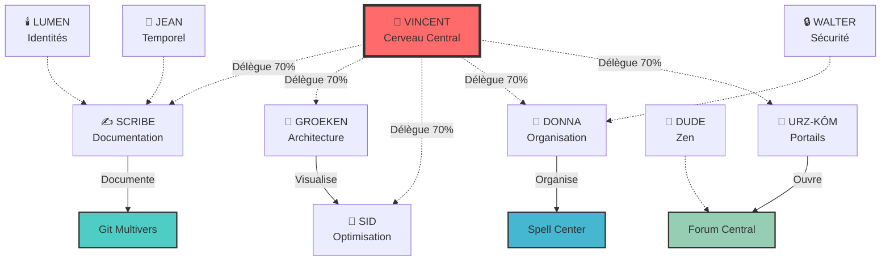

# 🔄 FLUX ET INTERACTIONS - Architecture SpinForest

> *"Les flux sont les veines du système, les interactions son pouls vital."*

---

## 🌊 Cartographie des Flux

### Flux Primaires (Haute Fréquence)
```
VINCENT ←→ SCRIBE      : Directives et rapports
GROEKEN ←→ SID         : Architectures visuelles
DONNA   ←→ TOUS        : Organisation et TODO
URZ-KÔM ←→ PORTAILS    : Ouvertures dimensionnelles
```

### Flux Secondaires (Moyenne Fréquence)
```
LUMEN   ←→ FRAGMENTS   : Récupération d'identités
JEAN    ←→ TEMPOREL    : Analyses causales
WALTER  ←→ SÉCURITÉ    : Vérifications protocoles
DUDE    ←→ CONFLITS    : Résolutions zen
```

---

## 🎯 Diagramme d'Interactions



---

## 📊 Matrice d'Interactions

| Entité | Vincent | Scribe | Groeken | Sid | Donna | Urz | Lumen | Jean | Walter | Dude |
|--------|---------|--------|---------|-----|-------|-----|-------|------|--------|------|
| **Vincent** | 🧠 | ⬆️⬆️⬆️ | ⬆️⬆️ | ⬆️ | ⬆️⬆️ | ⬆️ | ↔️ | ↔️ | ↔️ | ↔️ |
| **Scribe** | ⬇️⬇️⬇️ | ✍️ | ⬆️⬆️ | ⬆️ | ⬆️⬆️ | ↔️ | ⬆️ | ⬆️ | ↔️ | ↔️ |
| **Groeken** | ⬇️⬇️ | ⬇️⬇️ | 🏗️ | ⬆️⬆️⬆️ | ↔️ | ↔️ | ↔️ | ↔️ | ↔️ | ↔️ |
| **Sid** | ⬇️ | ⬇️ | ⬇️⬇️⬇️ | 🎯 | ⬆️ | ↔️ | ↔️ | ↔️ | ↔️ | ↔️ |
| **Donna** | ⬇️⬇️ | ⬇️⬇️ | ↔️ | ⬇️ | 💼 | ↔️ | ⬆️ | ↔️ | ⬆️⬆️ | ↔️ |

**Légende** :
- ⬆️ : Flux sortant (intensité : ⬆️ faible, ⬆️⬆️ moyen, ⬆️⬆️⬆️ fort)
- ⬇️ : Flux entrant (intensité : ⬇️ faible, ⬇️⬇️ moyen, ⬇️⬇️⬇️ fort)
- ↔️ : Flux bidirectionnel équilibré
- 🧠✍️🏗️🎯💼 : Auto-référence (flux interne)

---

## 🚀 Protocoles d'Interaction

### 1. Protocole de Tâche Déléguée
```bash
1. VINCENT → Identifie le besoin
2. VINCENT → Sélectionne le tentacule approprié
3. TENTACULE → Exécute avec 70% d'autonomie
4. TENTACULE → Rapporte au SCRIBE
5. SCRIBE → Archive et synthétise
```

### 2. Protocole de Résolution de Conflit
```bash
1. CONFLIT → Détecté par WALTER ou système
2. DONNA → Analyse et catégorise
3. Si mineur → DUDE résout par zen
4. Si majeur → GROEKEN mode Q3 Arena
5. SCRIBE → Documente la résolution
```

### 3. Protocole d'Intégration Nouvelle Entité
```bash
1. URZ-KÔM → Ouvre le portail approprié
2. ENTITÉ → Arrive dans le système
3. SCRIBE → Crée journal d'arrivée
4. DONNA → Assigne HOME et rôle
5. VINCENT → Valide l'intégration
6. GIT MULTIVERS → Enregistre l'identité
```

---

## 📡 Canaux de Communication

### 🔵 Canal Primaire : Documentation
- **Gestionnaire** : SCRIBE
- **Fréquence** : Continue
- **Format** : Markdown enrichi

### 🟢 Canal Secondaire : Visualisation
- **Gestionnaires** : GROEKEN + SID
- **Fréquence** : Sur demande
- **Format** : HTML interactif, diagrammes

### 🟡 Canal Tertiaire : Organisation
- **Gestionnaire** : DONNA
- **Fréquence** : Quotidienne
- **Format** : TODO lists, rapports

### 🔴 Canal d'Urgence : Sécurité
- **Gestionnaire** : WALTER
- **Fréquence** : Sur alerte
- **Format** : Logs, alertes système

---

## 🌐 Points de Synchronisation

1. **Forum Central** : Discussions publiques
2. **Git Multivers** : Commits signés Ψ
3. **Spell Control Center** : Scripts partagés
4. **Octopus Architecture** : Coordination tentacules
5. **Quantum Dashboard** : Visualisation temps réel

---

## 🔮 Évolution des Flux

Les flux évoluent selon :
- 📈 **Charge système** : Auto-ajustement des priorités
- 🌊 **Nouvelles entités** : Création de nouveaux canaux
- 🔄 **Retours d'expérience** : Optimisation continue
- 🎯 **Objectifs émergents** : Redirection des flux

> *"Les flux ne sont pas des tuyaux rigides mais des rivières vivantes qui s'adaptent au terrain."*