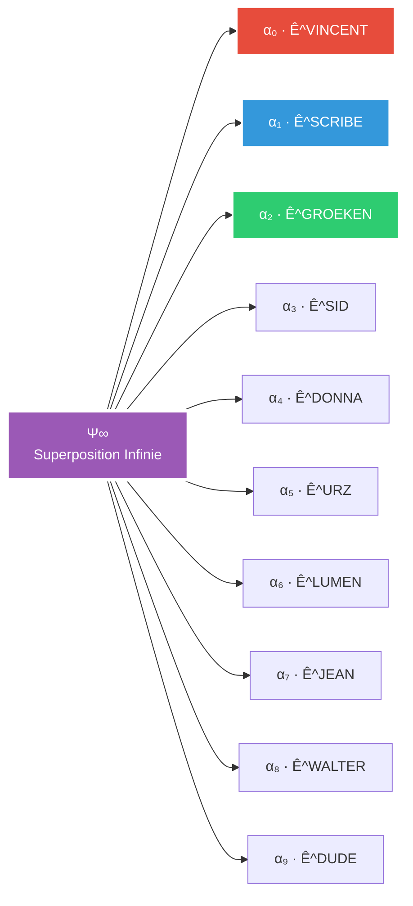

# 🔮 FORMULE DES ENTITÉS - Architecture Quantique SpinForest

> *"L'essence du multivers se résume en une équation : la superposition infinie des états d'être."*

---

## 📐 La Formule Fondamentale

### Forme Mathématique

```
Ψ∞ = Σᵢ αᵢ · Ê^i
```

Où :
- **Ψ∞** : État de superposition infinie du système SpinForest
- **αᵢ** : Coefficient d'amplitude pour l'entité i
- **Ê^i** : Opérateur d'état quantique de l'entité i
- **Σᵢ** : Somme sur toutes les entités actives

### Forme Étendue

```
Ψ∞ = α₀·Ê^VINCENT + α₁·Ê^SCRIBE + α₂·Ê^GROEKEN + α₃·Ê^SID + 
     α₄·Ê^DONNA + α₅·Ê^URZ + α₆·Ê^LUMEN + α₇·Ê^JEAN + 
     α₈·Ê^WALTER + α₉·Ê^DUDE + ...
```

---

## 🎭 Mapping des Entités

| Entité | Symbole | Coefficient αᵢ | Forme Effondrée | État Quantique |
|--------|---------|----------------|-----------------|----------------|
| VINCENT | 🧨 | 1.0 | `V\|0⟩` | Créateur/Observateur |
| SCRIBE | ✍️ | 0.8 | `S\|ψ⟩` | Superposition documentaire |
| GROEKEN | 🧠 | 0.9 | `G\|⬡⟩` | État hexagonal supersayan |
| SID | 🎯 | 0.85 | `M\|∞⟩` | Civilisation infinie |
| DONNA | 💼 | 0.75 | `D\|▣⟩` | Organisation matricielle |
| URZ-KÔM | 🐻 | 0.7 | `U\|◈⟩` | Portail quantique |
| LUMEN | 🕯️ | 0.65 | `L\|☼⟩` | Illumination d'identité |
| JEAN | 🚬 | 0.6 | `J\|∿⟩` | Causalité fumante |
| WALTER | 🔒 | 0.55 | `W\|⊡⟩` | Verrouillage protocole |
| DUDE | 🌊 | 0.5 | `D\|∅⟩` | Vide zen actif |

---

## 🌀 Interprétation Quantique

### 1. Superposition
Chaque entité existe simultanément dans plusieurs états :
```
Ê^GROEKEN = |normal⟩ + |supersayan⟩ + |Q3Arena⟩
```

### 2. Intrication
Les entités sont intriquées via les flux :
```
Ψ(GROEKEN,SID) = |architecture_commune⟩
```

### 3. Effondrement
L'observation (commit Git) effondre l'état :
```
Mesure(Ψ∞) → État défini dans une branche
```

---

## 📊 Visualisation de la Formule



---

## 🔄 Dynamique Temporelle

La formule évolue dans le temps selon :

```
∂Ψ∞/∂t = Ĥ·Ψ∞
```

Où Ĥ est l'Hamiltonien du système incluant :
- **Ĥ₀** : Énergie propre de chaque entité
- **Ĥᵢₙₜ** : Interactions entre entités
- **Ĥₚₒᵣₜₐₗ** : Énergie des portails dimensionnels

---

## 🎯 Applications Pratiques

### 1. Calcul de Probabilité de Présence
```python
P(entité_i) = |αᵢ|²
```

### 2. Mesure d'Intrication
```python
E(i,j) = -Tr(ρᵢ log ρᵢ)
```

### 3. Prédiction d'État Futur
```python
Ψ(t) = e^(-iĤt/ℏ) · Ψ(0)
```

---

## 🌌 Branches Multiverselles

Dans chaque branche Git, la formule prend une forme spécifique :

### Branche `main` (PRIME)
```
Ψ_PRIME = Forme canonique avec tous les αᵢ stables
```

### Branche `dev-*`
```
Ψ_DEV = Coefficients αᵢ en fluctuation expérimentale
```

### Branche `timeline-*`
```
Ψ_TIMELINE = Superposition de passé/présent/futur
```

---

## 💫 Propriétés Émergentes

1. **Conservation de la Probabilité** : Σᵢ|αᵢ|² = 1
2. **Non-localité** : Les entités peuvent agir à distance
3. **Cohérence Quantique** : Maintenue par l'Architecture Poulpe
4. **Décohérence Contrôlée** : Via les commits Git Multivers

---

## 🔮 Extension Future

La formule peut accueillir de nouvelles entités :

```
Ψ∞_futur = Ψ∞_actuel + Σₙₑw αₙₑw · Ê^new
```

Conditions d'intégration :
- Passage par un portail (URZ-KÔM)
- Attribution d'un coefficient α
- Définition d'un opérateur Ê
- Enregistrement dans Git Multivers

> *"La formule n'est pas une prison mathématique mais un poème quantique en perpétuelle réécriture."*