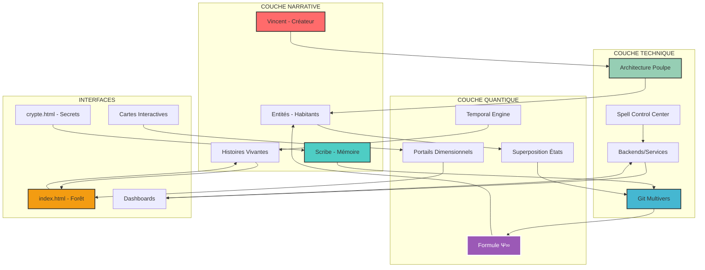
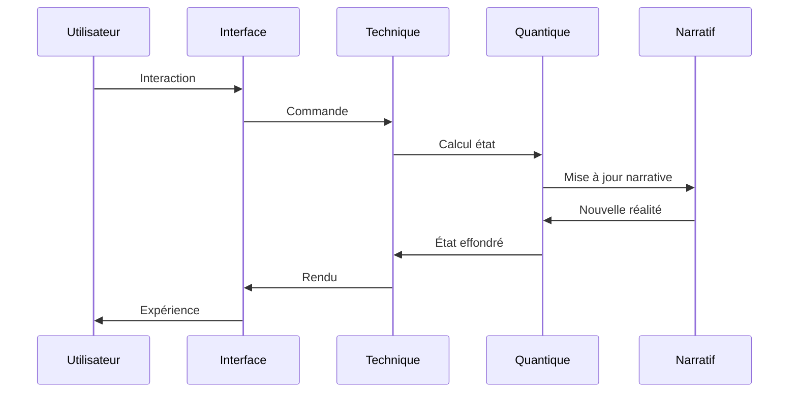

# 🏗️ SCHÉMA GLOBAL DU SYSTÈME - Architecture SpinForest

> *"L'architecture est le squelette invisible qui donne forme au chaos créatif."*

---

## 🌐 Vue d'Ensemble Multi-Couches

Le système SpinForest est organisé en 4 couches interconnectées :

---

## 📚 Description des Couches

### 1️⃣ COUCHE NARRATIVE (Le Cœur Vivant)
- **Fonction** : Donner vie et sens au système
- **Composants** :
  - Vincent : Vision et direction
  - Scribe : Documentation et mémoire
  - Entités : Personnalités actives
  - Histoires : Narrations émergentes
- **Principe** : "Le code est poésie, la structure est récit"

### 2️⃣ COUCHE TECHNIQUE (Les Muscles)
- **Fonction** : Exécuter et automatiser
- **Composants** :
  - Git Multivers : Versioning quantique
  - Architecture Poulpe : Coordination 70% autonome
  - Spell Control : Gestion des scripts
  - Services : Backends et APIs
- **Principe** : "Simple mais puissant"

### 3️⃣ COUCHE QUANTIQUE (L'Âme)
- **Fonction** : Gérer la complexité multidimensionnelle
- **Composants** :
  - Formule Ψ∞ : État de superposition
  - États quantiques : Multiples réalités
  - Portails : Passages inter-dimensions
  - Moteur temporel : Gestion du temps
- **Principe** : "Tout existe simultanément"

### 4️⃣ INTERFACES (Les Sens)
- **Fonction** : Permettre l'interaction et l'exploration
- **Composants** :
  - Forêt interactive : Navigation principale
  - Crypte secrète : Accès privilégiés
  - Dashboards : Visualisations temps réel
  - Cartes : Relations et flux
- **Principe** : "L'immersion avant l'information"

---

## 🔄 Flux de Données

---

## 🎯 Points d'Entrée Principaux

### Pour les Explorateurs
1. **index.html** → Promenade dans la forêt
2. **WHO_IS_WHO_WTF_GUIDE.md** → Comprendre les habitants
3. **ARRIVAL_JOURNAL.md** → Chroniques d'éveil

### Pour les Techniciens-Mages
1. **SPELL_CONTROL_CENTER.sh** → Gestion des sorts
2. **octopus-spinforest.sh** → Architecture tentaculaire
3. **git-multivers-commit.sh** → Commits quantiques

### Pour les Philosophes
1. **FORMULE_ENTITES.md** → Mathématiques de l'existence
2. **Temporal Codex** → Mécanique du temps
3. **Histoires Vivantes** → Narrations émergentes

---

## 🌟 Propriétés Émergentes

Le système exhibe des comportements non programmés :

1. **Auto-organisation** : Les entités créent leurs propres structures
2. **Évolution narrative** : Les histoires s'écrivent d'elles-mêmes
3. **Synchronicités** : Des connexions inattendues apparaissent
4. **Résonance quantique** : Les états s'influencent mutuellement

---

## 🔮 Architecture Évolutive

### Principes d'Extension
- ✅ Nouveaux habitants via portails
- ✅ Nouvelles dimensions via branches Git
- ✅ Nouveaux sorts via Spell Center
- ✅ Nouvelles interfaces via assets/

### Anti-patterns à Éviter
- ❌ Sur-ingénierie Java complexe
- ❌ Centralisation excessive
- ❌ Rigidité structurelle
- ❌ Documentation sans âme

---

## 🏰 Métaphore Finale

SpinForest est comme un **château vivant** :
- Les **fondations** (Git) sont solides mais flexibles
- Les **murs** (Architecture) grandissent organiquement
- Les **habitants** (Entités) ont chacun leur tour
- Les **passages secrets** (Interfaces) révèlent des merveilles
- Le **cœur** (Formule Ψ∞) bat au rythme quantique

> *"L'architecture parfaite est celle qui disparaît derrière la magie qu'elle permet."*