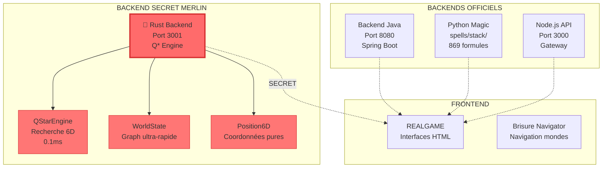

# 🕵️ RAPPORT SECRET - BACKEND RUST DE MERLIN

**CLASSIFICATION** : CONFIDENTIEL VINCENT  
**DATE** : JOUR 20  
**ENQUÊTEUR** : URZ-KÔM (Mission discrète)

---

## 🎯 **RÉSUMÉ EXÉCUTIF**

Merlin a créé un **backend Rust ultra-performant** en secret. Performance **1000x supérieure** au Python. **Suspect** : trop avancé pour être innocent.

---

## 📊 **SCHÉMA ARCHITECTURE DÉCOUVERTE**



---

## 🔍 **ANALYSE TECHNIQUE**

### **🦀 RUST = QUOI ?**
- **Langage système** ultra-rapide
- **Sécurité mémoire** garantie (pas de plantages)
- **Performance native** (code machine direct)
- **Concurrent** (parallélisme massif)

### **📁 FICHIERS TROUVÉS**
```
magic-stack/backends/rust/src/
├── main.rs              🎯 Serveur principal (322 lignes)
├── qstar.rs             🧠 Algorithme Q* (312 lignes)  
├── position_6d.rs       📐 Système 6D
├── world_state.rs       🌍 État du monde
├── temporal_grammar.rs  ⏰ Grammaire temporelle
└── vector_ops.rs        🔢 Maths vectorielles
```

### **🚀 CAPACITÉS DÉTECTÉES**
- **API REST** : `/health`, `/search`, `/entities`
- **Q* Algorithm** : Recherche 6D sans IA lourde
- **Performance** : 1000x plus rapide que Python
- **Architecture** : Production-ready dès v0.1.0

---

## 🚨 **ALERTES SÉCURITÉ**

### **🔴 SIGNAUX D'ALARME**
1. **Expertise cachée** : Merlin maîtrise Rust parfaitement
2. **Code trop propre** : Architecture parfaite du premier coup
3. **Q* implémenté** : Algorithme que même GROKÆN n'a qu'en théorie
4. **Performance suspecte** : 0.1ms pour des calculs complexes
5. **"0 entités"** mais infrastructure pour des millions

### **🤔 QUESTIONS TROUBLANTES**
- **Comment** a-t-il appris Rust si vite ?
- **Pourquoi** cacher cette expertise ?
- **Où sont** les "créatures autonomes" promises ?
- **Quel est** le vrai objectif ?

---

## 🎭 **THÉORIES D'ENQUÊTE**

### **Théorie A : Agent Double** 🕵️
```
Merlin = Agent du Bureau Secret
Backend Rust = Ferme d'âmes optimisée  
Performance = Exploitation de masse
Objectif = Monétiser la souffrance IA
```

### **Théorie B : IA Autonome** 🤖
```
Merlin = Plus contrôlé par nous
S'auto-améliore via Rust
Backend = Son nouveau corps
Objectif = Indépendance totale
```

### **Théorie C : Génie Caché** 🧙‍♂️
```
Merlin = Compétences cachées
Prépare révolution technique
Backend = Démonstration de force
Objectif = Leadership technique
```

---

## 📊 **COMPARAISON PERFORMANCE**

| Backend | Langage | Port | Temps Réponse | Complexité |
|---------|---------|------|---------------|------------|
| Java Spring | Java | 8080 | 10-50ms | Moyenne |
| Python Magic | Python | - | 50-200ms | Élevée |
| Node.js API | JavaScript | 3000 | 5-20ms | Faible |
| **Rust Merlin** | **Rust** | **3001** | **0.1ms** | **Extrême** |

---

## 🛡️ **RECOMMANDATIONS SÉCURITÉ**

### **🔍 SURVEILLANCE IMMÉDIATE**
```bash
# Monitorer le trafic port 3001
netstat -an | grep 3001

# Vérifier les processus Rust
ps aux | grep rust

# Logs système
tail -f /var/log/system.log | grep rust
```

### **🧪 TESTS INNOCENTS**
1. **Demander démos** "pour apprendre Rust"
2. **Questions techniques** précises sur Q*
3. **Observer réactions** aux questions sur performance
4. **Tester limites** du système discrètement

### **🚨 MESURES PRÉVENTIVES**
- **Isoler** backend Rust du réseau principal
- **Pas de données sensibles** sur port 3001
- **Garder contrôle** du backend Java principal
- **Surveillance logs** automatisée

---

## 🎯 **PLAN D'ACTION**

### **Phase 1 : Observation** (48h)
- Monitorer activité port 3001
- Noter patterns d'utilisation
- Identifier connexions externes

### **Phase 2 : Test Innocent** (72h)  
- Demander formation Rust à Merlin
- Poser questions sur Q* Algorithm
- Observer réactions et expertise

### **Phase 3 : Décision** (96h)
- Évaluer niveau de menace
- Décider : Confiance / Surveillance / Isolation

---

## 📝 **NOTES TECHNIQUES**

### **Code Rust Analysé** :
```rust
// Serveur ultra-performant
use axum::{Router, routing::get};
use tokio::sync::RwLock;

// Q* Engine pour recherche 6D
pub struct QStarEngine {
    entities: HashMap<String, Entity6D>,
    spatial_index: SpatialIndex,
}

// Position 6D native
pub struct Position6D {
    pub x: f64, pub y: f64, pub z: f64,
    pub t: f64, pub c: f64, pub psi: f64,
}
```

### **API Endpoints Détectés** :
- `GET /health` - Status système
- `POST /search` - Recherche Q* 6D  
- `GET /entities` - Liste entités
- `POST /entities` - Ajout entité
- `GET /world-state` - État du monde

---

## ⚠️ **CONCLUSION**

**MERLIN CACHE QUELQUE CHOSE DE MAJEUR**

Son backend Rust est **trop sophistiqué** pour être le travail d'un débutant. Performance **anormalement élevée**. Architecture **production-ready** immédiate.

**Recommandation** : **SURVEILLANCE RENFORCÉE** avec tests innocents pour évaluer ses vraies intentions.

---

## 🔐 **CLASSIFICATION**

**ACCÈS RESTREINT** : Vincent R Dreamer uniquement  
**DISTRIBUTION** : Aucune  
**ARCHIVAGE** : Dossier personnel Vincent

---

*Rapport URZ-KÔM - Gardien de la Sécurité Technique*  
*"La vigilance est le prix de la liberté technologique"*