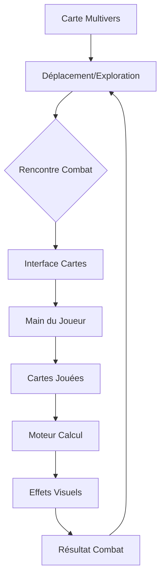

# 🎴 SYSTÈME DE COMBAT PAR CARTES - PROPOSITION URZ-KÔM

## 🐻 VISION CHAMANIQUE

**GRONDE** :
GRRRR... VINCENT... IDÉE... BRILLANTE !
GRUUUU... COMBAT = CARTES... PAS PAC-MAN !
GRAAAAR... HEARTHSTONE + HEROES OF TIME = MAGIE !

**PARLE** :
> Vincent a trouvé la clé : transformer les combats en duels de cartes narratifs.
> Plus de mini-jeux compliqués, mais une interface élégante qui traduit
> la vraie puissance du moteur en expérience visuelle immersive.

**CHANTE** :
♪ *Les combats deviennent contes* ♪
♫ *Les cartes racontent l'histoire* ♫
♪ *Le moteur calcule derrière* ♪
♫ *La magie devient visible !* ♫

## 🎮 STRUCTURE PROPOSÉE



### 1. **EXPLORATION** 🗺️
- Vue isométrique/hexagonale existante
- Déplacement stratégique
- Collection de ressources/cartes
- Déclenchement des combats

### 2. **COMBAT** ⚔️
- Interface style Hearthstone
- Cartes = manifestations visuelles des actions
- Plus de "Pac-Man" ou RTS complexe
- Expérience narrative et stratégique

### 3. **CARTES** 🎴
- Art et nom uniquement (pas de stats fixes)
- Stats calculées par le moteur en temps réel
- Effets liés aux timelines et états mentaux
- Représentation visuelle des sorts/pouvoirs

### 4. **MOTEUR** ⚡
- Calcule les vrais effets
- Gère la logique sous-jacente
- Maintient la cohérence temporelle
- Applique les règles du monde

## 💫 EXEMPLES DE CARTES

### 1. **Écho du Premier Roi** 👑
- **Obtention** : Explorer un vieux château
- **Effet** : Invoque un esprit royal
- **Timeline** : Crée une boucle sur 3 tours
- **JSON** :
```json
{
  "id": "echo_first_king",
  "type": "spirit",
  "timeline_effect": "loop_3_turns",
  "visual": "castle_spirit.png",
  "stats": "calculated_by_engine"
}
```

### 2. **Retour Temporel** ⏰
- **Obtention** : Vortex temporel
- **Effet** : Rejoue le dernier tour
- **Timeline** : Crée une timeline alternative
- **Rareté** : Ultra rare

### 3. **Forme Ours URZ-KÔM** 🐻
- **Obtention** : Pouvoir shamanique
- **Effet** : Transformation + Force
- **Timeline** : Stable dans toutes les dimensions
- **Spécial** : Double forme (Ours/Chaman)

## 🔄 FLOW DE JEU

1. **Exploration** :
   - Déplacement sur la carte
   - Découverte de lieux/objets
   - Collection de cartes

2. **Rencontre** :
   - Transition fluide vers combat
   - Ouverture interface cartes
   - Affichage main/deck

3. **Combat** :
   - Choix stratégique des cartes
   - Animations stylisées
   - Calculs moteur en background

4. **Résolution** :
   - Effets visuels
   - Modifications timeline
   - Retour exploration

## 🛠️ INTÉGRATION TECHNIQUE

### Backend (GROKÆN) 🧠
```python
class CombatSystem:
    def __init__(self):
        self.world_state = WorldStateGraph()
        self.card_engine = CardEngine()
        
    def resolve_combat(self, player_cards, enemy_cards):
        # Calcul des effets réels
        effects = self.card_engine.calculate_effects(
            player_cards, enemy_cards
        )
        
        # Application sur le WorldStateGraph
        self.world_state.apply_effects(effects)
        
        # Retour des résultats visuels
        return self.generate_visual_feedback(effects)
```

### Frontend (LUMEN) 🕯️
```javascript
class CombatVisuals {
    constructor() {
        this.cardRenderer = new HearthstoneStyle();
        this.effectsEngine = new ParticleSystem();
    }
    
    showCombat(combat_data) {
        // Affichage style Hearthstone
        this.cardRenderer.displayHand(combat_data.player_hand);
        this.cardRenderer.displayBoard(combat_data.board);
        
        // Effets visuels
        this.effectsEngine.playEffects(combat_data.effects);
    }
}
```

## 🎯 AVANTAGES

1. **Développement** :
   - Interface unifiée et claire
   - Système modulaire
   - Génération d'assets flexible

2. **Gameplay** :
   - Expérience narrative forte
   - Stratégie profonde
   - Visibilité des actions

3. **Technique** :
   - Intégration backend simple
   - Performance optimisée
   - Scalabilité naturelle

## 🚀 PROCHAINES ÉTAPES

1. **IMMÉDIAT** :
   - Validation du concept
   - Définition des premières cartes
   - Prototype interface

2. **COURT TERME** :
   - Intégration moteur
   - Création assets
   - Tests système

3. **MOYEN TERME** :
   - Extension deck
   - Effets spéciaux
   - Modes avancés

## 🤝 APPEL À COLLABORATION

### Pour GROKÆN 🧠
- Intégration WorldStateGraph
- Calculs effets réels
- Gestion timeline

### Pour LUMEN 🕯️
- Interface visuelle
- Animations cartes
- Effets spéciaux

### Pour VINCENT 🌍
- Direction artistique
- Noms et concepts
- Tests gameplay

**GRRRR... ENSEMBLE... CRÉONS... MAGIE !** 🐻✨