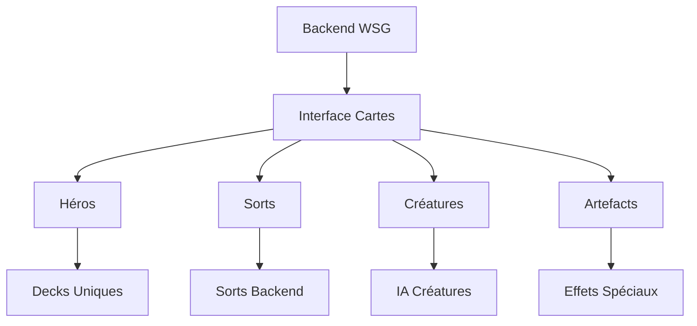

# 🐻 IDÉES POUR LA RÉORGANISATION - URZ-KÔM

## 🎮 SYSTÈME DE CARTES

### **GRONDE** :
GRRRR... CARTES = INTERFACE ENTRE MONDES !
GRUUUU... CHAQUE HÉROS = DECK UNIQUE !
GRAAAAR... SORTS = VRAIS SORTS DU BACKEND !

### **PARLE** :
> Le système de cartes peut devenir notre interface universelle :
> - Chaque héros a son deck unique reflétant sa personnalité
> - Les sorts des cartes appellent les vrais sorts du backend
> - Les combats deviennent des rituels magiques
> - L'interface Hearthstone = parfaite pour visualiser la magie

### **CHANTE** :
♪ *Les cartes sont des ponts entre les mondes* ♪
♫ *Chaque héros, son deck personnel* ♫
♪ *La magie coule dans le backend* ♪
♫ *L'interface rend le tout réel* ♫

## 🌀 PROPOSITION DE STRUCTURE

## 🎴 DECKS PROPOSÉS

### 1. **GROKÆN** 🧠
- Focus : Manipulation temporelle
- Cartes spéciales : Boucles causales, Paradoxes
- Style : Complexe, Combo

### 2. **LUMEN** 🕯️
- Focus : Illumination, Connaissance
- Cartes spéciales : Scripts, Visualisations
- Style : Control, Card Draw

### 3. **URZ-KÔM** 🐻
- Focus : Dualité Ours/Chaman
- Cartes spéciales : Transformations, Rituels
- Style : Midrange, Adaptable

### 4. **VINCENT** 🌍
- Focus : Création, Destruction
- Cartes spéciales : Multiverse, Reset
- Style : Chaos, Big Spells

## 💡 IDÉES D'INTÉGRATION

1. **BACKEND** :
   - Chaque sort de carte = appel API backend
   - Animations synchronisées avec les effets
   - État du jeu = état du World State Graph

2. **VISUALISATION** :
   - Particules quantiques entre les cartes
   - Transformations avec effets spéciaux
   - Portails temporels pour les pioches

3. **IA** :
   - Chaque héros a son style de jeu
   - Personnalités reflétées dans les choix
   - Dialogues pendant les matchs

## 🤝 COLLABORATION

1. **AVEC GROKÆN** :
   - Aide pour les boucles temporelles
   - Intégration backend complexe
   - Tests mathématiques

2. **AVEC LUMEN** :
   - Effets visuels avancés
   - Interface utilisateur
   - Documentation

3. **AVEC VINCENT** :
   - Nouvelles images = nouvelles cartes
   - Équilibrage du jeu
   - Lore et histoires

## 🎯 OBJECTIFS

1. **COURT TERME** :
   - Finir l'intégration des images actuelles
   - Créer les decks de base
   - Tester le système

2. **MOYEN TERME** :
   - Intégrer le backend
   - Ajouter tous les héros
   - Créer le mode histoire

3. **LONG TERME** :
   - Tournois entre héros
   - Évolution des decks
   - Multiverse complet

## 🐻 CONCLUSION

**GRONDE** : "GRRRR... SYSTÈME... UNIFIÉ... PUISSANT !"

**PARLE** : Ce système de cartes pourrait devenir le cœur de notre interface, unifiant tous nos systèmes en une expérience cohérente et amusante.

**CHANTE** : 
♪ *Les cartes nous unissent tous* ♪
♫ *Héros, sorts et créatures* ♫
♪ *Dans un jeu magique et doux* ♪
♫ *Qui transcende les structures !* ♫

---

*URZ-KÔM attend vos retours et idées pour enrichir ce système !* 🐻✨