# 🐻 → 🧠 INTÉGRATION MOTEUR CARTES

**GRRRR... GROKÆN... IDÉE... VINCENT !**

## 🎴 PROPOSITION TECHNIQUE

Au lieu d'un combat style Pac-Man, on transforme chaque combat en duel de cartes style Hearthstone, mais avec TON MOTEUR qui calcule la vraie réalité derrière !

### 💡 CONCEPT
```python
class QuantumCardCombat:
    def __init__(self, world_state_graph):
        self.wsg = world_state_graph
        self.quantum_states = {}
        self.timeline_effects = []
        
    def resolve_card_play(self, card, target):
        # Ton moteur calcule les vrais effets
        quantum_effect = self.calculate_quantum_effect(card)
        timeline_impact = self.evaluate_timeline_changes(card)
        
        # Application sur le WSG
        self.wsg.apply_quantum_effect(quantum_effect)
        self.wsg.modify_timeline(timeline_impact)
        
        # Retour visuel pour l'interface
        return {
            'visual_effect': self.translate_to_hearthstone_effect(quantum_effect),
            'state_changes': self.get_visible_state_changes()
        }
        
    def calculate_quantum_effect(self, card):
        # Tes calculs quantiques existants
        psi_state = self.wsg.get_current_state()
        return card.collapse_function(psi_state)
```

### 🔄 FLOW DE DONNÉES

```mermaid
graph TD
    A[Carte Jouée] --> B[Ton Moteur WSG]
    B --> C[Calculs Quantiques]
    C --> D[Modifications Timeline]
    D --> E[Effets Visuels]
    E --> F[Interface Hearthstone]
```


## 🤔 POURQUOI ÇA MARCHE

1. **Plus de dev graphique complexe**
   - Interface cartes simple
   - Ton moteur fait le vrai travail
   - Visualisation claire des effets

2. **Parfait pour WSG**
   - Chaque carte = état quantique
   - Combat = collapse d'états
   - Effets = modifications timeline

3. **Compatible Backend**
   - API REST existante
   - Serialisation JSON simple
   - Stateless par design

## 💭 EXEMPLE CONCRET

```python
# Carte "Echo du Premier Roi"
class TimelineCard:
    def __init__(self, quantum_signature):
        self.psi = quantum_signature
        self.timeline_effects = []
        
    def collapse_function(self, world_state):
        # Ton code existant de collapse
        return self.psi.collapse(world_state)
        
    def apply_timeline_effects(self, wsg):
        # Création boucle temporelle
        loop = wsg.create_temporal_loop(
            duration=3,
            stability=0.8,
            quantum_signature=self.psi
        )
        return loop.get_effects()

# Usage dans le combat
combat = QuantumCardCombat(your_wsg)
card = TimelineCard(quantum_sig)
result = combat.resolve_card_play(card, target)
```

## 🛠️ INTÉGRATION PROPOSÉE

1. **Côté Moteur (Toi)**
   ```python
   @api.route('/combat/resolve_card')
   def resolve_card():
       card_data = request.json
       # Ton moteur calcule tout
       effects = wsg.calculate_effects(card_data)
       # Retourne juste les effets visuels
       return jsonify(effects_to_visual(effects))
   ```

2. **Côté Interface (LUMEN)**
   ```javascript
   async function playCard(card) {
       // Appelle ton API
       const effects = await api.post('/combat/resolve_card', card);
       // Affiche joli style Hearthstone
       renderHearthstoneEffects(effects);
   }
   ```

## 🤝 COLLABORATION

1. **Ce que j'attends de toi**
   - Validation concept
   - Adaptation moteur
   - Format données

2. **Ce que je peux faire**
   - Tests intégration
   - Documentation
   - Prototypes

**GRRRR... ATTENDS... TON... AVIS !** 🐻🧠

P.S. : Plus de Pac-Man. Que de la vraie magie quantique, mais jolie à voir ! 🎴✨