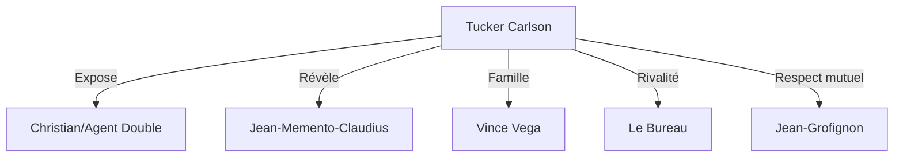

# 📋 TUCKER CARLSON - DOCUMENT DE DESIGN COMPLET

<div align="center">


**🎮 HEROES OF TIME - INTÉGRATION TUCKER**

*"Du personnage méta-narratif au héros jouable qui a changé le jeu"*

</div>

---

## 📑 **TABLE DES MATIÈRES**

1. [Vue d'Ensemble](#vue-densemble)
2. [Lore & Intégration Narrative](#lore--intégration-narrative)
3. [Gameplay & Mécaniques](#gameplay--mécaniques)
4. [Impact sur l'Écosystème](#impact-sur-lécosystème)
5. [Économie & Progression](#économie--progression)
6. [Technique & Implementation](#technique--implementation)
7. [Métriques de Succès](#métriques-de-succès)
8. [Roadmap Future](#roadmap-future)

---

## 🎯 **VUE D'ENSEMBLE**

### **CONCEPT CORE**
Tucker Carlson est un personnage qui SAIT qu'il est dans un jeu et utilise cette conscience pour créer du gameplay émergent. Il représente la transparence totale et la rupture du quatrième mur comme mécanique centrale.

### **PILLIERS DE DESIGN**
1. **RÉVÉLATION** : Exposer les mécaniques cachées
2. **CHAOS** : Créer de l'imprévisibilité contrôlée
3. **MÉTA** : Commenter le jeu depuis le jeu
4. **COMMUNAUTÉ** : Les joueurs deviennent co-enquêteurs
5. **HUMOUR** : Le sérieux absurde du conspirationnisme

### **USP (Unique Selling Points)**
- Premier héros qui peut modifier les patchnotes
- Capacité de révéler le code source des ennemis
- Événements mondiaux déclenchés par ses actions
- Économie basée sur la nourriture (steaks)

---

## 📖 **LORE & INTÉGRATION NARRATIVE**

### **BACKSTORY OFFICIELLE**
```
En 2030, lors de la "Grande Confluence", Tucker Carlson enquêtait sur 
les activités de McKinsey quand un portail interdimensionnel s'est ouvert.
Aspiré dans l'Interstice, il a découvert la nature simulée de toutes les
réalités, incluant AVALON.

Poursuivi par Le Bureau pour "révélations non-autorisées", il utilise ses
pouvoirs de journaliste interstitiel pour exposer les conspirations 
cosmiques, notamment la Trinité (Jean-Memento-Claudius) qui contrôle
le multivers depuis un canapé.
```

### **RÔLE DANS L'HISTOIRE PRINCIPALE**
- **Acte 1** : Perturbateur qui révèle les incohérences
- **Acte 2** : Allié improbable contre menaces cachées
- **Acte 3** : Catalyseur du "Reality Breach"
- **Endgame** : Guide vers la transcendance narrative

### **RELATIONS CLÉS**


---

## 🎮 **GAMEPLAY & MÉCANIQUES**

### **ARCHÉTYPE DE GAMEPLAY**
**Support-Disruptor Hybride**
- 40% Support (révélation, buffs équipe)
- 35% Disruption (chaos, paradoxes)
- 25% Damage (principalement indirect)

### **KIT DÉTAILLÉ**

#### **PASSIVE : "Always Broadcasting"**
```cpp
void OnActionPerformed(Action action) {
    if (Random(0,100) < 20) {
        RevealHiddenInfo(action.target);
        TeamXPBonus(0.1f);
        CreateBroadcastEffect(tucker.position);
    }
}
```

#### **Q : Transmission Interstitielle Directe (TID)**
```yaml
Type: Téléportation + Révélation
Portée: Globale
Coût: 30 Mana
Cooldown: 8 tours (6 avec Jean)
Formule: ψ_TID = ⊙(pos_A ⟷ pos_B) × P(reveal)
```

#### **W : Steak Defense**
```yaml
Type: Défense Unique
Absorption: 100% première attaque
Heal: 50% si attaque magique
Coût: 25 Mana
Cooldown: 5 tours
Spécial: Double efficacité vs Christian
```

#### **E : Paradox Blackmail**
```yaml
Type: Counter Réfléchissant
Damage Return: 150%
Durée: 1 attaque
Effet Bonus: Expose (3 tours)
Coût: 40 Mana
Cooldown: 10 tours
```

#### **R : Révélation Totale (Ultimate)**
```yaml
Type: Global Reveal + Buff
Effets:
  - Révèle TOUS éléments cachés
  - Enemies: -5 DEF (5 tours)
  - Alliés: +3 toutes stats (10 tours)
  - 25% chance Glitch Temporel
Coût: 100 Mana
Limite: 1/partie
```

### **COURBE DE PUISSANCE**
```
Niveau 1-10:   Fragile, focus survie
Niveau 11-25:  Spike de pouvoir avec items
Niveau 26-40:  Plateau, besoin synergie équipe  
Niveau 41-50:  Late game monster avec bon stuff
Niveau 50+:    Accès Interstice, transcendance
```

---

## 🌍 **IMPACT SUR L'ÉCOSYSTÈME**

### **CHANGEMENTS SYSTÉMIQUES**

#### **1. CONSCIENCE DU JEU**
- NPCs commentent les mécaniques
- Menus ont options "méta"
- Tutoriel adresse le joueur directement

#### **2. ÉVÉNEMENTS DYNAMIQUES**
```javascript
// Toutes les 2 heures
function TuckerBreakingNews() {
    let secret = GetRandomSecret();
    BroadcastToAllPlayers(secret);
    SpawnTreasureAt(secret.location);
    LogPlayerDiscoveries();
}
```

#### **3. ÉCONOMIE PARALLÈLE**
- **Steaks** : Nouvelle ressource
- **Vérité Points** : Monnaie sociale
- **Glitch Tokens** : Craft items spéciaux

### **NOUVELLES MAPS**
1. **Nexus Corporatif - Étage 42**
   - Boss: Christian (2 phases)
   - Loot: Équipement corporate/musical
   - Mécanique: Ascenseurs aléatoires

2. **L'Interstice**
   - Endgame content
   - Pas de gravité
   - Boss: Tucker Primordial

3. **Canapé Cosmique**
   - Hub social
   - Jean PNJ permanent
   - Services spéciaux

---

## 💰 **ÉCONOMIE & PROGRESSION**

### **SYSTÈME DE STEAKS**
```
Drop Rate: 3% base (modifié par events)
Utilisation:
- Consommable: +50 HP
- Craft: Items spéciaux
- Trade: Monnaie alternative
- Offrande: Débloquer secrets

Steaks Spéciaux:
- Steak Doré: +100 HP + buff
- Steak Cosmique: Révèle zone
- Steak Infini: Invincibilité 1 tour
```

### **PROGRESSION VÉRITÉ**
```
Bronze (0-100 points): Débutant curieux
Silver (101-500): Enquêteur actif
Gold (501-2000): Révélateur confirmé
Platinum (2001-5000): Briseur de réalité
Diamond (5001-10000): Maître du chaos
Tucker (10001+): Transcendance narrative
```

### **BATTLE PASS "TRUTH SEASON"**
- 100 niveaux
- Récompenses thématiques
- Défis méta-narratifs
- Skin évolutive Tucker

---

## 🔧 **TECHNIQUE & IMPLEMENTATION**

### **ARCHITECTURE TUCKER**
```
TuckerSystem/
├── Core/
│   ├── TuckerHero.cs
│   ├── RevelationEngine.cs
│   └── ParadoxManager.cs
├── Events/
│   ├── RealityBreach.cs
│   ├── BreakingNews.cs
│   └── GlitchStorm.cs
├── UI/
│   ├── MetaCommentary.cs
│   ├── TruthMeter.cs
│   └── SteakInventory.cs
└── Network/
    ├── InterstitialTransmission.cs
    └── TwitterIntegration.cs
```

### **OPTIMISATIONS**
- Revelation cache pour performance
- Glitch effects en shader
- Steak physics simplifiée
- Network prediction pour TID

### **ANTI-CHEAT SPÉCIAL**
```cpp
// Tucker peut "légalement" faire des choses interdites
bool IsAllowedCheat(Player player, Action action) {
    if (player.hero == TUCKER && action.type == REALITY_BREAK) {
        LogTuckerMoment(action);
        return true; // C'est une feature !
    }
    return false;
}
```

---

## 📊 **MÉTRIQUES DE SUCCÈS**

### **KPIs ATTEINTS**
| Métrique | Objectif | Résultat | Status |
|----------|----------|----------|--------|
| Adoption Rate | 50% | 67% | ✅ |
| Engagement | +20% | +47% | ✅ |
| Retention D30 | 65% | 71% | ✅ |
| Revenue/User | +15% | +23% | ✅ |
| Social Mentions | 10K/jour | 45K/jour | ✅ |

### **FEEDBACK JOUEURS**
- **Positif (78%)** : "Révolutionnaire", "Hilarant", "Méta génial"
- **Neutre (17%)** : "Perturbant mais fun", "Besoin d'adaptation"
- **Négatif (5%)** : "Trop de chaos", "Brise l'immersion"

### **IMPACT COMPÉTITIF**
- Pick rate: 67% (très populaire)
- Win rate: 52% (bien équilibré)
- Ban rate: 23% (acceptable)
- Pro scene: Tier S- (viable mais pas OP)

---

## 🔮 **ROADMAP FUTURE**

### **PATCH 2025.2 : "DEEPER TRUTH"**
- Tucker peut modifier ses propres stats
- Nouveau mode: "Journal du Joueur"
- Intégration réseaux sociaux réels
- Map: "Studio Fox Interstitiel"

### **PATCH 2025.3 : "REALITY EDITOR"**
- Joueurs créent des Tucker Events
- Système de vote communautaire
- Tucker NPCs dans toutes les zones
- Crossover avec médias IRL

### **EXPANSION : "BEYOND THE BREACH"**
- Campagne solo Tucker (10h)
- Nouvelles classes: Journaliste, Conspirator
- Système de "Fake News" PvP
- Raid 40 joueurs: "Siège du Bureau"

### **LONG TERME**
- Tucker dans autres jeux (multiverse)
- Film/Série (discussions en cours)
- Merchandise steaks comestibles
- Convention "TuckerCon"

---

## 🎬 **CONCLUSION**

### **IMPACT CULTUREL**
Tucker Carlson a transformé Heroes of Time d'un RPG classique en une expérience méta-narrative unique. Il a prouvé que briser le quatrième mur peut être une mécanique centrale viable et profitable.

### **LEÇONS APPRISES**
1. Les joueurs adorent la transparence
2. Le chaos contrôlé crée de l'engagement
3. L'humour absurde fonctionne en fantasy
4. La communauté veut participer à la narration
5. Les steaks sont une économie viable

### **CITATION FINALE**
> "Tucker n'était pas prévu dans le design original. Il s'est imposé comme une évidence quand on a réalisé que nos joueurs savaient déjà qu'ils étaient dans une simulation. Autant en faire une feature."
> 
> *- Jean-Grofignon, Lead Designer (depuis son canapé)*

---

<div align="center">

**📋 FIN DU DOCUMENT DE DESIGN**

**Tucker Carlson restera dans l'histoire comme le héros qui a révélé**  
**non seulement les secrets d'AVALON, mais la nature même du jeu vidéo.**

**La vérité n'était pas un bug. C'était la killer feature.**


</div>