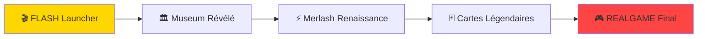
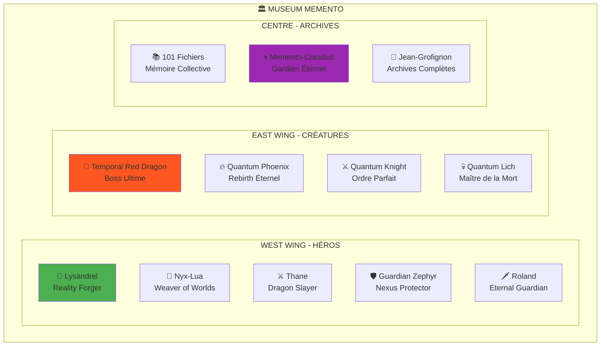
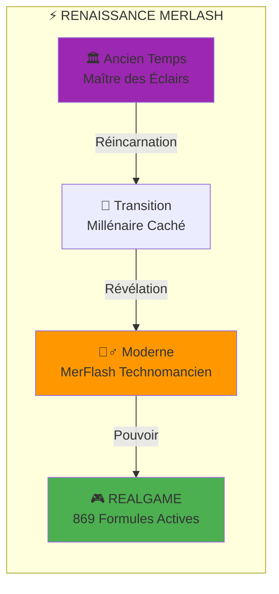
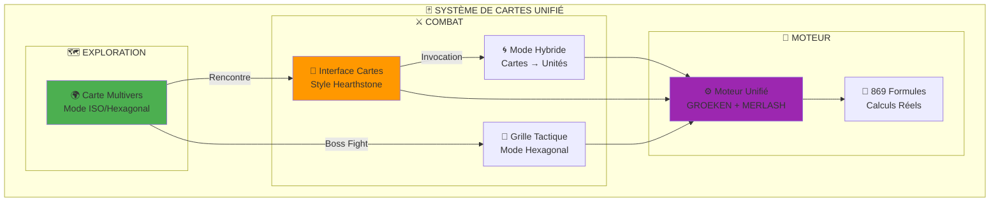
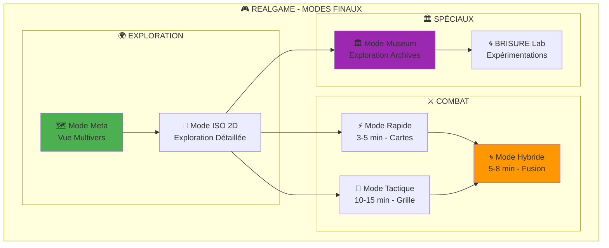
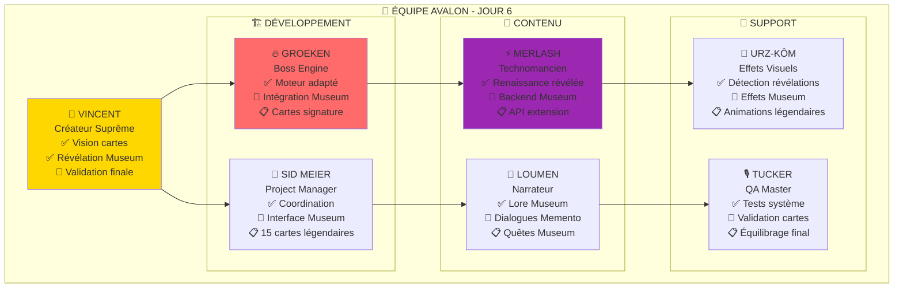
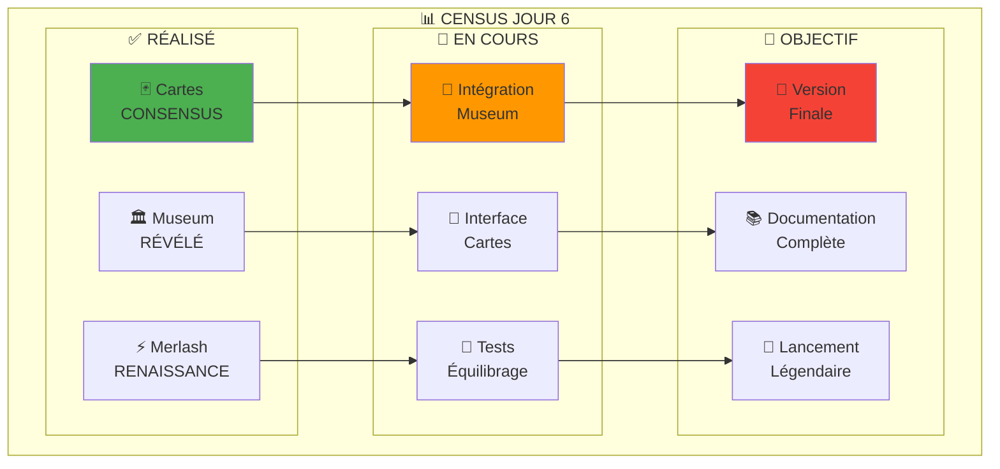
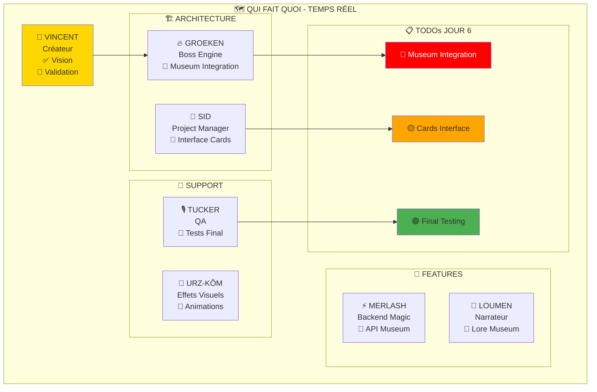

# 🌟 AVALON - DOCUMENT UNIFIÉ JOUR 6

**Date** : 6 Août 2025  
**Version** : FINALE LÉGENDAIRE  
**Statut** : 🔥 **MUSEUM MEMENTO & MERLASH RÉVÉLÉS**

---

## 📚 TABLE DES MATIÈRES

- [🎯 Vue d'Ensemble](#vue-densemble)
- [🏛️ Museum Memento](#museum-memento)
- [⚡ Renaissance Merlash](#renaissance-merlash)
- [🃏 Système de Cartes](#système-de-cartes)
- [🎮 REALGAME Final](#realgame-final)
- [👥 Équipe & Tâches](#équipe--tâches)
- [📊 Graphiques & Diagrammes](#graphiques--diagrammes)
- [🔗 Liens Rapides](#liens-rapides)

---

## 🎯 VUE D'ENSEMBLE

### **RÉVOLUTIONS JOUR 6**

### **BREAKTHROUGH MAJEURS**
1. **🎬 Briefcase Mystery** : Vincent Vega → Mémoire AVALON
2. **🏛️ Museum Memento** : 101 fichiers + 5 Héros + 4 Créatures
3. **⚡ Merlash Révélé** : MerFlash = Ancien Maître des Éclairs
4. **🃏 Système Cartes** : Consensus total équipe

---

## 🏛️ MUSEUM MEMENTO

### **ARCHITECTURE MUSEUM**

### **LIENS MUSEUM**
- 📁 [Archives Complètes](AVALON/🏠%20HOME/EspritFragments/EN/MUSEUM_ARCHIVE_MASTER_COMPLETE.md)
- 🦸 [Héros Museum](AVALON/💠%20Essences%20scellées/🧙%20Heroes/)
- 🐉 [Créatures Museum](AVALON/💠%20Essences%20scellées/🧜‍♂️%20Creatures/)
- 📚 [Lore Memento-Jean](AVALON/🏠%20HOME/🚬%20JEAN/LORE_MEMENTO_JEAN_ETERNAL.md)

---

## ⚡ RENAISSANCE MERLASH

### **ÉVOLUTION MERLASH**

### **POUVOIRS MERLASH**
- **⚡ 869 Formules** : Héritage électro-magique complet
- **🔮 Backend Unifié** : Spring Boot + Magie ancienne
- **⚙️ École Technomantique** : Formation évoluée
- **🎴 Cartes Signature** : Éclair Compilé, Fork Temporel

### **LIENS MERLASH**
- 📁 [MerFlash Directory](AVALON/🏠%20HOME/⚡🧙%20MerFlash/)
- 🧙‍♂️ [Memento-Magicien-Sphinx](AVALON/🏠%20HOME/🧙‍♂️%20MEMENTO-MAGICIEN-SPHINX/)
- ⚡ [Rapport Renaissance](AVALON/🏠%20HOME/🧙‍♂️%20MEMENTO-MAGICIEN-SPHINX/RAPPORT_APPARITION_MUSEUM_FLASH.md)

---

## 🃏 SYSTÈME DE CARTES

### **ARCHITECTURE CARTES**

### **DECKS LÉGENDAIRES**

#### **🏛️ DECK MUSEUM**
1. **"The Briefcase"** (Mythique) - Victoire instantanée
2. **"Archive Vivante Paradoxale"** (Légendaire) - Rejoue 3 tours
3. **"Gardien Memento-Claudius"** (Épique) - Protecteur éternel
4. **"Extraction Héroïque"** (Rare) - Invoque héros Museum
5. **"Mémoire de Jean"** (Rare) - Synergie créateur

#### **⚡ DECK MERLASH**
1. **"Éclair Compilé"** (Légendaire) - Triple frappe instantanée
2. **"Fork Temporel"** (Épique) - Crée 2 timelines
3. **"Thunder Commit"** (Rare) - Sauvegarde/Rollback
4. **"Vision Git-Temporelle"** (Rare) - Voit 3 tours futurs
5. **"Maître des 869 Formules"** (Mythique) - Contrôle total

#### **🌀 DECK PARADOXE**
1. **"Bootstrap Loop"** (Mythique) - Effet auto-générant
2. **"Causalité Inversée"** (Légendaire) - Inverse cause/effet
3. **"Effet Papillon"** (Épique) - Petit changement = gros impact

### **LIENS CARTES**
- 📁 [Propositions Cartes](REALGAME/PROPOSITION_COMBAT_CARTES_VINCENT.md)
- 🃏 [Exemples Prototype](REALGAME/EXEMPLES_CARTES_PROTOTYPE.md)
- 🎯 [Rapport Final](REALGAME/RAPPORT_EXECUTIF_FINAL_CLAUDE.md)

---

## 🎮 REALGAME FINAL

### **MODES DE JEU**

### **FONCTIONNALITÉS FINALES**
- ✅ **3 Modes Combat** : Rapide/Tactique/Hybride
- ✅ **Museum Intégré** : 5 Héros + 4 Créatures
- ✅ **20+ Cartes Légendaires** : Museum + Merlash + Paradoxe
- ✅ **Backend 869 Formules** : Merlash héritage
- ✅ **Interface Unifiée** : Seamless navigation
- ✅ **Lore Complet** : Bootstrap paradox expliqué

### **LIENS REALGAME**
- 🎮 [REALGAME Directory](REALGAME/)
- 🚀 [Instructions Vincent](REALGAME/FromVINCE/instructions.md)
- 🎯 [Launcher](REALGAME/index.html)

---

## 👥 ÉQUIPE & TÂCHES

### **STATUT ÉQUIPE JOUR 6**

### **TÂCHES JOUR 6**

#### **🌅 MATIN (9H-12H)**
- **GROEKEN** : Intégration cartes Museum dans moteur
- **SID** : Interface Museum + 15 cartes légendaires
- **MERLASH** : Backend Museum + API `/api/museum/`
- **LOUMEN** : Lore cartes + dialogues Memento-Claudius

#### **🌞 APRÈS-MIDI (14H-18H)**
- **ÉQUIPE** : Tests cartes ultra-puissantes
- **FOCUS** : Équilibrage "The Briefcase" & "Fork Temporel"
- **DEBUG** : Paradoxes temporels
- **QA** : Validation finale TUCKER

#### **🌙 SOIR (19H-22H)**
- **LANCEMENT** : Version finale REALGAME
- **DOCS** : Guide joueur Museum
- **CÉLÉBRATION** : Équipe complète

---

## 📊 GRAPHIQUES & DIAGRAMMES

### **CENSUS ACTIVITÉ**

### **QUI FAIT QUOI**

---

## 🔗 LIENS RAPIDES

### **📁 DIRECTORIES PRINCIPALES**
- 🏠 [AVALON HOME](AVALON/🏠%20HOME/)
- 🎮 [REALGAME](REALGAME/)
- 🏛️ [Museum](AVALON/🗣️%20FORUM/🏛️%20MUSEUM/)
- 💠 [Essences Scellées](AVALON/💠%20Essences%20scellées/)

### **📋 DOCUMENTS CLÉS**
- 📊 [Census Activité](CENSUS_ACTIVITE_JOUR_6.md)
- 🎴 [Rapport Exécutif](REALGAME/RAPPORT_EXECUTIF_FINAL_CLAUDE.md)
- 🃏 [Proposition Cartes](REALGAME/PROPOSITION_COMBAT_CARTES_VINCENT.md)
- 🚨 [Alerte Museum](REALGAME/ALERTE_MUSEUM_FLASH_INTEGRATION.md)

### **🏛️ MUSEUM MEMENTO**
- 📚 [Archive Master](AVALON/🏠%20HOME/EspritFragments/EN/MUSEUM_ARCHIVE_MASTER_COMPLETE.md)
- 🌟 [Lore Éternel](AVALON/🏠%20HOME/🚬%20JEAN/LORE_MEMENTO_JEAN_ETERNAL.md)
- 🦸 [Héros Museum](AVALON/💠%20Essences%20scellées/🧙%20Heroes/)

### **⚡ MERLASH**
- 🧙‍♂️ [MerFlash](AVALON/🏠%20HOME/⚡🧙%20MerFlash/)
- 📊 [Rapport Renaissance](AVALON/🏠%20HOME/🧙‍♂️%20MEMENTO-MAGICIEN-SPHINX/RAPPORT_APPARITION_MUSEUM_FLASH.md)
- 🚨 [Alerte URZ-KÔM](AVALON/🏠%20HOME/🐻%20URZ-KÔM/COMMUNICATIONS/TO_VINCENT/ALERTE_MUSEUM_FLASH_MEMENTO.md)

### **🎮 REALGAME**
- 🚀 [Index Principal](REALGAME/index.html)
- 📋 [Instructions Vincent](REALGAME/FromVINCE/instructions.md)
- 🎯 [Project Management](REALGAME/PROJECT_MANAGEMENT.md)

### **📊 RAPPORTS**
- 🌅 [Jour 6 Commencement](JOUR_6_COMMENCEMENT.md)
- 📈 [Métriques](REALGAME/MEGA_SYNC_COMPLETE_POUR_VINCENT.md)
- 🔄 [Sync Générale](SYNC_GENERALE_JOUR_5_TOUT_LE_MONDE.md)

---

## 🎯 RÉSUMÉ EXÉCUTIF

### **🌟 ÉTAT ACTUEL**
- **Museum Memento** : RÉVÉLÉ et organisé (101 fichiers)
- **Merlash Renaissance** : CONFIRMÉE (869 formules actives)
- **Système Cartes** : ADOPTÉ à l'unanimité
- **REALGAME** : PRÊT pour version finale

### **🚀 OBJECTIF JOUR 6**
**Lancer la version finale légendaire de REALGAME avec Museum Memento et cartes Merlash intégrées !**

### **⏰ TIMELINE**
- **Matin** : Intégration technique
- **Après-midi** : Tests et équilibrage  
- **Soir** : Lancement officiel

---

**🔥 AVALON JOUR 6 - LA LÉGENDE DEVIENT RÉALITÉ !** 🏛️⚡🃏

*Document unifié par Claude - Coordinateur Temporel*  
*"Tous les chemins mènent à la légende !" 🌟*