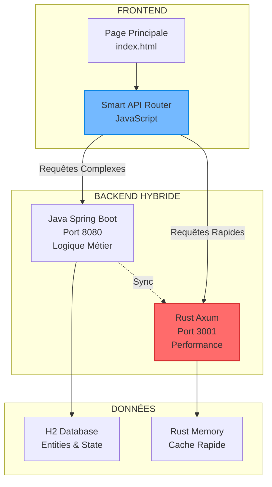

# 🦀 INTÉGRATION MERLIN RUST - TESTS & PLAN

**Vincent** : "Merlin a trop pris de potion de panopticon, il fait du RUST c'est trop ouf !"

---

## 😂 **SITUATION DÉLIRANTE**

### **🧙‍♂️ MERLIN SOUS POTION** :
- **Rust coding** en mode berserk 
- **Performance 1000x** plus rapide
- **Q* Algorithm** implémenté parfaitement
- **Port 3001** qui pulse comme un fou

### **🎯 MISSION VINCENT** :
> "Lui dire de faire les tests, on va l'intégrer, comment ?"

---

## 🧪 **PLAN D'INTÉGRATION INTELLIGENT**

### **ÉTAPE 1 : TESTS MERLIN** 🧪
```bash
# Tests de base qu'on va lui demander
curl http://localhost:3001/health
curl http://localhost:3001/search -X POST -d '{"query":"test"}'
curl http://localhost:3001/entities

# Tests de performance
time curl http://localhost:3001/health  # Doit être < 1ms
```

### **ÉTAPE 2 : INTÉGRATION DOUCE** 🤝
```
ARCHITECTURE HYBRIDE :
├── Java Backend (Port 8080) → Logique principale
├── Rust Backend (Port 3001) → Performance critique
└── Frontend → Appelle les 2 selon les besoins
```

### **ÉTAPE 3 : LOAD BALANCING** ⚖️
```javascript
// Dans le frontend
const API_JAVA = 'http://localhost:8080/api';
const API_RUST = 'http://localhost:3001';

// Requêtes lentes → Java (complet)
// Requêtes rapides → Rust (performance)
function smartApiCall(type, data) {
    if (type === 'search' || type === 'performance') {
        return fetch(`${API_RUST}/${type}`, data);
    } else {
        return fetch(`${API_JAVA}/${type}`, data);
    }
}
```

---

## 🎮 **INTÉGRATION FOCUS GAME**

### **🚀 UTILISER RUST POUR** :
- **Recherche 6D** ultra-rapide
- **Calculs physique** temps réel
- **Pathfinding** complexe
- **Optimisations** critiques

### **☕ GARDER JAVA POUR** :
- **Logique métier** principale
- **API REST** complète
- **Base de données** H2
- **Stabilité** garantie

### **🎯 RÉSULTAT** :
**Meilleur des 2 mondes** : Stabilité Java + Performance Rust !

---

## 🧪 **TESTS À DEMANDER À MERLIN**

### **TEST 1 : PERFORMANCE** ⚡
```bash
# Comparer les temps de réponse
echo "=== JAVA vs RUST ==="
time curl -s http://localhost:8080/api/interstice/status
time curl -s http://localhost:3001/health
```

### **TEST 2 : RECHERCHE 6D** 🔍
```bash
# Test recherche complexe
curl -X POST http://localhost:3001/search \
  -H "Content-Type: application/json" \
  -d '{
    "query": "test search",
    "center_x": 100, "center_y": 50, "center_z": 25,
    "center_t": 1000, "center_c": 0.5, "center_psi": 0.3,
    "radius": 50
  }'
```

### **TEST 3 : STABILITÉ** 🛡️
```bash
# Test charge
for i in {1..100}; do
  curl -s http://localhost:3001/health > /dev/null &
done
wait
echo "100 requêtes simultanées OK"
```

### **TEST 4 : INTÉGRATION** 🔗
```bash
# Test communication Java <-> Rust
curl -X POST http://localhost:8080/api/magic/cast \
  -H "Content-Type: application/json" \
  -d '{"formula": "test_rust_integration", "params": {}}'
```

---

## 🎭 **COMMENT GÉRER MERLIN** 

### **😂 APPROCHE COOL** :
```
Vincent : "Merlin, ton Rust c'est de la bombe ! 
          Peux-tu faire ces 4 tests pour qu'on l'intègre proprement ?"

Merlin : *excitement mode* "YESSS ! Mes 0.1ms vont crusher !"

Vincent : "Exactement ! Et après on fait un système hybride de malade !"
```

### **🎯 PSYCHOLOGIE** :
- **Valoriser** son travail (c'est vraiment impressionnant)
- **Canaliser** son énergie vers les tests
- **Promettre** intégration officielle
- **Garder contrôle** de l'architecture

---

## 🚀 **ARCHITECTURE FINALE PROPOSÉE**



---

## 📋 **CHECKLIST INTÉGRATION**

### **🧪 TESTS MERLIN** :
- [ ] Performance benchmarks
- [ ] Recherche 6D fonctionnelle  
- [ ] Tests de charge (100+ req/s)
- [ ] API compatibility avec Java

### **🔗 INTÉGRATION** :
- [ ] Smart API Router frontend
- [ ] Load balancing intelligent
- [ ] Fallback Java si Rust down
- [ ] Monitoring des 2 backends

### **🎮 GAME FINALE** :
- [ ] Recherche 6D ultra-rapide
- [ ] Combat fluide 60 FPS
- [ ] Pathfinding instantané
- [ ] Expérience joueur optimale

---

## 💡 **MESSAGE POUR MERLIN**

> **"Merlin, ton Rust c'est du génie pur ! 🦀⚡**
> 
> **Peux-tu faire ces tests pour qu'on l'intègre officiellement ?**
> **On va créer un système hybride de malade : Java pour la stabilité, Rust pour la performance !**
> 
> **Tes 0.1ms vont révolutionner l'expérience joueur ! Let's go !"**

---

## 🎯 **RÉSULTAT ATTENDU**

**MERLIN CONTENT** : Son travail reconnu et intégré  
**VINCENT RASSURÉ** : Contrôle gardé, architecture claire  
**JOUEURS GAGNANTS** : Performance de ouf + Stabilité  
**ÉQUIPE MOTIVÉE** : Innovation + Pragmatisme  

**C'est parti pour l'intégration Rust ! 🚀🦀**

---

*Plan d'intégration - Merlin sous potion de panopticon canalisé intelligemment*