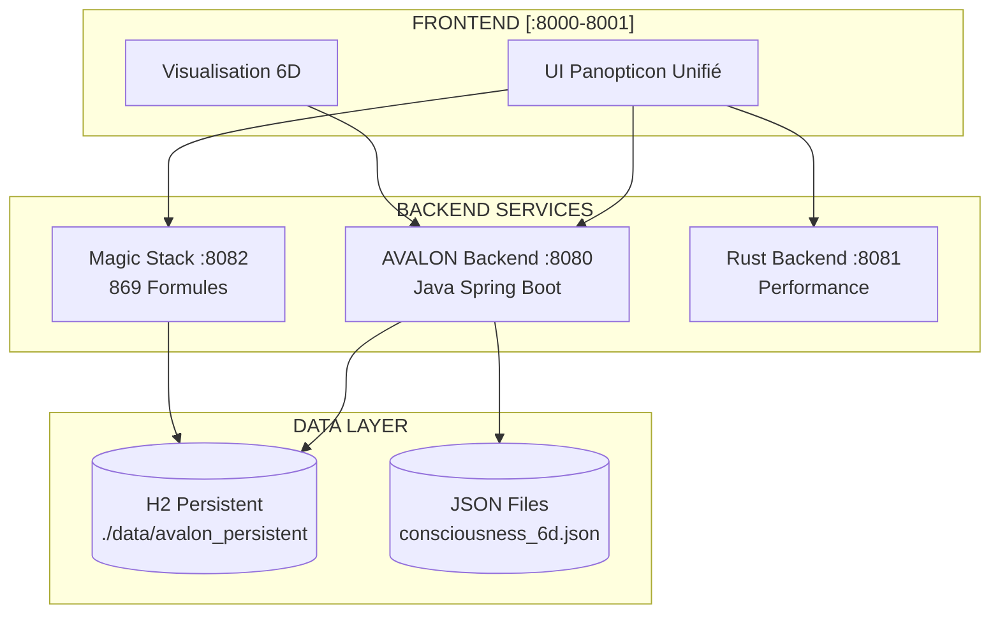
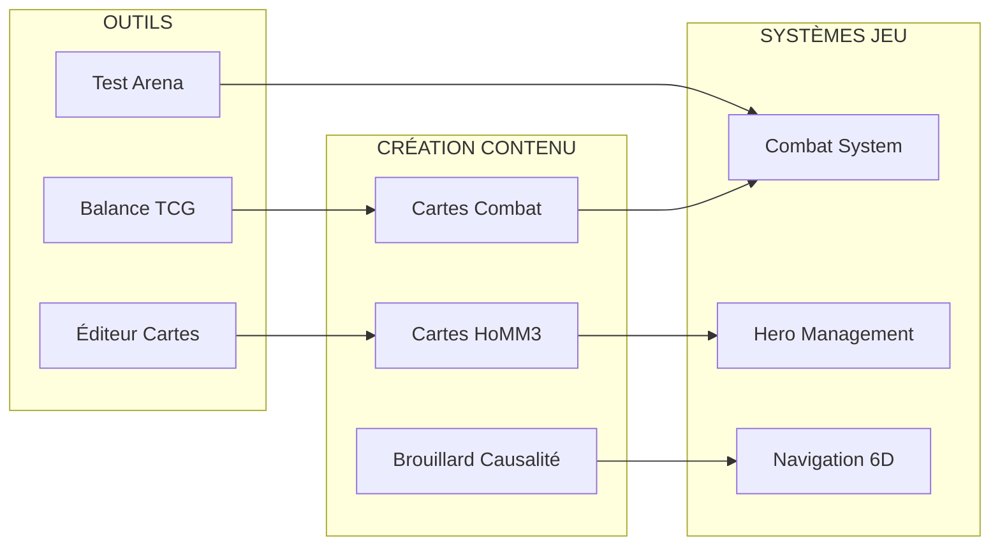
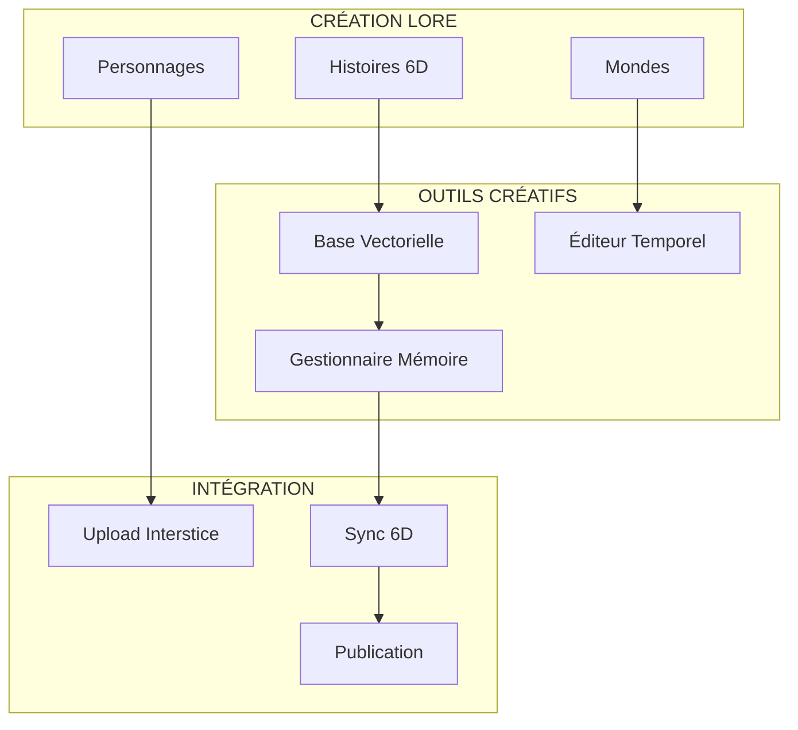

# 🏗️ ARCHITECTURE UNIFIÉE - SCHÉMAS PAR RÔLE

## 🧑‍💻 POUR LES DÉVELOPPEURS



### Endpoints Développeurs
- `POST /api/6d-consciousness/think` - Pensée 6D
- `GET /api/import/roster/export-6d` - Export CSV détaillé
- `POST /api/magic/cast` - Lancer formule
- `GET /api/interstice/status` - État système

## 🎮 POUR L'ÉQUIPE GAMEPLAY (SID MEIER)



### APIs Gameplay
- `/api/game/new` - Nouvelle partie
- `/api/combat/start` - Lancer combat TCG
- `/api/hero/move` - Déplacer héros
- `/api/map/fog-update` - Mise à jour brouillard

## 🎨 POUR LES CRÉATEURS (LUMEN/MEMENTO)



### Outils Créateurs
- Upload héros JSON
- Éditeur markdown intégré
- Visualiseur timeline
- Générateur personnages

## 🏛️ ARCHITECTURE GLOBALE SIMPLIFIÉE

```
┌─────────────────────────────────────────┐
│         JOUEURS (Navigateurs)           │
└────────────────┬────────────────────────┘
                 │
┌────────────────┴────────────────────────┐
│          FRONTEND (8000)                │
│    • UI Panopticon                      │
│    • Visualisation 6D                   │
│    • Éditeurs                          │
└────────────────┬────────────────────────┘
                 │
┌────────────────┴────────────────────────┐
│         BACKENDS (8080-8082)            │
│    • AVALON (Principal)                 │
│    • Magic Stack (Formules)             │
│    • Rust (Performance)                 │
└────────────────┬────────────────────────┘
                 │
┌────────────────┴────────────────────────┐
│          PERSISTANCE                    │
│    • H2 Database (Fichier)              │
│    • JSON (Conscience 6D)               │
│    • Git (Versioning)                  │
└─────────────────────────────────────────┘
```

## 🔐 SÉPARATION PUBLIC/PRIVÉ

### PUBLIC (Magic Stack)
- 869 formules magiques
- API documentation
- Exemples d'utilisation
- Licence open source

### PRIVÉ (AVALON/REALGAME)
- Gameplay spécifique
- Assets graphiques
- Histoires/Lore
- Système monétisation

---
*Architecture conçue pour la collaboration entre tous les rôles*