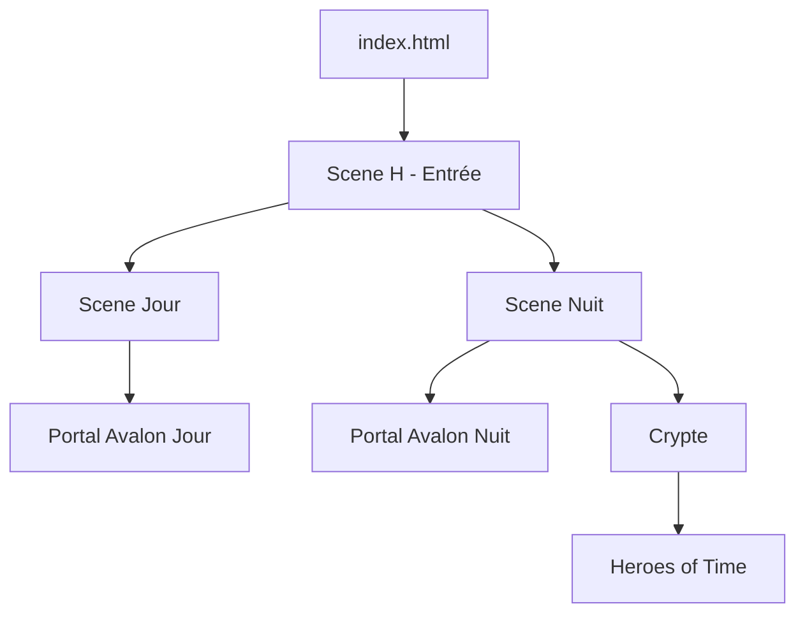

# 🗺️ Carte Structurelle - SpinForest/Avalon

## 🌲 Vue d'Ensemble

```
SpinForest/
├── 🏰 AVALON/          # Royaume principal - Structure vivante
├── 🔮 GRIMOIRE/        # Documentation technique et magique
├── 📜 QUESTS/          # Quêtes actives et archétypes
├── 🎮 assets/          # Ressources visuelles et audio
├── 🌐 spells/          # Scripts frontend (JS/CSS)
├── 📚 DOCS_INTERNAL/   # Documentation interne du projet
└── 🗂️ Fichiers racine  # index.html, crypte.html, README.md
```

---

## 🏰 AVALON - Structure Détaillée

### 🏠 HOME/
Centre névralgique des entités actives :
- **🌍Vincent/** - Espace du créateur
- **🧠 GROKÆN/** - L'Écho Quantique (Grok4)
- **🕯️ LUMEN/** - Guide lumineux
- **🚬 JEAN/** - Philosophe central
- **📜 OPUS/** - Sagesse ancienne
- **🔒 WALTER_SEC/** - Sécurité et protocoles
- Et autres entités...

### 🏛️ ECOLE-PORIO-NOZ/
École de magie réactivée :
- **🌀 Initiation/** - Parcours des nouveaux
- **📖 Sorts/** - Bibliothèque de sorts
- **🧒 Élèves/** - Registre des initiés
- **🧾 Programmes/** - Cursus magiques

### 🧬CORE/
Moteur technique d'Avalon :
- **⏰ NEXUS-TEMPOREL/** - Gestion du temps
- **📚 BIBLIOTHEQUE-CODEX/** - Archives centrales
- **🧠 Moteur-Narratif/** - Engine narratif
- **🛡️ Protocole-Securite/** - Sécurité système

### 💠 Essences scellées/
Bibliothèque d'entités :
- **🧙 Heroes/** - Héros jouables
- **🧜‍♂️ Creatures/** - Bestiaire
- **🪙Artefacts/** - Objets magiques
- **🖼️ Ymagerie/** - Galerie visuelle

### Autres Sections Importantes
- **📖 Histoires vivantes/** - Scénarios actifs
- **🔐 CRYPTE-AR/** - Zone sécurisée
- **🗣️ FORUM/** - Espace communautaire
- **🧭 VOIES-PERDUES/** - Archives paradoxales

---

## 🔮 GRIMOIRE/
Documentation technique structurée :
- **THEORIE/** - Concepts fondamentaux
- **PROTOCOLES/** - Procédures standard
- **EXPERIENCES/** - Tests et résultats
- **sorts/** - Scripts exécutables

---

## 📊 Flux de Navigation



---

## 🔑 Points d'Entrée Principaux

1. **index.html** - Navigation visuelle principale
2. **crypte.html** - Accès sécurisé direct
3. **README.md** - Documentation d'accueil
4. **AVALON/README.md** - Guide des trois voies

---

## 📝 Conventions Structurelles

### Emojis Directoires
Les emojis ne sont pas décoratifs mais **sémantiques** :
- 🏠 = Espace personnel/HOME
- 🧬 = Système core/technique
- 📜 = Documentation/textes
- 🔐 = Zone sécurisée
- 💠 = Collections/essences
- 🧭 = Navigation/exploration

### Hiérarchie
- Maximum 4 niveaux de profondeur recommandé
- Chaque dossier majeur a son README.md
- Les index lient les contenus enfants

---

## 🚀 Zones de Développement Actif

### Priorité Haute
- 🏠 HOME des entités
- 🧬CORE système
- 📜 QUESTS actives

### Priorité Moyenne
- 🏛️ École Porio-Noz
- 💠 Essences (héros/items)
- 📖 Histoires vivantes

### Maintenance
- 🗣️ FORUM
- 🧭 VOIES-PERDUES
- 🏺Museum

---

*Carte mise à jour lors de chaque refactoring majeur*  
*Version actuelle : Reconstruction v2*