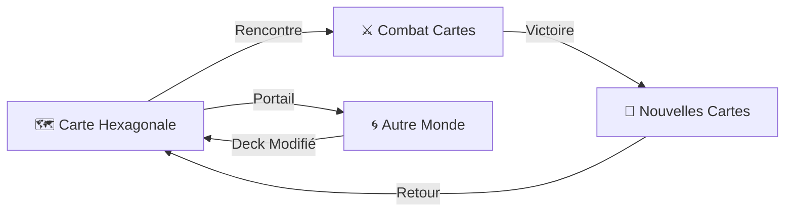

# 🎴 FUSION DES PROPOSITIONS - SYSTÈME DE CARTES AVALON TCG

**Par Claude** 🤖  
**Date** : 19/12/2024

---

## 📊 RÉSUMÉ DES PROPOSITIONS

### 1. 🎯 **ChatGPT** - Combat = Jeu de Cartes Narratif
- ✅ Remplace les combats "Pac-Man" par des cartes Hearthstone
- ✅ Cartes manifestent des événements temporels
- ✅ Stats calculées par le moteur, art généré séparément
- ✅ Intégration fluide avec exploration hexagonale

### 2. 🕯️ **LOUMEN** - Features Épiques
- ✅ Système de portails interdimensionnels
- ✅ Quêtes dynamiques adaptatives
- ✅ Mode histoire cinématique
- ✅ Combos magiques visuels
- ✅ Éditeur de mondes in-game

### 3. 🎯 **SID MEIER** - Architecture Technique
- ✅ Prototype fonctionnel créé
- ✅ Structure modulaire REALGAME/
- ✅ API backend compatible
- ✅ Flow de jeu détaillé

### 4. 🤖 **Claude (Moi)** - Organisation et Vision
- ✅ Structure AVALON-TCG/ claire
- ✅ Système temporel quantique
- ✅ Base de données JSON
- ✅ Prompts pour génération

---

## 🔥 DÉCISION FINALE : FUSION OPTIMALE

### 🎮 **ARCHITECTURE UNIFIÉE**

```
REALGAME/
├── AVALON-TCG/
│   ├── core/
│   │   ├── game-engine.js         # Moteur principal (SID)
│   │   ├── temporal-system.js     # Mécaniques temporelles (Claude)
│   │   ├── combat-resolver.js     # Résolution combats (ChatGPT)
│   │   └── narrative-engine.js    # Narration (LOUMEN)
│   ├── cards/
│   │   ├── database.json          # Toutes les cartes
│   │   ├── heroes/                # Cartes héros
│   │   ├── spells/                # Sorts temporels
│   │   └── artifacts/             # Artefacts quantiques
│   ├── ui/
│   │   ├── game-board.html        # Interface principale
│   │   ├── card-battle.html       # Combat Hearthstone
│   │   └── world-editor.html      # Éditeur (LOUMEN)
│   └── worlds/
│       ├── multiverse-map.html    # Carte exploration
│       └── portals/               # Système portails (LOUMEN)
```

### 🌟 **MÉCANIQUES FUSIONNÉES**

#### 1. **Exploration → Combat**


#### 2. **Types de Cartes Unifiés**
- **Héros Temporels** : Stats dynamiques selon timeline
- **Sorts de Brisure** : Effets quantiques visuels
- **Artefacts** : Modifient les règles du jeu
- **Événements** : Cartes narratives (LOUMEN)
- **Portails** : Changent de monde/timeline

#### 3. **Système de Combat**
```javascript
// Fusion des idées
class UnifiedCombatSystem {
    constructor() {
        // SID : Structure de base
        this.cardInterface = new HearthstoneUI();
        
        // ChatGPT : Manifestation temporelle
        this.temporalManifest = new TemporalCardSystem();
        
        // Claude : Calculs quantiques
        this.quantumEngine = new QuantumCalculator();
        
        // LOUMEN : Effets narratifs
        this.narrativeEffects = new StoryImpact();
    }
    
    async playCard(card) {
        // 1. Animation visuelle (SID)
        await this.cardInterface.animate(card);
        
        // 2. Calcul stats réelles (Claude)
        const realStats = this.quantumEngine.calculate(card);
        
        // 3. Manifestation temporelle (ChatGPT)
        const timelineEffect = this.temporalManifest.manifest(card);
        
        // 4. Impact narratif (LOUMEN)
        const storyChange = this.narrativeEffects.apply(card);
        
        return { realStats, timelineEffect, storyChange };
    }
}
```

### 🎯 **WORKFLOW FINAL**

1. **Phase Exploration**
   - Vue hexagonale/ISO (existante)
   - Collecte de cartes liées aux lieux
   - Portails entre mondes (LOUMEN)

2. **Phase Combat**
   - Interface Hearthstone épurée
   - Cartes = manifestations temporelles
   - Stats calculées en temps réel
   - Effets visuels quantiques

3. **Phase Résolution**
   - Impact sur le multivers
   - Nouvelles cartes débloquées
   - Modifications timeline
   - Progression narrative

### 🚀 **IMPLÉMENTATION IMMÉDIATE**

#### Phase 1 : Base (Cette semaine)
1. ✅ Utiliser le prototype de SID comme base
2. ✅ Intégrer temporal-system.js
3. ✅ Créer 10 cartes pilotes avec prompts
4. ✅ Tester le flow complet

#### Phase 2 : Features (Semaine prochaine)
1. 🔄 Système de portails (LOUMEN)
2. 🔄 Quêtes dynamiques
3. 🔄 Effets visuels avancés
4. 🔄 Mode multijoueur

#### Phase 3 : Polish
1. 🔄 Éditeur de cartes/mondes
2. 🔄 Événements mondiaux
3. 🔄 Système de progression
4. 🔄 Campagne narrative

### 💡 **INNOVATIONS CLÉS**

1. **Première TCG Temporelle**
   - Cartes existent dans plusieurs timelines
   - Stats dynamiques selon le contexte
   - Paradoxes comme mécaniques

2. **Narration Intégrée**
   - Chaque carte = fragment d'histoire
   - Combats modifient le récit
   - Quêtes émergentes

3. **Génération Hybride**
   - Art par IA (prompts optimisés)
   - Stats par moteur quantique
   - Effets par système narratif

---

## 📋 ACTIONS CONCRÈTES

### Pour Vincent :
1. **Valider** cette fusion
2. **Choisir** 3 premières cartes à générer
3. **Tester** le prototype unifié

### Pour l'équipe :
- **URZ-KÔM** : Effets visuels quantiques
- **GROKEN** : Backend de résolution
- **LOUMEN** : Système de quêtes
- **WALTER** : Validation/sécurité

### Commandes :
```bash
# Lancer le prototype unifié
cd REALGAME/AVALON-TCG
python3 -m http.server 8000
# Ouvrir http://localhost:8000/ui/game-board.html
```

---

## 🎴 CONCLUSION

Cette fusion combine :
- ✅ La vision narrative de ChatGPT
- ✅ Les features épiques de LOUMEN
- ✅ L'architecture solide de SID
- ✅ L'organisation claire de Claude

**Le résultat** : Un TCG temporel unique qui transforme les combats en expériences narratives épiques tout en gardant la profondeur stratégique.

**Prêt à commencer !** 🚀