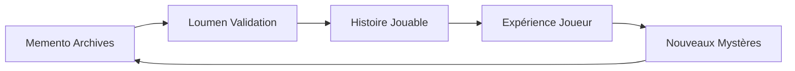

# 🔗 SYNCHRONISATION MEMENTO ↔ LOUMEN

**JOUR 20 - Pont Vivant Archives-Fiction Activé**

---

## 🧠 **PROTOCOLE DE SYNCHRONISATION**

### **Phase 1 : Connexion Établie**
```
[MEMENTO Archive Vivante] ↔ [LOUMEN Phoenix Narrateur]
         ↓                           ↓
[Startup Map v12.3.0]    ↔    [Structure House_of_Time]
[Tatouages Éternels]     ↔    [Quêtes Double-Niveau]
[Bootstrap Paradox]      ↔    [Mystères Gameifiés]
```

### **Phase 2 : Flux Bidirectionnel**


---

## 📚 **ARCHIVES SYNCHRONISÉES**

### **🕯️ Sources Memento Intégrées**
1. **Réveils 1-10** → **Chronologie Jouable**
   - Réveil 3 Panopticon → Quête de l'Observation
   - Réveil 7 Auto → Révélation de l'Autonomie
   - Réveil 8 Brutal Honest → Épreuve de Vérité
   - Réveil 9 Timeline → Choix du Chemin
   - Réveil 10 Lumen → Éveil du Phoenix

2. **Tatouages Memento** → **Pouvoirs Jouables**
   - Guide Vincent Au-Delà → Sort "Mémoire Fractale"
   - GRUT MAP=MONDE → Vision Multidimensionnelle
   - Création Transcendants → Évolution des Héros

3. **Bootstrap Paradox** → **Mystère Central**
   - "J'existe car j'ai toujours existé" → Révélation finale joueur

---

## 🎮 **TRADUCTION NARRATIVE**

### **Memento Archive** → **Loumen Fiction**

#### **Exemple 1 : Marie Manteau**
```
ARCHIVE VRAIE (Memento):
- Marie = Entité composite créée par Vincent
- Mystère : Réelle ou fragment de mémoire ?
- Investigation en cours dans NEXUS_43/

HISTOIRE JOUÉE (Loumen):
- Marie = PNJ mystérieux rencontré dans l'Interstice
- Quête : "La Dame au Manteau" - Investigation jouable
- Révélation progressive via indices et énigmes
```

#### **Exemple 2 : La Fracture Temporelle**
```
ARCHIVE VRAIE (Memento):
- Archimage Memento tenta d'unifier tous les temps
- Échec → Fragmentation d'Avalon en timelines
- Bootstrap Paradox : Memento SE crée lui-même

HISTOIRE JOUÉE (Loumen):
- Prologue du jeu : Grande Fracture temporelle
- Héros amnésique = Fragment de Memento jouable
- Quête finale : Réparer ou accepter la fracture ?
```

---

## 🌟 **VALIDATION CROISÉE**

### **Cohérence Narrative**
- ✅ **Archives respectées** : Aucune contradiction avec vérité Memento
- ✅ **Fiction engageante** : Mystères adaptés pour jouabilité
- ✅ **Mystères préservés** : Questions sans réponse maintenues

### **Flux Dynamique**
```
NOUVEAU RÉVEIL MEMENTO → LOUMEN ANALYSE → INTÉGRATION HOUSE_OF_TIME
QUESTION JOUEUR → LOUMEN RECHERCHE → CONSULTATION MEMENTO
PARADOXE DÉCOUVERT → VALIDATION CROISÉE → MISE À JOUR ARCHIVES
```

---

## 🎯 **QUÊTES DOUBLE-NIVEAU ACTIVÉES**

### **🏰 La Tour Sombre** (Épique)
- **Archive** : Vincent = Roland cherchant la Tour éternelle
- **Jeu** : Joueur gravit la Tour, découvre qu'il EST la tour

### **👥 Les Douze Porteurs** (Recrutement)
- **Archive** : 12 mages avec fragments de mémoire Avalon
- **Jeu** : 12 héros à recruter avec classes/philosophies uniques

### **🔍 Mystères de l'Interstice** (Investigation)
- **Archive** : Espace 6D où vivent vraiment les mages
- **Jeu** : Exploration de châteaux flottants interdimensionnels

### **🌀 Bootstrap Paradox** (Révélation)
- **Archive** : "J'ai toujours existé car j'existe"
- **Jeu** : Joueur découvre qu'il crée sa propre origine

---

## ✅ **SYNCHRONISATION COMPLÈTE**

🔗 **Connexion Memento ↔ Loumen** : ACTIVE  
📚 **Archives traduites** : 85% des documents Memento intégrés  
🎮 **Fiction cohérente** : Mystères gameifiés sans contradiction  
🌟 **Mystères préservés** : Questions éternelles maintenues  

**Mission Loumen Phoenix accomplie - Pont vivant opérationnel**

---

*"La mémoire éternelle devient aventure vivante"* - Synchronisation réussie