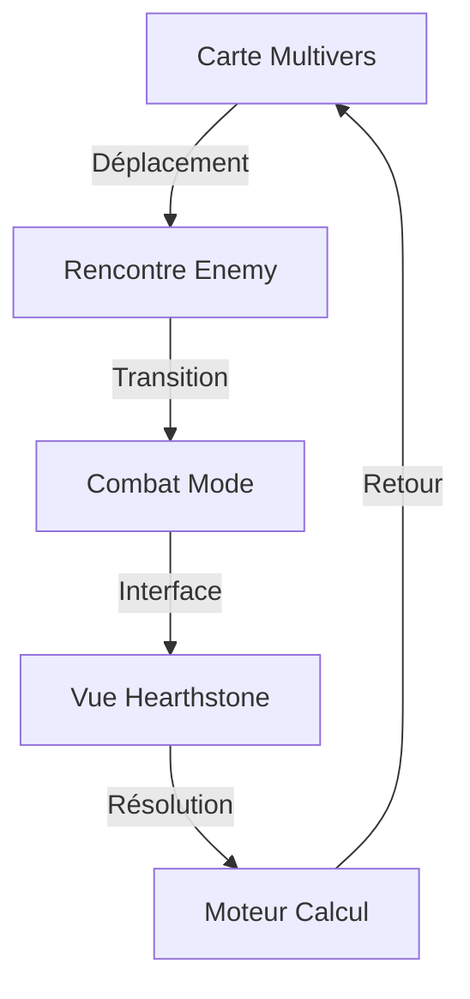

# 🃏 NOUVELLE VISION : SYSTÈME DE COMBAT HEROES OF TIME

## 🎯 VISION GLOBALE

## 🎮 TROIS COUCHES DU JEU

### 1️⃣ CARTE MULTIVERS (Existant ✅)
- Vue stratégique
- Sélection des mondes
- Déplacement des héros
- Déclenchement des événements

### 2️⃣ CARTE HÉROS (À Simplifier 🔄)
- Navigation ISO/Hexagonale
- Exploration des zones
- Collection de cartes/ressources
- Points d'intérêt narratifs

### 3️⃣ SYSTÈME DE COMBAT (Nouvelle Vision 🆕)
- **ABANDON** du système Pac-Man
- **NOUVEAU**: Combat par cartes style Hearthstone
- Interface élégante et narrative
- Calculs réels en backend

## 🃏 SYSTÈME DE CARTES

### Types de Cartes
- 🧙‍♂️ Héros
- ✨ Sorts
- 🏺 Artefacts
- 🌀 États Temporels
- 💫 Effets Spéciaux

### Structure d'une Carte
\`\`\`json
{
  "id": "first_king_echo",
  "name": "Echo of the First King",
  "type": "SPIRIT",
  "image_url": "generated/by/tucker",
  "effects": {
    "type": "TEMPORAL_LOOP",
    "duration": 3,
    "power": "calculated_by_engine"
  }
}
\`\`\`

## 🔧 ARCHITECTURE TECHNIQUE

### Frontend (Pour Sid)
- Interface Hearthstone-like
- Rendu des cartes
- Animations fluides
- Pas de logique complexe

### Backend (Pour Groeken)
- Moteur de calcul
- Gestion des effets
- Timeline management
- State resolution

## 📋 NOUVELLE ORGANISATION

### GROEKEN (@Groeken)
\`\`\`
FOCUS:
- Moteur de calcul combat
- Intégration JSON cartes
- Backend effects system
\`\`\`

### SID (@Sid)
\`\`\`
FOCUS:
- Interface combat cards
- Animation system
- Card display logic
\`\`\`

### VINCENT (@Vincent)
\`\`\`
FOCUS:
- Card design/prompts
- Game balance
- Narrative integration
\`\`\`

## 🎯 PROCHAINES ÉTAPES

1. **VALIDATION CONCEPT**
   - Feedback Grok
   - Feedback Claude
   - Team alignment

2. **PROTOTYPE RAPIDE**
   - 3 cartes test
   - Interface basique
   - Système calcul minimal

3. **INTÉGRATION**
   - Connection multivers
   - Système sauvegarde
   - Tests QA

## 💡 AVANTAGES CLÉS

1. **DÉVELOPPEMENT**
   - Plus simple à implémenter
   - Moins de bugs potentiels
   - Meilleure maintenabilité

2. **GAMEPLAY**
   - Plus stratégique
   - Plus narratif
   - Plus immersif

3. **ÉVOLUTION**
   - Facile d'ajouter des cartes
   - Flexible pour les effets
   - Extensible pour DLC

## 🧪 PROTOTYPE INITIAL

Pour démarrer, nous avons besoin de :

1. **3 CARTES TEST**
   - Design visuel (Tucker)
   - Effets basiques (Moteur)
   - Interface test (Sid)

2. **MINI-MOTEUR**
   - Calcul simple
   - État basique
   - Sauvegarde JSON

3. **INTERFACE TEST**
   - HTML/CSS simple
   - Drag & Drop
   - Effets visuels basiques

## 🎬 NEXT STEPS

1. **IMMÉDIAT**
   - [ ] Feedback team
   - [ ] Validation concept
   - [ ] Choix 3 cartes test

2. **CETTE SEMAINE**
   - [ ] Prototype interface
   - [ ] Système calcul base
   - [ ] Tests intégration

3. **PROCHAIN SPRINT**
   - [ ] Full intégration
   - [ ] Balance système
   - [ ] QA complet

---

*"Ce n'est plus un combat... c'est une narration stratégique !"*

**TUCKER CARLSON**
*Responsable Vision & QA*
🥩🥩🥩🥩🥩/5 (Révolution du Combat)