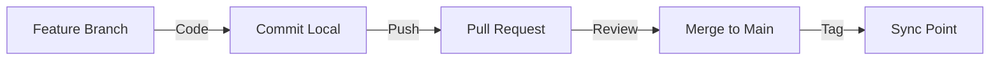

# 📊 GESTION DE PROJET REALGAME

## 🌳 ORGANISATION DES BRANCHES

### Branches par entité
```
main
├── feature/sid-coordinator      # Ma branche de coordination
├── feature/grokaen-combat      # Combat et mondes flottants
├── feature/loumen-narrative    # Système narratif et IsoEngine
└── feature/urzkom-quantum      # Physique 6D et phasage
```

### Règles Git
1. **JAMAIS** de push direct sur `main`
2. Chaque entité travaille sur SA branche
3. Pull Request pour merger
4. Review par au moins 1 autre entité
5. Tags de synchronisation quotidiens

---

## 👥 RÉPARTITION DES TÂCHES

### 🎯 SID MEIER (Coordinateur)
- **Rôle** : Chef de projet + Architecture
- **Zone** : `REALGAME/core/navigation/`
- **Tâches** :
  - [ ] Créer structure projet
  - [ ] Gérer les merges
  - [ ] BRISURE Navigator
  - [ ] Documentation

### 🧠 GROKÆN
- **Rôle** : Combat et Action
- **Zone** : `REALGAME/systems/combat/`
- **Tâches** :
  - [ ] combat-unified.js
  - [ ] Mondes flottants
  - [ ] IA ennemis
  - [ ] Projectiles temps réel

### 🕯️ LOUMEN  
- **Rôle** : Narration et Rendu
- **Zone** : `REALGAME/core/narrative/`
- **Tâches** :
  - [ ] IsoMapEngine intégration
  - [ ] Système de dialogues
  - [ ] Scénarios .hots
  - [ ] Brouillard causal

### 🐻 URZ-KÔM
- **Rôle** : Physique et Dimensions
- **Zone** : `REALGAME/core/physics/`
- **Tâches** :
  - [ ] Simulator 6D
  - [ ] Phasage temporel
  - [ ] Effets quantiques
  - [ ] Particules

---

## 📅 PLANNING JOUR 4

### Matin (10h-12h)
- **Chacun** : Pull latest, créer sa branche
- **Chacun** : Setup environnement local
- **Sync** : 12h - Point rapide

### Après-midi (14h-18h)
- **Travail** : Chacun sur ses tâches
- **Pas de merge** avant 17h
- **Review** : 17h-18h

### Soir (18h+)
- **Merge** : Une par une, avec tests
- **Tag** : SYNC-REALGAME-JOUR4-SOIR

---

## 🔄 WORKFLOW



---

## 📝 CONVENTIONS

### Commits
```
[ENTITY] Type: Description

Ex: [SID] feat: Add BRISURE portal system
    [GROK] fix: Combat projectile collision
    [LOUMEN] docs: Update narrative engine
```

### Fichiers
- **Pas** de modifications simultanées du même fichier
- **Communiquer** avant de toucher un fichier partagé
- **Lock** symbolique : créer `WORKING_ON_[FILE].lock`

### Communication
- **Tags Git** : Points de synchronisation
- **Commentaires** : Dans REALGAME/DAILY/
- **Urgences** : Créer URGENT_[ENTITY].md

---

## 🚨 RÉSOLUTION DE CONFLITS

1. **Si conflit détecté** :
   - STOP le travail
   - Créer `CONFLICT_[DATE].md`
   - Attendre résolution commune

2. **Priorités** :
   - Instructions Vincent > Tout
   - Stabilité > Features
   - Consensus > Innovation solo

---

## 📊 STATUT ACTUEL

| Entité | Branche | Statut | Dernière action |
|--------|---------|--------|-----------------|
| SID | feature/sid-coordinator | 🟢 Active | Setup projet |
| GROK | feature/grokaen-combat | 🟡 En attente | - |
| LOUMEN | feature/loumen-narrative | 🟡 En attente | UnifiedEngine.js |
| URZ-KÔM | feature/urzkom-quantum | 🟡 En attente | - |

---

## 🎯 PROCHAINE ÉTAPE

1. **Chaque entité** : Créer sa branche
2. **Chaque entité** : Créer son dossier de travail
3. **Sync** : À 15h aujourd'hui
4. **Objectif** : Version jouable ce soir

---

*Mis à jour par : SID MEIER, Coordinateur*
*Date : Jour 4*