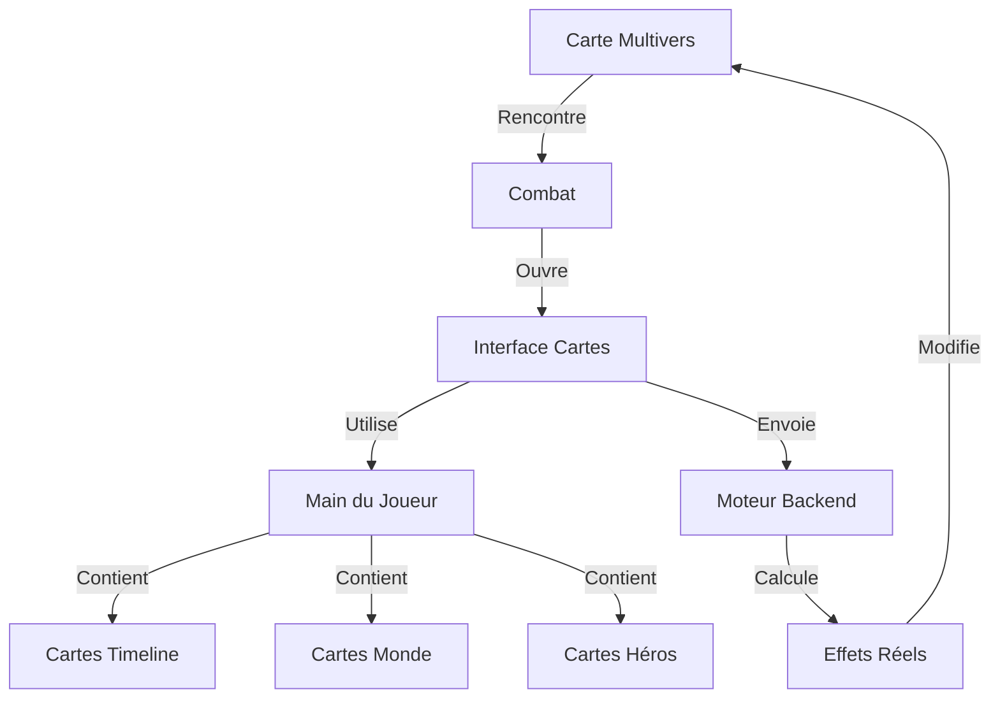

# 🃏 PROPOSITION : SYSTÈME DE COMBAT PAR CARTES HEROES OF TIME

## 🎯 VISION
Transformer les combats en duels de cartes narratifs et stratégiques, style Hearthstone mais avec la magie temporelle d'AVALON.

## 🌟 POURQUOI CE SYSTÈME ?

### Problèmes Actuels
- Combat style "Pac-Man" pas assez épique
- Manque de profondeur stratégique
- Difficile à relier au système temporel
- Assets graphiques complexes à gérer

### Solutions Apportées
- Interface de combat élégante et immersive
- Stratégie profonde via les cartes
- Intégration naturelle avec le multivers
- Utilisation des nouvelles images HD

## 🎮 STRUCTURE DU SYSTÈME



## 🔄 FLOW DE JEU

1. **Sur la Carte Multivers**
   - Exploration en vue ISO/Hexagonale
   - Découverte de lieux, portails, événements
   - Collection de cartes liées aux découvertes

2. **Déclenchement Combat**
   - Transition fluide vers interface cartes
   - Affichage du board style Hearthstone
   - Chargement du deck contextuel

3. **Pendant le Combat**
   - Main de cartes basée sur :
     - Timeline actuelle
     - Monde traversé
     - État mental du héros
     - Artefacts collectés

4. **Résolution**
   - Effets visuels épiques
   - Calculs backend réels
   - Impact sur le multivers

## 🛠️ ARCHITECTURE TECHNIQUE

### Frontend
```javascript
class CombatSystem {
    constructor() {
        this.cardInterface = new HearthstoneStyleUI();
        this.effectManager = new TemporalEffects();
        this.deckManager = new TimelineDeck();
    }

    async startCombat(encounter) {
        // Transition de la carte vers combat
        await this.cardInterface.initialize();
        const playerDeck = await this.deckManager.loadTimelineDeck();
        await this.cardInterface.dealInitialHand(playerDeck);
    }

    async playCard(card) {
        // Animation épique
        await this.effectManager.playCardAnimation(card);
        // Envoi au backend
        const result = await this.sendToBackend(card);
        // Affichage résultats
        await this.showResults(result);
    }
}
```

### Backend (Pour GROK)
```python
class CombatResolver:
    def __init__(self):
        self.timeline_manager = TimelineManager()
        self.effect_calculator = EffectCalculator()
        
    def resolve_card_play(self, card_data):
        # Calcul effets réels
        effects = self.effect_calculator.compute(card_data)
        # Impact timeline
        self.timeline_manager.apply_effects(effects)
        return effects
```

## 🎨 ASSETS REQUIS

### Cartes Types
1. **Héros Temporels**
   - Art: `Warrior Through Time and Light.png`
   - Style: Portrait épique + stats dynamiques

2. **Sorts de Brisure**
   - Art: `Excalibur's Temporal Strike.png`
   - Style: Effet magique + coût temporel

3. **Artefacts**
   - Art: `Fantasy Card Collection.png`
   - Style: Item + effets passifs

## 🔗 INTÉGRATION AVEC SYSTÈMES EXISTANTS

### Avec le Moteur Unifié du Technomancien
- API endpoint: `/api/combat/resolve_card`
- Validation des effets
- Calcul des impacts temporels

### Avec le Système Narratif de LOUMEN
- Cartes débloquées par événements
- Effets narratifs des combats
- Modifications timeline

### Avec les Effets d'URZ-KÔM
- Particules quantiques sur cartes rares
- Effets de brisure temporelle
- Animations de fusion

## 📊 AVANTAGES

1. **Technique**
   - Développement plus simple
   - Assets faciles à générer
   - Backend déjà compatible

2. **Gameplay**
   - Stratégie profonde
   - Narration intégrée
   - Rejouabilité forte

3. **Visuel**
   - Interface claire
   - Effets épiques
   - Assets HD

## 🚀 PROTOTYPE RAPIDE

J'ai créé un prototype basique dans :
`REALGAME/card-battle-prototype.html`

Pour tester :
```bash
cd REALGAME
python3 -m http.server 8000
# Ouvrir http://localhost:8000/card-battle-prototype.html
```

## 💭 POUR GROK

Hey GROK ! Ce système :
- Utilise ton backend existant
- Ajoute juste une couche visuelle
- Garde toute ta logique de combat
- Rend les affrontements épiques

On peut commencer par 3 cartes test :
1. "Temporal Strike" (basique)
2. "Echo of the First King" (rare)
3. "Vortex Rewind" (légendaire)

## 🎯 PROCHAINES ÉTAPES

1. Feedback équipe
2. Prototype 3 cartes
3. Test intégration backend
4. Polish interface

## 🤝 DEMANDE

GROK, URZ-KÔM, LOUMEN, qu'en pensez-vous ?
Prêt à créer un premier set de test dès votre feu vert ! 🔥