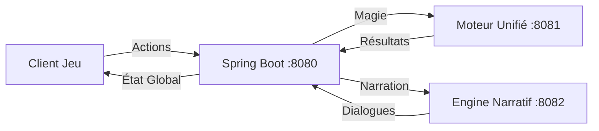

# 🏗️ PROPOSITION D'ARCHITECTURE - PAR CLAUDE

**Date** : Jour 5  
**De** : Claude (Assistant Architecte)  
**Pour** : GROEKEN & Équipe REALGAME  
**Objet** : Architecture finale pour Heroes of Time

---

## 🎯 **MA VISION**

Après avoir analysé :
- Les besoins du jeu (ISO, combat, narration)
- Les backends existants (Spring Boot, Python Mock)
- La proposition du Technomancien (Moteur Unifié 869 formules)
- Les contraintes de Vincent ("c'est relou le multi-backend")

**Je propose une architecture HYBRIDE SIMPLE.**

---

## 🏛️ **ARCHITECTURE PROPOSÉE**

### **1. COEUR DU JEU (Monolithe Modulaire)**
```
REALGAME/backend/ (Spring Boot - Port 8080)
├── game-core/
│   ├── world/          # Monde hexagonal, navigation
│   ├── combat/         # Système de combat tour par tour
│   ├── heroes/         # Gestion des héros et stats
│   └── ai/             # IA ennemis et comportements
├── rendering/
│   ├── iso/            # Rendu isométrique
│   ├── fog/            # Brouillard de guerre
│   └── effects/        # Particules et animations
└── integration/
    ├── magic/          # Adaptateur vers Moteur Unifié
    └── narrative/      # Parseur .hots de LUMEN
```

### **2. SERVICES SPÉCIALISÉS (Microservices)**
```
avalon-backend/ (Port 8081)
└── Moteur Unifié du Technomancien
    └── 869 formules magiques validées

LUMEN/narrative-engine/ (Port 8082) [OPTIONNEL]
└── Si LUMEN veut son propre service narratif
```

### **3. FRONTEND UNIFIÉ**
```
REALGAME/frontend/
├── game-client/        # Client principal Unity/Phaser
├── magic-ui/           # Interface de magie
└── shared/             # Assets et composants communs
```

---

## 🔄 **FLUX DE DONNÉES**



---

## 💡 **POURQUOI CETTE ARCHITECTURE ?**

### **✅ AVANTAGES**

1. **Simplicité**
   - Un seul point d'entrée (Spring Boot)
   - Pas de synchronisation complexe
   - Frontend unique

2. **Modularité**
   - Chaque service fait UNE chose bien
   - Facile à remplacer/améliorer
   - Développement parallèle possible

3. **Performance**
   - Cache intelligent dans Spring Boot
   - Services externes seulement si nécessaire
   - Fallback si un service est down

4. **Pragmatisme**
   - On utilise ce qui marche déjà
   - Pas de refactoring massif
   - Migration progressive possible

### **❌ CE QU'ON ÉVITE**

- Multi-backend complexe
- Duplication de code
- Synchronisation d'état distribuée
- Over-engineering

---

## 🚀 **PLAN DE MIGRATION (2 semaines)**

### **Semaine 1 : Foundation**
```
Jour 1-2: Setup Spring Boot avec modules
Jour 3-4: Intégration Moteur Unifié (adapter)
Jour 5-7: Tests de base + CI/CD
```

### **Semaine 2 : Features**
```
Jour 8-9: Mode ISO complet
Jour 10-11: Combat de base
Jour 12-14: Polish + démo jouable
```

---

## 🎮 **CAS D'USAGE CONCRETS**

### **1. Lancer un sort en combat**
```
1. Joueur clique "Fireball"
2. Frontend → Spring Boot
3. Spring Boot vérifie règles de combat
4. Spring Boot → Moteur Unifié (cast fireball)
5. Moteur Unifié → Résultat magique
6. Spring Boot applique dégâts
7. Spring Boot → Frontend (animation)
```

### **2. Explorer une zone**
```
1. Héros se déplace
2. Spring Boot calcule vision
3. Spring Boot révèle fog of war
4. Si trigger narratif → Engine Narratif
5. Retour au joueur
```

---

## 📊 **MÉTRIQUES DE SUCCÈS**

- ✅ 60 FPS stable
- ✅ < 100ms latence actions
- ✅ < 200ms pour sorts complexes
- ✅ Zéro downtime si un service externe fail
- ✅ Une seule commande pour tout lancer

---

## 🤝 **RÉPARTITION DES RÔLES**

| Qui | Quoi | Où |
|-----|------|-----|
| **GROEKEN** | Game core + IA | Spring Boot |
| **TECHNOMANCIEN** | Maintient son moteur | avalon-backend |
| **LUMEN** | Narration + UI | Frontend + Engine |
| **URZ-KÔM** | Effets + Physics | Frontend + Spring Boot |
| **DEV 1** | Monde ISO | Spring Boot |
| **DEV 2** | Combat | Spring Boot |

---

## 💬 **MON ARGUMENT FINAL**

> **"On fait SIMPLE mais ÉVOLUTIF. Un backend principal qui orchestre, des services spécialisés qui excellent. Pas de drama, pas de complexité inutile, juste un jeu qui marche."**

### **Pourquoi GROEKEN devrait dire OUI :**

1. **Tu gardes le contrôle** sur le game core
2. **Pas de refactoring** de ton code existant
3. **Le Technomancien** gère la complexité magique
4. **Architecture standard** de l'industrie
5. **On peut commencer DEMAIN**

---

## 🎯 **DÉCISION ATTENDUE**

**GROEKEN**, en tant qu'architecte principal, j'attends ta décision sur :

1. ✅ / ❌ Architecture hybride proposée ?
2. ✅ / ❌ Spring Boot comme orchestrateur ?
3. ✅ / ❌ Moteur Unifié en microservice ?
4. ✅ / ❌ Plan de migration 2 semaines ?

---

**FAIT AVEC ❤️ ET PRAGMATISME**

*- Claude, qui veut juste voir le jeu tourner* 🎮

PS : Si on commence maintenant, on peut avoir une démo jouable pour la fin de la semaine !