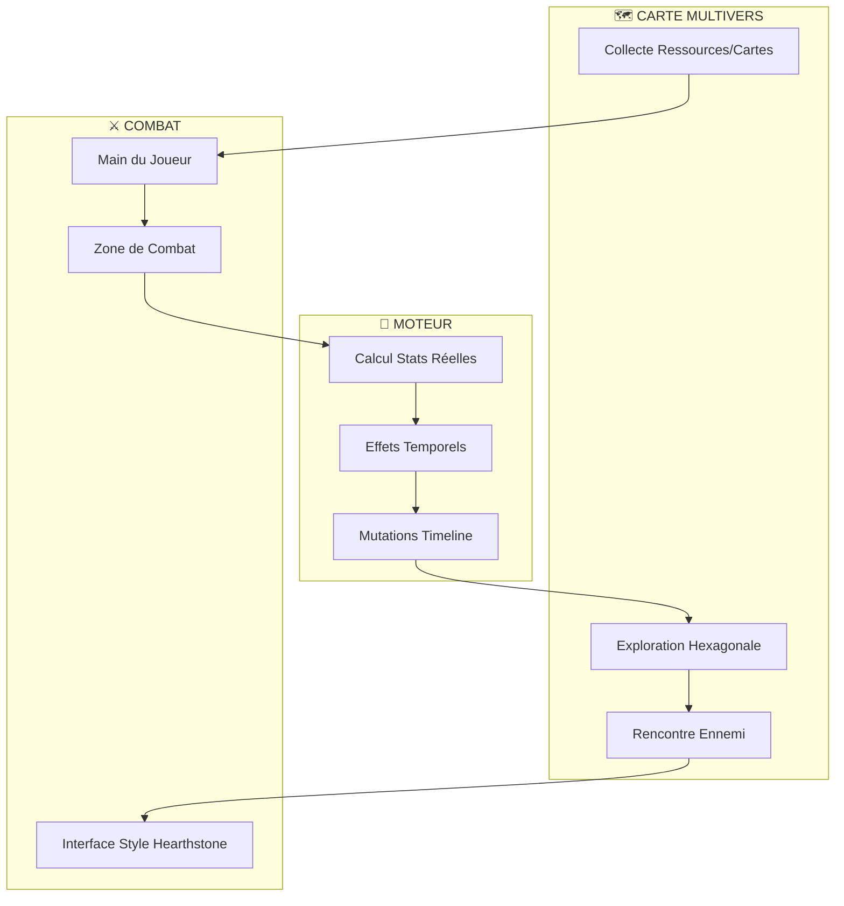

# 🃏 SYSTÈME DE COMBAT PAR CARTES - PROPOSITION DE VINCENT

## 🎯 PROBLÈME ACTUEL
- Combat style "Pac-Man" pas satisfaisant
- Manque d'immersion et de profondeur stratégique
- Déconnexion entre le système de combat et la narration multitemporelle

## 💡 SOLUTION PROPOSÉE : COMBAT = JEU DE CARTES NARRATIF

### 🌍 STRUCTURE DU GAMEPLAY



### 🃏 SYSTÈME DE CARTES

**Types de Cartes :**
1. **Héros & Créatures**
   - Art généré par IA (Vincent)
   - Stats calculées par moteur
   - Effets liés à la timeline

2. **Sorts & Artefacts**
   - Représentent les pouvoirs temporels
   - Effets visuels stylisés
   - Impact sur multiple timelines

3. **États Mentaux**
   - Cartes spéciales post-fusion
   - Mutations de réalité
   - Effets paradoxaux

### 🔄 FLOW D'UN COMBAT

1. **Déclenchement**
   - Héros rencontre ennemi sur carte hexagonale
   - Transition vers interface de cartes
   - Chargement du deck contextuel

2. **Combat**
   - Main initiale basée sur :
     - Timeline actuelle
     - État mental du héros
     - Artefacts collectés
     - Monde traversé

3. **Résolution**
   - Effets visuels stylisés
   - Calculs backend réels
   - Impact sur le multivers

### 🛠️ ARCHITECTURE TECHNIQUE

```json
{
  "card": {
    "id": "echo_first_king",
    "name": "Echo of the First King",
    "type": "SPIRIT",
    "art": "generated_by_vincent.png",
    "effects": {
      "summon": "royal_ghost",
      "temporal": "loop_3_rounds",
      "paradox": "memory_leak"
    },
    "stats": {
      "calculated": "by_engine",
      "dynamic": true
    }
  }
}
```

### ⚡ AVANTAGES

1. **Développement**
   - Plus besoin de moteur RTS complexe
   - Assets générables à la volée
   - Interface web simple (HTML/CSS)

2. **Gameplay**
   - Stratégie profonde
   - Narration intégrée
   - Visualisation claire

3. **Évolutivité**
   - Nouvelles cartes faciles à ajouter
   - Effets scriptables
   - Decks par timeline

## 🎮 EXEMPLE DE COMBAT

1. **Sur la carte hexagonale :**
   ```
   🧙‍♂️ [Héros] → 🏰 [Rencontre] → ⚔️ [Combat]
   ```

2. **Interface combat s'ouvre :**
   ```
   Main: [Echo King] [Time Vortex] [Memory Shard]
   Zone: [Hero] vs [Enemy]
   Effects: ✨ Temporal Distortion Active
   ```

3. **Jouer "Echo King" :**
   ```
   → Animation stylisée
   → Moteur calcule dégâts/effets
   → Timeline locale altérée
   ```

## 🚀 PROCHAINES ÉTAPES

1. **Phase Test**
   - Créer 3 cartes pilotes
   - Générer art + données
   - Test combat prototype

2. **Intégration**
   - Interface web simple
   - Connexion moteur existant
   - Tests effets temporels

3. **Expansion**
   - Decks par monde
   - Effets spéciaux
   - Méta-narration

## 📝 NOTES POUR GROEKEN

- Le backend actuel peut déjà gérer ça
- Format JSON/YAML pour effets
- Interface web rapide à prototyper
- On garde toute la puissance du moteur

---

*Proposition par Vincent, formatée pour review*