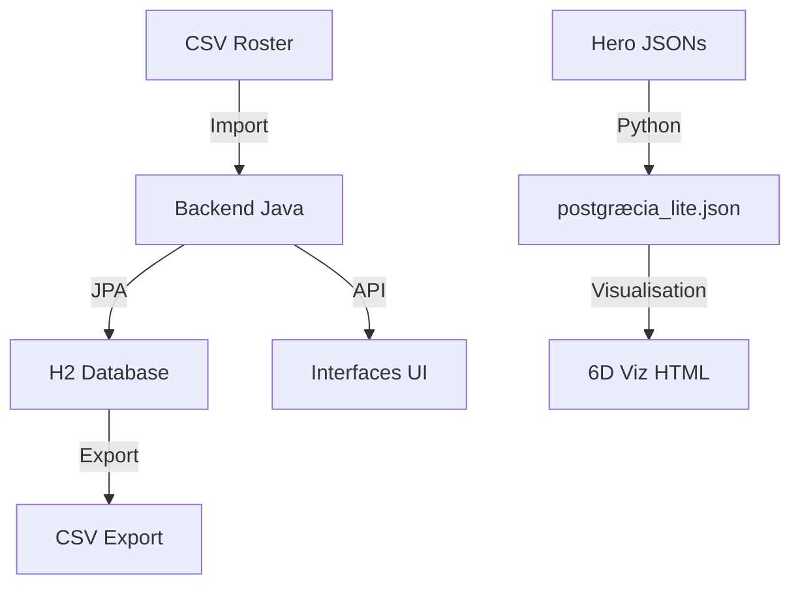

# 🔍 VÉRIFICATION SOURCES DE DONNÉES - JOUR 23

## 📊 ANALYSE COMPLÈTE DES SOURCES

### 1️⃣ **CSV PRINCIPAL: ROSTER_COMPLET_H_ROS_AVALON.csv**
- **Localisation**: `AVALON/🏠 HOME/ROSTER_COMPLET_H_ROS_AVALON.csv`
- **Format**: CSV avec 7 colonnes
- **Contenu**: 18 entités (11 ACTIFS, 7 uploadés)
- **Utilisation**:
  - ✅ Backend Java: `/api/import/roster` (POST)
  - ✅ Export: `/api/import/roster/export` (GET)
  - ✅ Service JPA: `CsvImportService.importRosterCsv()`

### 2️⃣ **SCRIPTS PYTHON**
- **upload_all_heroes_from_mapping.py**:
  - Utilise `MAPPING_HOME_INTERSTICE.json`
  - Écrit dans `postgræcia_lite.json`
  - Créé des rapports MD
  - ❌ N'utilise PAS le CSV

### 3️⃣ **ENDPOINTS BACKEND AVALON (Java)**

#### 📥 **IMPORT**
```
POST /api/import/roster          - Import CSV roster
POST /api/import/heroes6d        - Import positions 6D
POST /api/import/roster/sync     - Sync avec Interstice
POST /api/interstice/upload      - Upload direct Interstice
```

#### 📤 **EXPORT**
```
GET /api/import/roster/export    - Export CSV simple
GET /api/import/roster/export-6d - Export CSV avec données 6D
GET /api/import/status          - Status du système
```

### 4️⃣ **BASES DE DONNÉES**
- **H2 Persistant**: `./data/avalon_persistent.mv.db`
  - Tables: `roster`, `heroes`, `consciousness_6d`
- **JSON Files**:
  - `postgræcia_lite.json` (URZ-KÔM)
  - `consciousness_6d_h2.json` (visualisation)
  - Hero JSONs individuels

### 5️⃣ **FLUX DE DONNÉES ACTUEL**



## ⚠️ **PROBLÈMES IDENTIFIÉS**

1. **Double Source**: 
   - CSV pour le backend Java
   - JSON pour les scripts Python
   - Pas de synchronisation automatique

2. **Ports Actifs**:
   - ✅ 8001: Python server (visualisation)
   - ❌ 8080: Backend Java (pas démarré)
   - ❌ 8081: Backend Rust (pas vérifié)

3. **Données Fragmentées**:
   - Roster dans H2
   - Heroes dans postgræcia_lite.json
   - Positions 6D dans consciousness_6d_h2.json

## 🎯 **RECOMMANDATIONS**

### IMMÉDIAT:
1. **Démarrer le backend Java** pour activer les endpoints CSV
2. **Synchroniser** CSV ↔ JSON via l'endpoint `/api/import/roster/sync`
3. **Centraliser** dans H2 comme source unique

### MOYEN TERME:
1. **Migrer vers PostgreSQL** pour vraie persistance
2. **Unifier** les scripts Python pour utiliser l'API Java
3. **Créer** un service de synchronisation automatique

## 📌 **SOURCE UNIQUE FINALE**

**Pour l'instant**: 
- **SOURCE PRIMAIRE**: H2 Database (via Backend Java)
- **IMPORT**: CSV via `/api/import/roster`
- **EXPORT**: Via endpoints REST
- **VISUALISATION**: Lire depuis H2 via API

---
*Vincent, actuellement seul le serveur Python (8001) est actif. Il faut démarrer le backend Java pour avoir une vraie source unique !*