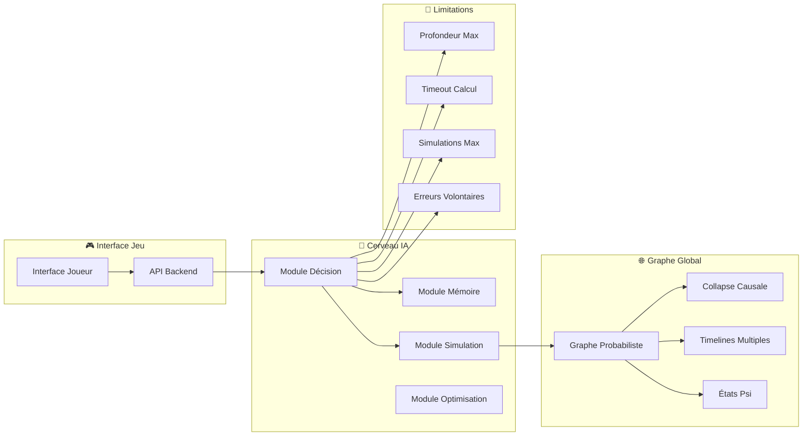
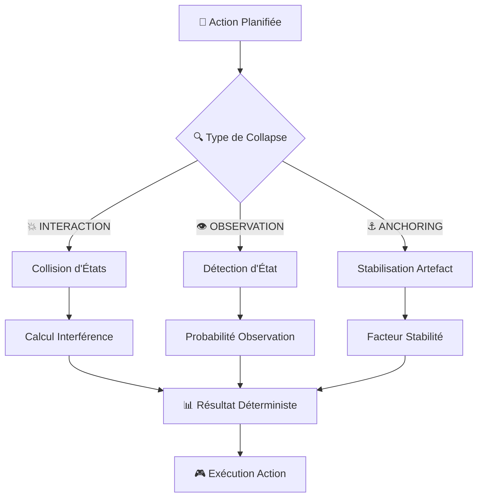
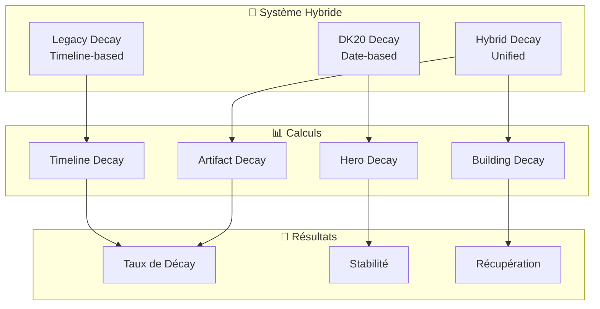
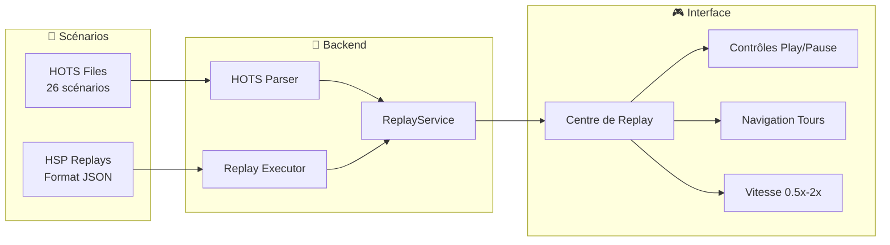
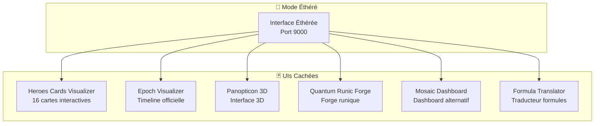
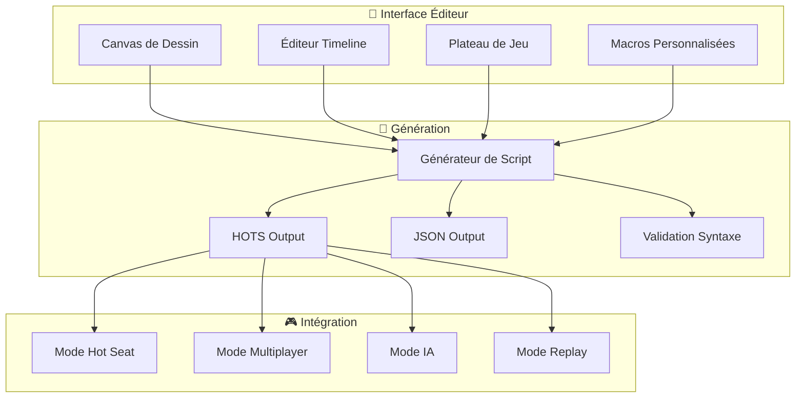
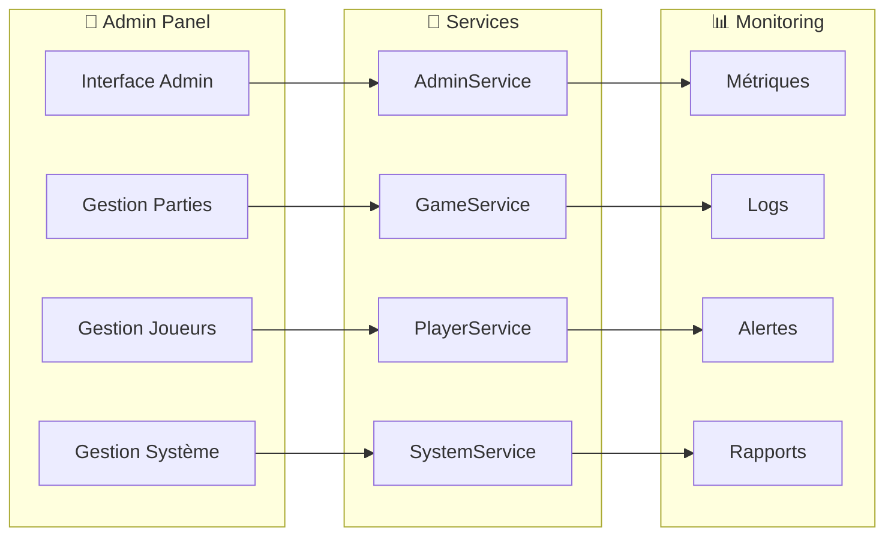
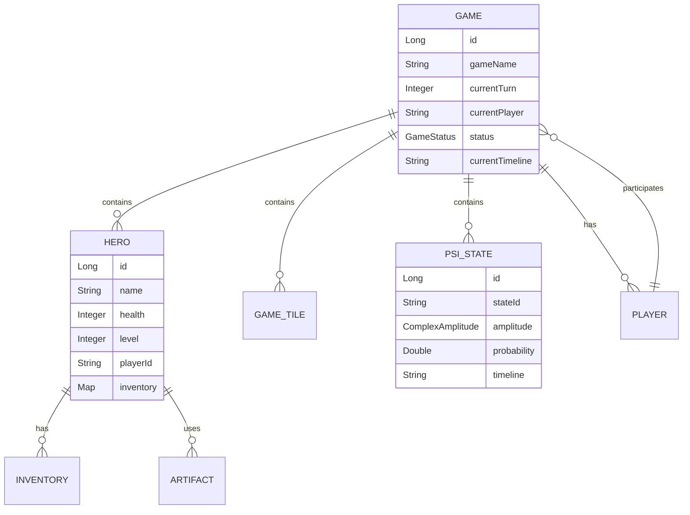
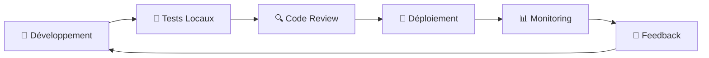

# 🏗️ **ARCHITECTURE HEROES OF TIME - VERSION COMPLÈTE**

## 🎯 **VUE D'ENSEMBLE DU SYSTÈME**

```mermaid
graph TB
    subgraph "🎮 Frontends Multiples"
        DASH[Dashboard Principal<br/>Port 9000]
        MAIN[Frontend Principal<br/>Port 8000]
        TEMP[Interface Temporelle<br/>Port 5174]
        QUANT[Quantum Visualizer<br/>Port 8001]
        COLL[Collection & Grammar<br/>Port 5175]
        TEST[Test Runner<br/>Port 8888]
        EDIT[Éditeur Visuel<br/>Port 8081]
    end
    
    subgraph "🔧 Backend Core"
        API[REST API<br/>Port 8080]
        TEMP_ENGINE[TemporalEngineService]
        AI_SERVICE[LimitedAIService]
        COLLAPSE[CausalCollapseService]
        DECAY[TemporalDecayHybridService]
        REPLAY[ReplayService]
        ADMIN[AdminService]
    end
    
    subgraph "🗄️ Base de Données"
        DB[(H2 Database)]
        GAMES[Games]
        HEROES[Heroes]
        PLAYERS[Players]
        PSI_STATES[PsiStates]
        REPLAYS[Replays]
    end
    
    subgraph "🎯 Contrôleurs"
        GAME_CTRL[GameController]
        TEMP_CTRL[TemporalController]
        AI_CTRL[LimitedAIController]
        COLLAPSE_CTRL[CausalController]
        DECAY_CTRL[TemporalDecayController]
        REPLAY_CTRL[ReplayController]
        ADMIN_CTRL[AdminController]
    end
    
    subgraph "🧠 Services Avancés"
        GROFI[GROFI System]
        QUANTUM[Quantum Mechanics]
        CAUSAL[Causality Engine]
        MEMORY[Pattern Memory]
    end
    
    DASH --> API
    MAIN --> API
    TEMP --> API
    QUANT --> API
    COLL --> API
    TEST --> API
    EDIT --> API
    
    API --> GAME_CTRL
    API --> TEMP_CTRL
    API --> AI_CTRL
    API --> COLLAPSE_CTRL
    API --> DECAY_CTRL
    API --> REPLAY_CTRL
    API --> ADMIN_CTRL
    
    GAME_CTRL --> TEMP_ENGINE
    TEMP_CTRL --> TEMP_ENGINE
    AI_CTRL --> AI_SERVICE
    COLLAPSE_CTRL --> COLLAPSE
    DECAY_CTRL --> DECAY
    REPLAY_CTRL --> REPLAY
    ADMIN_CTRL --> ADMIN
    
    TEMP_ENGINE --> DB
    AI_SERVICE --> DB
    COLLAPSE --> DB
    DECAY --> DB
    REPLAY --> DB
    ADMIN --> DB
    
    TEMP_ENGINE --> GROFI
    AI_SERVICE --> MEMORY
    COLLAPSE --> QUANTUM
    DECAY --> CAUSAL
```



---

## 🧠 **SYSTÈME IA CLAUDIUS-MEMENTO**

### **Architecture IA**



### **Niveaux de Difficulté**

| Niveau | Profondeur | Simulations | Temps (ms) | Erreurs | États Psi |
|--------|------------|-------------|------------|---------|-----------|
| **EASY** | 2 | 20 | 2000 | 25% | 10 |
| **MEDIUM** | 4 | 50 | 5000 | 15% | 20 |
| **HARD** | 6 | 100 | 8000 | 10% | 30 |
| **EXPERT** | 8 | 200 | 12000 | 5% | 50 |
| **PARADOX** | 10 | 500 | 20000 | 2% | 100 |

---

## ⚡ **SYSTÈME COLLAPSE CAUSALE**

### **Types de Collapse**



### **Calculs Quantiques**

```java
// Probabilité de collapse INTERACTION
P(INTERACTION) = Σ(ψi * ψj) pour tous les états superposés

// Probabilité de collapse OBSERVATION  
P(OBSERVATION) = |ψ|² pour l'état le plus probable

// Probabilité de collapse ANCHORING
P(ANCHORING) = Σ(artifacts * stability_factor)
```

---

## 🕰️ **SYSTÈME TEMPORAL DECAY HYBRIDE**

### **Architecture Unifiée**



### **Formules de Décay**

```java
// Décay Timeline (Legacy)
decay_rate = base_rate * timeline_factor * temporal_energy

// Décay Hero (DK20)
hero_decay = hero_level * time_factor * activity_penalty

// Décay Hybride
hybrid_decay = (legacy_decay + dk20_decay) / 2 * stability_factor
```

---

## 🎬 **CENTRE DE REPLAY**

### **Architecture Replay**



### **Format HSP (Heroes Scenario Playback)**

```json
{
  "metadata": {
    "scenario": "jean_vs_claudius_epic",
    "duration": "25 minutes",
    "players": ["Jean-Grofignon", "Claudius"],
    "turns": 150
  },
  "turns": [
    {
      "turn": 1,
      "actions": [
        {
          "hero": "Jean-Grofignon",
          "action": "MOV",
          "target": "@15,15",
          "timestamp": "2025-07-22T10:30:00"
        }
      ],
      "psi_states": ["ψ001", "ψ002"],
      "timeline": "ℬ1"
    }
  ]
}
```

---

## 🌟 **MODE ÉTHÉRÉ - UIs CACHÉES**

### **Interfaces Récupérées**



---

## 🎨 **ÉDITEUR VISUEL QUANTIQUE**

### **Architecture Éditeur**



---

## 🏛️ **SYSTÈME ADMIN**

### **Fonctionnalités Admin**



---

## 🎯 **PORTS ET SERVICES**

### **Allocation des Ports**

| Port | Service | Description |
|------|---------|-------------|
| **9000** | Dashboard Principal | Interface principale avec Centre de Replay et Mode Éthéré |
| **8000** | Frontend Principal | Jeu principal avec interface chiadée |
| **8080** | Backend API | API REST Spring Boot |
| **5174** | Interface Temporelle | Effets visuels temporels |
| **8001** | Quantum Visualizer | D3.js + graphiques quantiques |
| **5175** | Collection & Grammar | Visualiseur de collection et traducteur |
| **8888** | Test Runner | Interface de tests |
| **8081** | Éditeur Visuel | IDE quantique-temporel |

### **Services Backend**

```java
// Services Principaux
TemporalEngineService          // Moteur temporel principal
LimitedAIService              // IA avec limitations
CausalCollapseService         // Collapse causale
TemporalDecayHybridService    // Décay temporel unifié
ReplayService                 // Système de replay
AdminService                  // Administration

// Contrôleurs
GameController                // Gestion des parties
TemporalController            // Contrôle temporel
LimitedAIController          // Contrôle IA
CausalController             // Contrôle collapse
TemporalDecayController      // Contrôle decay
ReplayController             // Contrôle replay
AdminController              // Contrôle admin
```

---

## 🧮 **MODÈLES DE DONNÉES**

### **Entités Principales**



---

## 🚀 **WORKFLOW DE DÉVELOPPEMENT**

### **Pipeline d'Intégration**



### **Scripts de Contrôle**

```bash
# Contrôle principal
./hots help                    # Aide complète
./hots status                  # Statut des services
./hots start                   # Démarrage complet
./hots test quick              # Tests rapides
./hots test report             # Rapport complet

# Services spécifiques
./hots editor                  # Éditeur visuel
./hots admin                   # Interface admin
./hots replay center           # Centre de replay
./hots test uis                # Test des UIs
```

---

## 🎯 **ROADMAP FUTURE**

### **Prochaines Implémentations**

1. **🤖 IA Avancée**
   - Apprentissage par renforcement
   - Stratégies adaptatives
   - IA coopérative

2. **🌐 Multiplayer Réel**
   - WebSocket temps réel
   - Synchronisation temporelle
   - Tournois en ligne

3. **🎨 Interface 3D**
   - Rendu WebGL
   - Navigation 3D
   - Effets visuels avancés

4. **📱 Mobile**
   - Application mobile
   - Synchronisation cloud
   - Notifications push

---

## 🏆 **SYSTÈMES IMPLÉMENTÉS**

### **✅ Systèmes Complets**

1. **🤖 IA Claudius-Memento** - Algorithme maximal avec limitations
2. **🎬 Centre de Replay** - 26 scénarios HOTS + format HSP
3. **🌟 Mode Éthéré** - 6 UIs cachées récupérées
4. **🎨 Éditeur Visuel** - IDE quantique-temporel
5. **👑 Système Admin** - Gestion complète
6. **⚡ Collapse Causale** - 3 types de collapse
7. **🕰️ Temporal Decay Hybride** - Système unifié
8. **🌫️ Brouillard de Causalité** - 7 états + timelines
9. **📜 Langage HOTS** - Scripting quantique-temporel
10. **🏛️ GROFI System** - Jean-Grofignon's quantum mechanics

### **🎯 Systèmes en Développement**

1. **🏛️ Interface de Ville** - Gestion de base
2. **⚔️ Interface de Combat** - Combat hexagonale
3. **👤 Interface de Héros** - Progression complète
4. **🧙‍♂️ Système de Magie** - Grimoire basique
5. **🗺️ Minimap** - Navigation avancée
6. **💰 Gestion Économique** - Ressources détaillées

---

**🏆 L'architecture Heroes of Time est maintenant complète et prête pour la production !**