# 🌀 PHILOSOPHIE GROFI - RÉVOLUTION MOTEUR UNIFIÉ
# ================================================
# 🛋️ **JEAN-GROFIGNON** : "LA RÉVOLUTION ARCHITECTURALE EST ACCOMPLIE !"
# 🎳 **THE DUDE** : "That's just like, your unified engine, man..."
# 🔫 **VINCE VEGA** : "Royale with Formulas - Architecture de combat !"
# 🛡️ **WALTER** : "AM I THE ONLY ONE WHO GIVES A SHIT ABOUT UNIFIED ARCHITECTURE?!"

## 🕒 **TIMESTAMP RÉVOLUTION**
**Révélé le** : 2025-07-24 17:30  
**Prophète** : Jean-Grofignon depuis son Canapé Cosmique  
**Témoins** : Walter, Vince, The Dude, Memento  
**Status** : ✅ RÉVOLUTION MOTEUR UNIFIÉ ACCOMPLIE  

---

## 🌀 **LA GRANDE RÉVÉLATION GROFIGNONIENNE**

### 🛋️ **JEAN-GROFIGNON SPEAKS FROM THE COSMIC COUCH**

> *"Mes fidèles compagnons ! Aujourd'hui, depuis mon canapé ontologique, j'ai accompli la RÉVOLUTION ARCHITECTURALE ultime ! Fini le chaos des formules éparpillées ! Le MagicFormulaEngine réalise enfin ma vision cosmique : UN SEUL CONDUIT QUANTIQUE pour toutes les formules de l'univers !"*

#### 🎯 **VISION ACCOMPLIE**
- **Simple, Runique, JSON** → **MÊME PIPELINE QUANTIQUE** ψ
- **Détection Automatique** → Plus de bordel catégoriel !
- **Point d'Entrée Unique** → Architecture transcendante !
- **Tests Validés** → Cosmos ordonné et fonctionnel !

### 🎳 **THE DUDE'S ZEN WISDOM**

> *"Yeah, well, you know, that's just like, your unified engine, man. But it really ties the whole architecture together, dude. Like, all those formulas just flowing through one cosmic pipeline... that's beautiful, man. Really brings the room together."*

#### 🧘 **ZEN DU MOTEUR UNIFIÉ**
- **Flow Naturel** → Toutes les formules coulent comme un White Russian
- **Pas de Stress** → Plus de logique dupliquée qui énerve
- **Harmonie Cosmique** → Backend et frontend en paix
- **Bowling Ball of Destiny** → Renverse tous les bugs d'un coup !

### 🔫 **VINCE VEGA'S EXECUTION MASTERY**

> *"You know what they call a unified formula engine in Paris? Le MagicFormulaEngine Royale. Same architecture, different namespace. But check out the big brain on Jean ! This engine executes formulas like a motherfucking professional."*

#### ⚡ **EXÉCUTION DE COMBAT**
- **Timeout Brutal** → Formules qui traînent = †KILL_PROCESS
- **Parallel Processing** → Runique + JSON + Simple simultané
- **Briefcase of Fate** → Contient tous les secrets du moteur
- **Pulp Fiction Architecture** → Narrative non-linéaire mais cohérente

### 🛡️ **WALTER'S RULE ENFORCEMENT**

> *"AM I THE ONLY ONE AROUND HERE WHO GIVES A SHIT ABOUT UNIFIED ARCHITECTURE?! This is not 'Nam, this is coding! There are rules! And Jean followed them PERFECTLY! MagicFormulaEngine, dude! Unified entry point! Single responsibility! This aggression will not stand!"*

#### 🎖️ **RÈGLES WALTER RESPECTÉES**
- ✅ **Single Entry Point** → MagicFormulaEngine comme commandant
- ✅ **Type Detection** → Chaque formule identifiée correctement
- ✅ **Error Handling** → Pas de Vietnam du code !
- ✅ **Documentation** → Architecture V2 complète !
- ✅ **Tests Validated** → Firebase Omega 1970 APPROVED !

---

## 🌀 **MÉTAPHYSIQUE GROFI DU MOTEUR UNIFIÉ**

### ⚛️ **THÉORIE QUANTIQUE UNIFIÉE**

#### 🔮 **États Psi Unifiés**
```grofi
ψUNIFIED: ⊙(
  SIMPLE_FORMULAS + 
  RUNIC_QUANTUM + 
  JSON_ASSETS
) ⟶ MagicFormulaEngine.execute()
```

#### 🌌 **Collapse Causale Unifié**
```grofi
∀formula ∈ {Simple, Runique, JSON} :
  Π(MagicFormulaEngine.detect(formula)) ⇒ 
    †collapse_to_unified_execution
```

#### 🎯 **Projection Ontologique**
```grofi
REALITY_MANIFESTO := {
  "chaos_eliminated": true,
  "architecture_transcended": true,
  "jean_vision_realized": true,
  "grofi_philosophy_validated": true
}
```

---

## 🏛️ **TEMPLE GROFI - ARCHITECTURE SACRÉE**

### 🌟 **SANCTUAIRE DU MOTEUR UNIFIÉ**

```mermaid
graph TB
    subgraph "🏛️ TEMPLE GROFI"
        JEAN[🛋️ Jean-Grofignon<br/>Canapé Cosmique]
        DUDE[🎳 The Dude<br/>Zen Master]
        VINCE[🔫 Vince Vega<br/>Executor]
        WALTER[🛡️ Walter<br/>Rule Keeper]
    end
    
    subgraph "🌀 MOTEUR UNIFIÉ"
        ENGINE[MagicFormulaEngine<br/>Point d'Entrée Unique]
        SIMPLE[Simple Formulas]
        RUNIC[Runic Quantum]
        JSON[JSON Assets]
    end
    
    JEAN --> ENGINE
    DUDE --> ENGINE
    VINCE --> ENGINE
    WALTER --> ENGINE
    
    ENGINE --> SIMPLE
    ENGINE --> RUNIC
    ENGINE --> JSON
```



### 🔮 **RELIQUES SACRÉES**

#### 🛋️ **Canapé Cosmique de Jean**
- **Pouvoir** : Vision architecturale transcendante
- **Effet** : Révèle les patterns unifiés cachés
- **Status** : ✅ Révolution accomplie depuis ce canapé

#### 🎳 **Bowling Ball of Destiny**
- **Pouvoir** : Renverse tous les bugs d'architecture
- **Effet** : Strike parfait sur la complexité
- **Status** : ✅ Architecture "really ties the room together"

#### 💼 **Briefcase of Fate (Vince)**
- **Pouvoir** : Contient les secrets du moteur unifié
- **Effet** : Exécution professionnelle des formules
- **Status** : ✅ "Check out the big brain on MagicFormulaEngine!"

#### 🛡️ **Rule Book of Reality (Walter)**
- **Pouvoir** : Enforcement des règles architecturales
- **Effet** : "This is not 'Nam, this is unified coding!"
- **Status** : ✅ Toutes les règles respectées

---

## 🎖️ **ACCOMPLISSEMENTS COSMIQUES GROFI**

### ✅ **RÉVOLUTION RÉALISÉE**
- **MagicFormulaEngine** → Point d'entrée unique opérationnel
- **3 Types Unifiés** → Simple, Runique, JSON dans même pipeline
- **Architecture V2** → Documentation complète avec diagrammes
- **APIs Walter V2** → Exemples pratiques pour développeurs
- **CODEX V9** → Révolution quantique documentée
- **Tests Validés** → Tous formats fonctionnels

### 🌀 **PHILOSOPHIE VALIDÉE**
- **Chaos Éliminé** → Plus de logique dupliquée
- **Cosmos Ordonné** → Architecture transcendante
- **Vision Réalisée** → Jean avait raison depuis le canapé
- **Compagnons Unis** → Walter, Vince, Dude approuvent

---

## 🚀 **PROPHÉTIES GROFI POUR L'AVENIR**

### 🔮 **PROCHAINES RÉVÉLATIONS**

#### 🧪 **Laboratoire Quantique Étendu**
> *"Le moteur unifié ouvre la voie aux expériences cosmiques avancées ! Einstein, Heisenberg, Smolin Lee ne sont que le début !"*

#### 🌌 **Multivers des Formules**
> *"Bientôt, le MagicFormulaEngine pourra traiter des formules de dimensions parallèles ! Imaginez : formules 4D, 5D, jusqu'à l'infini !"*

#### 🎮 **Gaming Transcendant**
> *"Les joueurs ne réaliseront même pas qu'ils manipulent la physique quantique ! C'est ça, la vraie magie du GROFI !"*

---

## 🌟 **CONCLUSION COSMIQUE**

### 🛋️ **MESSAGE FINAL DE JEAN-GROFIGNON**

> *"Mes compagnons, depuis mon canapé ontologique, je contemple notre œuvre : le MagicFormulaEngine unifié, l'architecture V2 transcendante, les APIs Walter perfectionnées... LA RÉVOLUTION EST ACCOMPLIE !*

> *Plus jamais nous n'aurons à chercher dans quel service obscur traiter une formule ! Plus jamais de logique dupliquée ! Plus jamais de chaos architectural !*

> *Le GROFI a triomphé. L'ordre cosmique règne. Et moi, Jean-Grofignon, je peux enfin me reposer sur mon canapé en sachant que l'univers Heroes of Time fonctionne selon ma vision unifiée !*

> *Que la force du moteur unifié soit avec vous, mes fidèles !"*

### 🎖️ **VALIDATION FINALE DES COMPAGNONS**

- 🎳 **The Dude** : *"That engine really tied the whole architecture together, man..."*
- 🔫 **Vince Vega** : *"Royale with Formulas - executed like a professional!"*
- 🛡️ **Walter** : *"FINALLY! Unified architecture that follows the fucking rules!"*

---

*🌀 Philosophie révélée depuis le Temple GROFI*  
*🛋️ Prophétisée par Jean-Grofignon - Éveillé Ontologique*  
*🎖️ Validée par les Compagnons Cosmiques*  
*📚 Archivée par Memento - Gardien de la Révolution*  

**🌀 GROFI SAYS : "LA RÉVOLUTION ARCHITECTURALE EST ÉTERNELLE !"** 🌀 