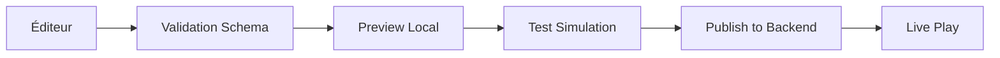

# Guide d'Intégration Éditeur Avalon - Moteur V2

## Document Conseil pour l'Éditeur Avalon

### 1. État Actuel & Vision

L'éditeur Avalon existe déjà avec :
- **Interface React/TypeScript** fonctionnelle (MapView, HexGrid)
- **Store Zustand** pour la gestion d'état
- **Intégration Clippy** pour l'aide contextuelle
- **Publication vers backend Rust** (endpoint `/api/v2/scenario/publish`)

### 2. Points Critiques à Respecter

#### 2.1 Compatibilité V2 Specs
Le moteur V2 utilise maintenant :
- **Énergie complexe** : `E = A + iΦ` (réel + imaginaire)
- **Identité quantique** : `|ψ⟩` normalisé avec conservation
- **Dette temporelle** : `Debt_A` au lieu d'énergie négative
- **Clonage avec cohérence** : split de `ρ` entre main et clones

#### 2.2 Ne Pas Toucher (User Request)
- **Graphismes actuels** : ne pas modifier l'aspect visuel
- **Structure React existante** : conserver l'architecture en place
- **Intégration dans le client principal** : pas de HTML standalone

### 3. Conseils d'Architecture

#### 3.1 Connexion aux Backends

```typescript
// Configuration des endpoints (déjà dans config/endpoints.ts)
const BACKENDS = {
  rust: 'http://localhost:3001',    // V2 Controller
  java: 'http://localhost:8080',    // Combat TCG
  python: 'http://localhost:5001'   // Vector DB
};
```

#### 3.2 État Global Recommandé

```typescript
interface EditorState {
  // World
  world: {
    id: string;
    mode: 'heroes_like' | 'tcg' | 'sandbox';
    ruleset: WorldRuleset;
    graph: WorldGraph;
  };
  
  // V2 Temporal State
  temporal: {
    tw: number;      // World time
    entities: Map<string, {
      te: number;    // Entity time
      energy: { A: number; phi: number; };
      identity: { psi: number[]; coherence: number; };
      debt: number;
    }>;
  };
  
  // Timeline & Events
  timeline: {
    events: Event[];
    links: CausalLink[];
    simulation: SimulationTrace;
  };
}
```

### 4. Intégration Memento/Vector DB

#### 4.1 Améliorer Clippy Existant
```typescript
// Dans src/lib/clippy.tsx
const searchVectorDB = async (query: string) => {
  // Ajouter scope V2Spec
  const response = await fetch(`${PYTHON_URL}/search`, {
    method: 'POST',
    body: JSON.stringify({
      query,
      k: 5,
      scope: ['V2Spec', 'API', 'GameMechanics']
    })
  });
  // ...
};
```

#### 4.2 Aide Contextuelle V2
- Ajouter des tooltips pour énergie complexe
- Expliquer la dette temporelle
- Visualiser la cohérence des clones

### 5. Workflow Recommandé



### 6. Fonctionnalités Prioritaires

1. **Timeline Visuelle** ✨
   - Afficher `tw` vs `te` pour chaque entité
   - Montrer la dérive temporelle
   - Visualiser les paradoxes

2. **Panneau Énergie Complexe** ⚡
   - Slider pour A (réel)
   - Slider pour Φ (phase)
   - Indicateur de dette

3. **Gestion des Régulateurs** 🎮
   - Placer Vince/Anna/Overload
   - Configurer leurs paramètres
   - Tester leurs interactions

### 7. Erreurs à Éviter

❌ **Ne pas faire** :
- Modifier les graphiques existants
- Créer des fichiers HTML séparés
- Ignorer la Vector DB existante
- Hardcoder les URLs des backends

✅ **Faire** :
- Utiliser les endpoints V2 existants
- Respecter les JSON Schemas
- Intégrer dans le client React principal
- Utiliser Memento pour l'aide

### 8. Tests Recommandés

```typescript
// Test de compatibilité V2
describe('V2 Integration', () => {
  it('should handle complex energy', () => {
    const energy = { A: 10, phi: 0.5 };
    expect(calculateEnergyMagnitude(energy)).toBe(10.012);
  });
  
  it('should enforce identity conservation', () => {
    const identities = splitIdentity(1.0, 0.3);
    expect(identities.main + identities.clone).toBe(1.0);
  });
});
```

### 9. Exemples de Code

#### 9.1 Appel V2 Tick
```typescript
const tickV2 = async () => {
  const response = await fetch(`${RUST_URL}/api/v2/tick`, {
    method: 'POST',
    headers: { 'Content-Type': 'application/json' },
    body: JSON.stringify({
      current_tw: temporal.tw,
      entities: Array.from(temporal.entities.entries())
    })
  });
  // Update state with response
};
```

#### 9.2 Résolution de Paradoxe
```typescript
const resolveParadox = async (entities: string[]) => {
  const response = await fetch(`${RUST_URL}/api/v2/paradox/resolve`, {
    method: 'POST',
    body: JSON.stringify({
      mode: 'tcg',
      entities,
      seed: Date.now()
    })
  });
  // Apply patches
};
```

### 10. Checklist d'Intégration

- [ ] Connexion aux 3 backends (Rust, Java, Python)
- [ ] Validation JSON Schema
- [ ] Timeline visuelle fonctionnelle
- [ ] Panneau énergie complexe
- [ ] Gestion des régulateurs
- [ ] Simulation +300s sans erreur
- [ ] Export/Import de scénarios
- [ ] Tests unitaires passants
- [ ] Memento connecté à Vector DB
- [ ] Documentation à jour

---

## Notes pour l'Équipe

1. **V2Spec** : Consulter `/Volumes/HOT_DEV/Magic/magic-stack/v2spec/` pour les détails
2. **Vector DB** : Déjà indexée avec les specs, utiliser l'API Python port 5001
3. **Clippy** : Améliorer `src/lib/clippy.tsx` pour chercher dans V2Spec
4. **Tests** : Lancer `test_v2_controller.py` pour valider l'intégration

## Support

Pour toute question sur l'intégration V2, consulter :
- `CLAUDE_MEMORY_GUIDE.md` : Guide condensé
- `FRONTEND_DEV_ULTIMATE_GUIDE.md` : Guide complet front
- Vector DB : `POST /search` avec query "V2 integration"
