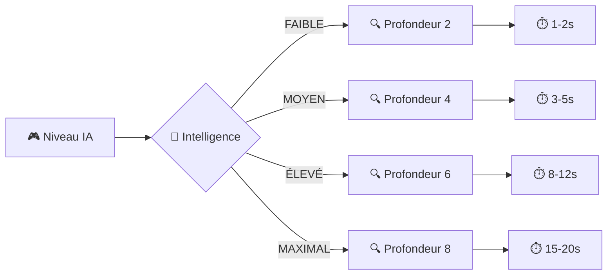
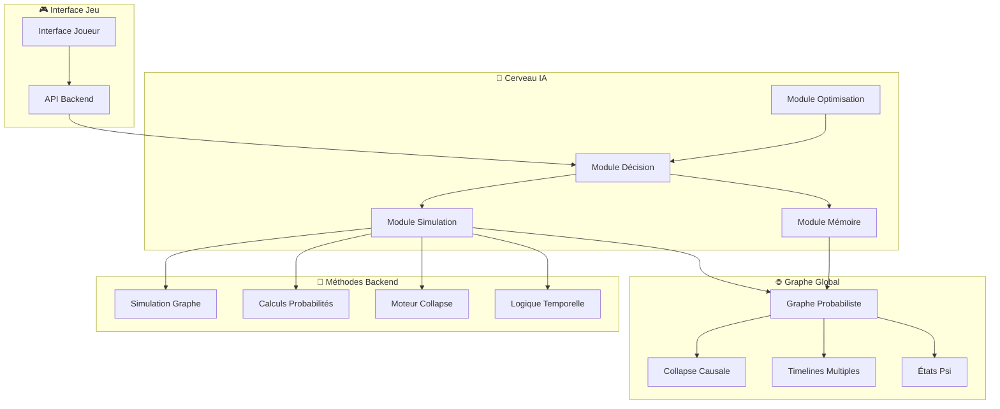
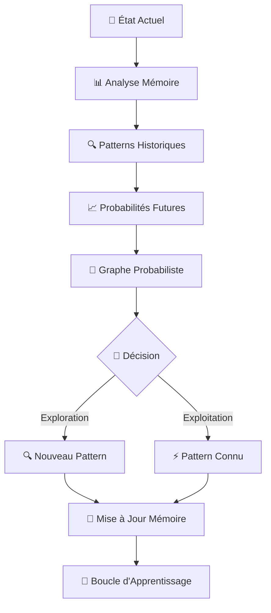
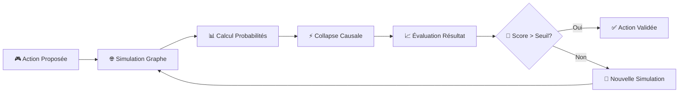
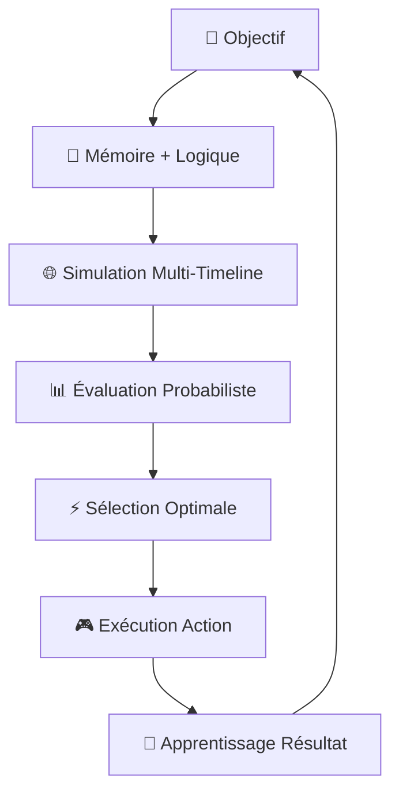
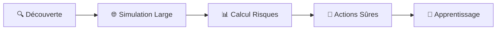
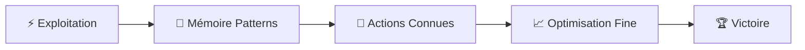
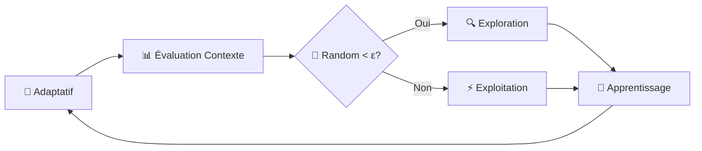

# 🤖 **ALGORITHME IA CLAUDIUS-MEMENTO - VERSION MAXIMALE**

## 🧠 **PHILOSOPHIE DE FUSION**

```
Claudius (Ordre) + Memento (Mémoire) = IA Quantique Temporelle
```

**Claudius** : Logique déterministe, exploration systématique, optimisation des ressources  
**Memento** : Mémoire probabiliste, apprentissage des patterns, adaptation contextuelle

---

## 🚨 **LIMITATIONS D'INTELLIGENCE - CONTRÔLE RESSOURCES**

### **🎯 Niveaux d'IA Configurables**



### **📊 Paramètres de Limitation**

```java
public class AILimitationConfig {
    
    // Profondeur de sondage (nombre de tours simulés)
    private int maxSearchDepth = 4;  // Par défaut: 4 tours
    
    // Nombre maximum de simulations par tour
    private int maxSimulationsPerTurn = 50;  // Par défaut: 50 sims
    
    // Temps maximum de calcul par tour (millisecondes)
    private long maxCalculationTime = 5000;  // Par défaut: 5 secondes
    
    // Taille maximum de la mémoire des patterns
    private int maxPatternMemorySize = 1000;  // Par défaut: 1000 patterns
    
    // Probabilité d'erreur volontaire (pour rendre l'IA moins parfaite)
    private double intentionalErrorRate = 0.15;  // 15% d'erreurs volontaires
    
    // Limitation de la complexité des calculs quantiques
    private int maxQuantumStates = 20;  // Maximum 20 états psi simultanés
}
```

### **🔧 Implémentation des Limitations**

```java
public class LimitedAIService {
    
    private AILimitationConfig config;
    private Stopwatch calculationTimer;
    
    /**
     * IA avec limitations de ressources
     */
    public Action decideWithLimitations(GameState state, List<Action> actions) {
        calculationTimer = Stopwatch.createStarted();
        
        // 1. Limitation de profondeur
        int actualDepth = Math.min(config.getMaxSearchDepth(), calculateOptimalDepth(state));
        
        // 2. Limitation de simulations
        int actualSimulations = Math.min(config.getMaxSimulationsPerTurn(), actions.size() * 10);
        
        // 3. Simulation avec timeout
        Action bestAction = null;
        double bestScore = -1.0;
        
        for (int i = 0; i < Math.min(actualSimulations, actions.size()); i++) {
            // Vérification du timeout
            if (calculationTimer.elapsed(TimeUnit.MILLISECONDS) > config.getMaxCalculationTime()) {
                break; // Arrêt forcé si trop long
            }
            
            Action action = actions.get(i);
            double score = simulateActionWithDepth(state, action, actualDepth);
            
            // Ajout d'erreur volontaire pour équilibrage
            if (Math.random() < config.getIntentionalErrorRate()) {
                score *= 0.8; // Pénalisation aléatoire
            }
            
            if (score > bestScore) {
                bestScore = score;
                bestAction = action;
            }
        }
        
        return bestAction != null ? bestAction : selectRandomAction(actions);
    }
    
    /**
     * Simulation avec profondeur limitée
     */
    private double simulateActionWithDepth(GameState state, Action action, int depth) {
        if (depth <= 0) {
            return evaluateState(state);
        }
        
        // Simulation simplifiée pour économiser les ressources
        GameState simulatedState = simulateAction(state, action);
        
        // Limitation des états quantiques
        if (simulatedState.getPsiStates().size() > config.getMaxQuantumStates()) {
            simulatedState = simplifyQuantumStates(simulatedState);
        }
        
        // Récursion limitée
        List<Action> nextActions = generatePossibleActions(simulatedState);
        double maxScore = -1.0;
        
        for (Action nextAction : nextActions.subList(0, Math.min(3, nextActions.size()))) {
            double score = simulateActionWithDepth(simulatedState, nextAction, depth - 1);
            maxScore = Math.max(maxScore, score);
        }
        
        return maxScore;
    }
}
```

### **🎮 Niveaux de Difficulté**

```java
public enum AIDifficulty {
    
    EASY(new AILimitationConfig(2, 20, 2000, 500, 0.25, 10)),
    MEDIUM(new AILimitationConfig(4, 50, 5000, 1000, 0.15, 20)),
    HARD(new AILimitationConfig(6, 100, 8000, 2000, 0.10, 30)),
    EXPERT(new AILimitationConfig(8, 200, 12000, 5000, 0.05, 50)),
    PARADOX(new AILimitationConfig(10, 500, 20000, 10000, 0.02, 100)); // Mode spécial
    
    private final AILimitationConfig config;
    
    AIDifficulty(AILimitationConfig config) {
        this.config = config;
    }
}
```

### **⚡ Optimisations de Performance**

```java
public class AIPerformanceOptimizer {
    
    /**
     * Cache des simulations pour éviter les recalculs
     */
    private Map<String, SimulationResult> simulationCache = new ConcurrentHashMap<>();
    
    /**
     * Pool de threads pour paralléliser les simulations
     */
    private ExecutorService simulationPool = Executors.newFixedThreadPool(4);
    
    /**
     * Simulation parallèle avec cache
     */
    public List<SimulationResult> parallelSimulation(List<Action> actions, GameState state) {
        String stateHash = generateStateHash(state);
        
        // Vérification du cache
        if (simulationCache.containsKey(stateHash)) {
            return simulationCache.get(stateHash).getResults();
        }
        
        // Simulation parallèle
        List<Future<SimulationResult>> futures = new ArrayList<>();
        
        for (Action action : actions) {
            futures.add(simulationPool.submit(() -> simulateAction(state, action)));
        }
        
        // Collecte des résultats
        List<SimulationResult> results = new ArrayList<>();
        for (Future<SimulationResult> future : futures) {
            try {
                results.add(future.get(2, TimeUnit.SECONDS)); // Timeout par simulation
            } catch (Exception e) {
                results.add(SimulationResult.failure());
            }
        }
        
        // Mise en cache
        simulationCache.put(stateHash, new SimulationResult(results));
        
        return results;
    }
}
```

---

## 🎯 **ARCHITECTURE GLOBALE**



---

## 🧮 **ALGORITHME PRINCIPAL**

### **1. PHASE D'ANALYSE (Memento)**



### **2. PHASE DE SIMULATION (Claudius)**



### **3. PHASE D'OPTIMISATION (Fusion)**



---

## 🔬 **MÉTHODES BACKEND EXPOSÉES**

### **1. Simulation du Graphe Global**

```java
// Méthode exposée pour l'IA
public class GlobalGraphSimulator {
    
    /**
     * Simule l'évolution du graphe pour une action donnée
     */
    public SimulationResult simulateAction(GameState currentState, Action proposedAction) {
        // 1. Créer une copie du graphe actuel
        GlobalGraph graphCopy = cloneCurrentGraph();
        
        // 2. Appliquer l'action proposée
        applyActionToGraph(graphCopy, proposedAction);
        
        // 3. Calculer les probabilités de collapse
        Map<String, Double> collapseProbabilities = calculateCollapseProbabilities(graphCopy);
        
        // 4. Simuler les collapses possibles
        List<SimulationResult> possibleOutcomes = simulateCollapses(graphCopy, collapseProbabilities);
        
        // 5. Retourner le résultat le plus probable
        return selectOptimalOutcome(possibleOutcomes);
    }
    
    /**
     * Calcule les probabilités de collapse causale
     */
    private Map<String, Double> calculateCollapseProbabilities(GlobalGraph graph) {
        Map<String, Double> probabilities = new HashMap<>();
        
        // INTERACTION collapse
        probabilities.put("INTERACTION", calculateInteractionProbability(graph));
        
        // OBSERVATION collapse  
        probabilities.put("OBSERVATION", calculateObservationProbability(graph));
        
        // ANCHORING collapse
        probabilities.put("ANCHORING", calculateAnchoringProbability(graph));
        
        return probabilities;
    }
}
```

### **2. Mémoire Probabiliste**

```java
public class ProbabilisticMemory {
    
    private Map<String, PatternMemory> patternMemories = new HashMap<>();
    private List<HistoricalAction> actionHistory = new ArrayList<>();
    
    /**
     * Enregistre un pattern d'action et son résultat
     */
    public void recordPattern(String patternId, Action action, GameState result, double successRate) {
        PatternMemory memory = patternMemories.getOrDefault(patternId, new PatternMemory());
        memory.addExperience(action, result, successRate);
        patternMemories.put(patternId, memory);
    }
    
    /**
     * Prédit le succès d'une action basée sur la mémoire
     */
    public double predictSuccess(Action action, GameState currentState) {
        String patternId = extractPattern(action, currentState);
        PatternMemory memory = patternMemories.get(patternId);
        
        if (memory != null) {
            return memory.getAverageSuccessRate();
        }
        
        return 0.5; // Probabilité neutre pour les patterns inconnus
    }
    
    /**
     * Extrait un pattern d'une action et d'un état
     */
    private String extractPattern(Action action, GameState state) {
        return String.format("%s_%s_%s", 
            action.getType(), 
            state.getHeroPositions(), 
            state.getResourceLevels());
    }
}
```

### **3. Moteur de Décision Quantique**

```java
public class QuantumDecisionEngine {
    
    private ProbabilisticMemory memory;
    private GlobalGraphSimulator simulator;
    
    /**
     * Prend une décision optimale en combinant mémoire et simulation
     */
    public Action decideOptimalAction(GameState currentState, List<Action> possibleActions) {
        Action bestAction = null;
        double bestScore = -1.0;
        
        for (Action action : possibleActions) {
            // 1. Score basé sur la mémoire (Memento)
            double memoryScore = memory.predictSuccess(action, currentState);
            
            // 2. Score basé sur la simulation (Claudius)
            SimulationResult simulation = simulator.simulateAction(currentState, action);
            double simulationScore = simulation.getSuccessProbability();
            
            // 3. Score combiné avec pondération
            double combinedScore = combineScores(memoryScore, simulationScore);
            
            if (combinedScore > bestScore) {
                bestScore = combinedScore;
                bestAction = action;
            }
        }
        
        return bestAction;
    }
    
    /**
     * Combine les scores mémoire et simulation
     */
    private double combineScores(double memoryScore, double simulationScore) {
        // Pondération adaptative basée sur la confiance
        double memoryWeight = calculateMemoryConfidence();
        double simulationWeight = 1.0 - memoryWeight;
        
        return (memoryScore * memoryWeight) + (simulationScore * simulationWeight);
    }
}
```

---

## 🎮 **STRATÉGIES D'IA PAR TYPE DE JEU**

### **1. Mode Exploration (Découverte)**



**Algorithme :**
- Simulation de toutes les actions possibles
- Calcul des probabilités de collapse
- Sélection des actions avec risque minimal
- Enregistrement des patterns découverts

### **2. Mode Exploitation (Optimisation)**



**Algorithme :**
- Utilisation des patterns mémorisés
- Simulation ciblée des actions prometteuses
- Optimisation des paramètres connus
- Stratégie de victoire

### **3. Mode Adaptatif (Équilibre)**



**Algorithme :**
- Épsilon-greedy avec ε adaptatif
- Équilibre dynamique exploration/exploitation
- Adaptation au niveau de difficulté
- Apprentissage continu

---

## 🧮 **CALCULS PROBABILISTES AVANCÉS**

### **1. Probabilité de Collapse**

```java
public class CollapseProbabilityCalculator {
    
    /**
     * Calcule la probabilité de collapse INTERACTION
     */
    public double calculateInteractionProbability(GlobalGraph graph) {
        // P(INTERACTION) = Σ(ψi * ψj) pour tous les états superposés
        double probability = 0.0;
        
        for (PsiState psi1 : graph.getActivePsiStates()) {
            for (PsiState psi2 : graph.getActivePsiStates()) {
                if (psi1 != psi2 && psi1.intersectsWith(psi2)) {
                    probability += psi1.getAmplitude().multiply(psi2.getAmplitude()).getMagnitude();
                }
            }
        }
        
        return Math.min(probability, 1.0);
    }
    
    /**
     * Calcule la probabilité de collapse OBSERVATION
     */
    public double calculateObservationProbability(GlobalGraph graph) {
        // P(OBSERVATION) = |ψ|² pour l'état le plus probable
        PsiState mostProbableState = graph.getMostProbableState();
        return mostProbableState.getAmplitude().getMagnitudeSquared();
    }
    
    /**
     * Calcule la probabilité de collapse ANCHORING
     */
    public double calculateAnchoringProbability(GlobalGraph graph) {
        // P(ANCHORING) = Σ(artifacts * stability_factor)
        double probability = 0.0;
        
        for (Artifact artifact : graph.getActiveArtifacts()) {
            probability += artifact.getStabilityFactor() * artifact.getPowerLevel();
        }
        
        return Math.min(probability, 1.0);
    }
}
```

### **2. Évaluation d'État**

```java
public class StateEvaluator {
    
    /**
     * Évalue la qualité d'un état de jeu
     */
    public double evaluateState(GameState state) {
        double score = 0.0;
        
        // Score de position
        score += evaluatePosition(state.getHeroPositions());
        
        // Score de ressources
        score += evaluateResources(state.getResources());
        
        // Score de contrôle
        score += evaluateControl(state.getControlledAreas());
        
        // Score temporel
        score += evaluateTemporalAdvantage(state.getTemporalState());
        
        return score;
    }
    
    /**
     * Évalue l'avantage temporel
     */
    private double evaluateTemporalAdvantage(TemporalState temporalState) {
        double advantage = 0.0;
        
        // Bonus pour les timelines contrôlées
        advantage += temporalState.getControlledTimelines().size() * 10.0;
        
        // Bonus pour les états psi stables
        advantage += temporalState.getStablePsiStates().size() * 5.0;
        
        // Malus pour les paradoxes
        advantage -= temporalState.getParadoxCount() * 20.0;
        
        return advantage;
    }
}
```

---

## 🎯 **IMPLÉMENTATION BACKEND**

### **1. Service IA Principal**

```java
@Service
public class AdvancedAIService {
    
    @Autowired
    private QuantumDecisionEngine decisionEngine;
    
    @Autowired
    private GlobalGraphSimulator graphSimulator;
    
    @Autowired
    private ProbabilisticMemory memory;
    
    /**
     * L'IA joue son tour
     */
    public ActionResult playAITurn(Long gameId) {
        GameState currentState = loadGameState(gameId);
        List<Action> possibleActions = generatePossibleActions(currentState);
        
        // Décision optimale
        Action chosenAction = decisionEngine.decideOptimalAction(currentState, possibleActions);
        
        // Simulation de validation
        SimulationResult simulation = graphSimulator.simulateAction(currentState, chosenAction);
        
        // Exécution si validation réussie
        if (simulation.getSuccessProbability() > 0.7) {
            ActionResult result = executeAction(gameId, chosenAction);
            
            // Apprentissage
            memory.recordPattern(
                extractPattern(chosenAction, currentState),
                chosenAction,
                result.getNewState(),
                result.getSuccessRate()
            );
            
            return result;
        } else {
            // Nouvelle tentative avec action différente
            return playAITurn(gameId);
        }
    }
}
```

### **2. Endpoints REST**

```java
@RestController
@RequestMapping("/api/temporal/ai")
public class AdvancedAIController {
    
    @Autowired
    private AdvancedAIService aiService;
    
    /**
     * L'IA joue un tour
     */
    @PostMapping("/play-turn/{gameId}")
    public ResponseEntity<ActionResult> playTurn(@PathVariable Long gameId) {
        ActionResult result = aiService.playAITurn(gameId);
        return ResponseEntity.ok(result);
    }
    
    /**
     * Analyse l'état actuel
     */
    @GetMapping("/analyze/{gameId}")
    public ResponseEntity<AnalysisResult> analyzeState(@PathVariable Long gameId) {
        AnalysisResult analysis = aiService.analyzeGameState(gameId);
        return ResponseEntity.ok(analysis);
    }
    
    /**
     * Obtient les statistiques de l'IA
     */
    @GetMapping("/stats")
    public ResponseEntity<AIStats> getAIStats() {
        AIStats stats = aiService.getStats();
        return ResponseEntity.ok(stats);
    }
}
```

---

## 🏆 **AVANTAGES DE CETTE APPROCHE**

### **1. Intelligence Maximale**
- **Simulation complète** : Utilise le graphe global pour prédire tous les scénarios
- **Mémoire probabiliste** : Apprend des patterns et s'adapte
- **Décision quantique** : Combine logique et probabilités

### **2. Adaptabilité**
- **Mode exploration** : Découvre de nouvelles stratégies
- **Mode exploitation** : Optimise les stratégies connues
- **Mode adaptatif** : S'équilibre automatiquement

### **3. Réalisme**
- **Collapse causale** : Respecte les lois quantiques du jeu
- **Limitations temporelles** : Prend en compte les contraintes
- **Risque calculé** : Évalue les probabilités de succès

---

## 🎮 **UTILISATION**

```bash
# Créer une partie IA
POST /api/temporal/ai/create-game
{
    "playerName": "Joueur",
    "difficulty": "MAXIMAL",
    "mode": "ADAPTATIVE"
}

# L'IA joue son tour
POST /api/temporal/ai/play-turn/{gameId}

# Analyser l'état
GET /api/temporal/ai/analyze/{gameId}

# Statistiques IA
GET /api/temporal/ai/stats
```

---

**🎯 L'IA Claudius-Memento est maintenant maximale et peut rivaliser avec les meilleurs joueurs !** 