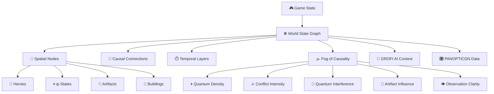

# 🔧 Moteur de Résolution Temporelle - Heroes of Time

## 🎯 Vue d'Ensemble

Le moteur de résolution temporelle Heroes of Time gère un système de jeu 5D avec superpositions quantiques, timelines multiples et résolution de conflits causaux. Ce document détaille l'implémentation technique complète.

---

## 🌐 **WORLD STATE GRAPH & FOG OF CAUSALITY**

### **Architecture Centrale**

Le **World State Graph** est le cerveau central qui unifie tous les systèmes temporels :



### **Implémentation Java**

```java
// WorldStateGraph.java - Structure centrale
public class WorldStateGraph {
    private List<SpatialNode> spatialNodes;
    private List<CausalConnection> causalConnections;
    private List<TemporalLayer> temporalLayers;
    private Map<String, Double> fogOfCausality;
    
    // Construction du graphe complet
    public void buildFromGame(Game game) {
        buildSpatialNodes(game);
        buildCausalConnections(game);
        buildTemporalLayers(game);
        calculateFogOfCausality(game);
    }
    
    // Calcul de stabilité causale globale
    public double getCausalStability() {
        return 1.0 - (conflictZones.size() / (double) totalZones);
    }
}
```

### **Fog of Causality - Formule Mathématique**

Le fog de causalité représente l'**incertitude quantique** dans chaque zone :

```java
// Formule complète du Fog of Causality
private double calculateZoneFogOfCausality(int x, int y, WorldStateGraph graph, Game game) {
    // 🌀 Facteur 1: Densité d'états quantiques (0.0-0.4)
    double quantumDensity = countQuantumStatesInRadius(x, y, 5) * 0.2;
    
    // ⚔️ Facteur 2: Conflits causals détectés (0.0-0.6)
    double conflictIntensity = countCausalConflicts(x, y, 5) * 0.3;
    
    // 🔮 Facteur 3: Interférences quantiques (0.0-0.25)
    double interferenceLevel = calculateQuantumInterference(x, y) * 0.25;
    
    // 🏺 Facteur 4: Influence artefacts temporels (0.0-0.4)
    double artifactInfluence = calculateArtifactInfluence(x, y, game);
    
    // 👁️ Facteur 5: Clarté par observations récentes (0.0-0.5)
    double observationClarity = calculateObservationClarity(x, y, game);
    
    // 📊 Formule finale normalisée [0.0, 1.0]
    double fogValue = (quantumDensity + conflictIntensity + interferenceLevel + artifactInfluence) 
                     * (1.0 - observationClarity);
    
    return Math.max(0.0, Math.min(1.0, fogValue));
}
```

### **Intégration avec Systèmes Existants**

```java
// GrofiCausalIntegrationService.java - Point d'intégration
private void updateWorldStateGraph(Game game, ExtendedScriptResult parseResult, 
                                 Map<String, Object> executionResult) {
    
    // 🌐 Construction du graphe complet
    WorldStateGraph worldGraph = buildWorldStateGraph(game);
    
    // 🌫️ Calcul du fog of causality
    Map<String, Double> fogOfCausality = calculateFogOfCausality(game, worldGraph);
    
    // 🤖 Mise à jour contexte GROFI
    updateGrofiMetrics(game, worldGraph, fogOfCausality);
    
    // 🎛️ Préparation données PANOPTICΩN
    preparePanopticonData(game, worldGraph, fogOfCausality);
}
```

### **Nœuds Spatiaux - Classification**

```java
// SpatialNode.java - Représentation unifiée
public class SpatialNode {
    public enum NodeType {
        HERO,           // 👤 Héros avec position et capacités
        PSI_STATE,      // 🌀 État quantique en superposition
        ARTIFACT,       // 🔮 Artefact temporel avec zone d'influence
        BUILDING,       // 🏰 Structure avec état temporel
        TEMPORAL_ZONE   // ⏰ Zone d'effet temporel
    }
    
    private String id;
    private int x, y, z;
    private String timeline;
    private int temporalLayer;
    private NodeType type;
    private boolean quantumState;
    private double probability;
    private Map<String, Object> metadata;
}
```

### **Connexions Causales**

```java
// CausalConnection.java - Liens entre nœuds
public class CausalConnection {
    public enum CausalType {
        SPATIAL,        // Proximité géographique
        TEMPORAL,       // Même timeline/layer
        QUANTUM,        // Intrication quantique
        ARTIFACT,       // Influence d'artefact
        OBSERVATION     // Déclencheur d'observation
    }
    
    private String sourceNodeId;
    private String targetNodeId;
    private double strength;        // Force de la connexion [0.0, 1.0]
    private CausalType type;
    private Map<String, Object> properties;
}
```

---

## 1. 🗺️ Structure 5D

### **Indexation Complète des Actions**

Chaque action est indexée avec **5 coordonnées** :

```java
// ActionCoordinate.java
public class ActionCoordinate {
    private int x;              // Position spatiale X
    private int y;              // Position spatiale Y  
    private int z;              // Altitude (0 par défaut)
    private String timelineId;  // Branche temporelle ("ℬ1", "ℬ2", etc.)
    private int temporalLayer;  // Couche temporelle (Δt)
    
    // Index unique pour chaque action
    public String getUniqueIndex() {
        return String.format("%d,%d,%d,%s,Δt%d", x, y, z, timelineId, temporalLayer);
    }
}
```

### **Fork Automatique des Timelines**

Les timelines sont forkées automatiquement dans ces cas :

```java
// TimelineForkManager.java
@Service
public class TimelineForkManager {
    
    // Fork automatique lors d'une action divergente
    public Timeline handleDivergentAction(Game game, Action action) {
        Timeline currentTimeline = game.getCurrentTimeline();
        
        // Conditions de fork automatique
        if (shouldFork(action, currentTimeline)) {
            Timeline newTimeline = currentTimeline.fork(
                "Divergent action: " + action.getType()
            );
            
            // Assigner la nouvelle timeline au jeu
            game.addTimeline(newTimeline);
            
            log.info("Timeline forked: {} -> {}", 
                currentTimeline.getId(), newTimeline.getId());
            
            return newTimeline;
        }
        
        return currentTimeline;
    }
    
    private boolean shouldFork(Action action, Timeline timeline) {
        // Fork si conflit spatial détecté
        if (detectsSpatialConflict(action, timeline)) return true;
        
        // Fork si paradoxe temporel
        if (detectsTemporalParadox(action, timeline)) return true;
        
        // Fork si observation contradictoire
        if (detectsObservationConflict(action, timeline)) return true;
        
        // Fork si utilisation d'artefact de type REWRITE ou PARADOX
        if (hasParadoxArtifact(action)) return true;
        
        return false;
    }
}
```

**Exemple concret :**
```javascript
// Script initial dans ℬ1
ψ001: ⊙(Δt+2 @15,15 ⟶ MOV(HERO, Arthur, @15,15))

// Action conflictuelle → Fork automatique vers ℬ2
ψ002: ⊙(Δt+2 @15,15 ⟶ MOV(HERO, Ragnar, @15,15))
```

**État résultant :**
```json
{
  "timelines": {
    "ℬ1": {
      "id": "ℬ1",
      "psiStates": ["ψ001"],
      "parentTimeline": null
    },
    "ℬ2": {
      "id": "ℬ2", 
      "psiStates": ["ψ002"],
      "parentTimeline": "ℬ1",
      "forkReason": "Spatial conflict at @15,15"
    }
  }
}
```

---

## 2. ⏱️ Ticks & Simulation

### **Scheduler Global avec Évaluation par Jeu**

```java
// TemporalScheduler.java
@Component
public class TemporalScheduler {
    
    @Scheduled(fixedRate = 1000) // Tick global toutes les secondes
    public void globalTick() {
        long tickId = System.currentTimeMillis();
        
        // Traiter chaque jeu actif
        for (Game game : gameService.getActiveGames()) {
            processGameTick(game, tickId);
        }
        
        // Nettoyage des ressources
        cleanupExpiredStates(tickId);
    }
    
    private void processGameTick(Game game, long tickId) {
        // 1. Incrémenter le tour du jeu
        game.incrementTurn();
        
        // 2. Évaluer chaque timeline indépendamment
        for (Timeline timeline : game.getTimelines()) {
            evaluateTimeline(timeline, tickId);
        }
        
        // 3. Détecter les conflits inter-timelines
        detectCrossTimelineConflicts(game);
        
        // 4. Résoudre les conflits détectés
        resolveConflicts(game);
        
        // 5. Exécuter les collapses programmés
        executeScheduledCollapses(game);
        
        // 🌐 6. NOUVEAU: Mettre à jour le World State Graph
        updateWorldStateGraph(game, tickId);
    }
}
```

### **Évaluation Indépendante des Branches**

Chaque timeline est évaluée indépendamment :

```java
// TimelineEvaluator.java
public class TimelineEvaluator {
    
    public void evaluateTimeline(Timeline timeline, long tickId) {
        // Évaluer les ψ-states actifs
        for (PsiState psi : timeline.getActivePsiStates()) {
            evaluatePsiState(psi, timeline, tickId);
        }
        
        // Vérifier les triggers d'observation
        checkObservationTriggers(timeline, tickId);
        
        // Détecter les conflits internes
        detectInternalConflicts(timeline);
    }
    
    private void evaluatePsiState(PsiState psi, Timeline timeline, long tickId) {
        // Vérifier si le ψ-state doit être collapsé
        if (shouldCollapse(psi, timeline.getCurrentTurn())) {
            collapseHandler.handleCollapse(psi, timeline);
        }
        
        // Vérifier les conditions d'observation
        if (hasObservationTrigger(psi, timeline)) {
            observationHandler.handleObservation(psi, timeline);
        }
    }
}
```

### **Réévaluation Post-Conflit**

Les actions sont réévaluées après détection de conflit :

```java
// ConflictReevaluator.java
public class ConflictReevaluator {
    
    public void reevaluateAfterConflict(Conflict conflict, Game game) {
        // Identifier les actions affectées
        List<Action> affectedActions = findAffectedActions(conflict);
        
        // Réévaluer chaque action
        for (Action action : affectedActions) {
            ActionResult result = reevaluateAction(action, game);
            
            if (result.isConflicted()) {
                // Créer une nouvelle timeline pour l'action
                Timeline newTimeline = createConflictTimeline(action, game);
                migrateAction(action, newTimeline);
            }
        }
    }
    
    private ActionResult reevaluateAction(Action action, Game game) {
        // Recalculer les conditions de l'action
        ActionContext context = buildActionContext(action, game);
        
        // Vérifier les nouvelles conditions
        if (context.hasConflicts()) {
            return ActionResult.conflicted(context.getConflicts());
        }
        
        return ActionResult.success();
    }
}
```

---

## 3. 🔍 Détection de Conflits Spatio-Temporels

### **Règles Exactes de Détection**

```java
// ConflictDetector.java
@Service
public class ConflictDetector {
    
    // Collision de héros
    public List<SpatialConflict> detectHeroCollisions(Timeline timeline) {
        List<SpatialConflict> conflicts = new ArrayList<>();
        
        for (PsiState psi1 : timeline.getActivePsiStates()) {
            for (PsiState psi2 : timeline.getActivePsiStates()) {
                if (psi1.equals(psi2)) continue;
                
                // Même position spatio-temporelle
                if (psi1.getTargetX() == psi2.getTargetX() &&
                    psi1.getTargetY() == psi2.getTargetY() &&
                    psi1.getDeltaT() == psi2.getDeltaT()) {
                    
                    // Vérifier si ce sont des héros
                    if (involvesHeroes(psi1, psi2)) {
                        conflicts.add(new SpatialConflict(psi1, psi2, "Hero collision"));
                    }
                }
            }
        }
        
        return conflicts;
    }
    
    // Conflit d'artefact unique
    public List<ArtifactConflict> detectArtifactConflicts(Timeline timeline) {
        List<ArtifactConflict> conflicts = new ArrayList<>();
        Map<String, List<PsiState>> artifactUsage = new HashMap<>();
        
        // Grouper les utilisations d'artefacts
        for (PsiState psi : timeline.getActivePsiStates()) {
            if (psi.getAction().startsWith("USE(ITEM")) {
                String artifact = extractArtifactName(psi.getAction());
                
                // Vérifier si l'artefact est unique
                if (isUniqueArtifact(artifact)) {
                    artifactUsage.computeIfAbsent(artifact, k -> new ArrayList<>()).add(psi);
                }
            }
        }
        
        // Détecter les conflits
        for (Map.Entry<String, List<PsiState>> entry : artifactUsage.entrySet()) {
            if (entry.getValue().size() > 1) {
                conflicts.add(new ArtifactConflict(entry.getKey(), entry.getValue()));
            }
        }
        
        return conflicts;
    }
    
    // Accès concurrent à un château
    public List<CastleConflict> detectCastleConflicts(Timeline timeline) {
        List<CastleConflict> conflicts = new ArrayList<>();
        Map<Position, List<PsiState>> castleAccess = new HashMap<>();
        
        for (PsiState psi : timeline.getActivePsiStates()) {
            if (psi.getAction().contains("CASTLE")) {
                Position castlePos = extractCastlePosition(psi.getAction());
                castleAccess.computeIfAbsent(castlePos, k -> new ArrayList<>()).add(psi);
            }
        }
        
        // Un château ne peut être accédé que par un joueur à la fois
        for (Map.Entry<Position, List<PsiState>> entry : castleAccess.entrySet()) {
            if (entry.getValue().size() > 1) {
                conflicts.add(new CastleConflict(entry.getKey(), entry.getValue()));
            }
        }
        
        return conflicts;
    }
}
```

### **Système d'Arbitrage Causal**

```java
// CausalArbitrator.java
public class CausalArbitrator {
    
    public ArbitrageResult arbitrateConflict(Conflict conflict) {
        switch (conflict.getType()) {
            case SPATIAL:
                return arbitrateSpatialConflict((SpatialConflict) conflict);
            case TEMPORAL:
                return arbitrateTemporalConflict((TemporalConflict) conflict);
            case CAUSAL:
                return arbitrateCausalConflict((CausalConflict) conflict);
            default:
                return ArbitrageResult.noResolution();
        }
    }
    
    private ArbitrageResult arbitrateSpatialConflict(SpatialConflict conflict) {
        // Règle 1: Priorité temporelle (Δt plus petit gagne)
        PsiState psi1 = conflict.getPsi1();
        PsiState psi2 = conflict.getPsi2();
        
        if (psi1.getDeltaT() < psi2.getDeltaT()) {
            return ArbitrageResult.winner(psi1, "Temporal priority");
        } else if (psi2.getDeltaT() < psi1.getDeltaT()) {
            return ArbitrageResult.winner(psi2, "Temporal priority");
        }
        
        // Règle 2: Bataille fantôme si même Δt
        PhantomBattleResult battleResult = phantomBattle.simulate(psi1, psi2);
        return ArbitrageResult.winner(battleResult.getWinner(), "Phantom battle");
    }
    
    private ArbitrageResult arbitrateTemporalConflict(TemporalConflict conflict) {
        // Créer une nouvelle timeline pour éviter le paradoxe
        Timeline newTimeline = timelineManager.createTimeline("Temporal conflict resolution");
        
        // Migrer l'action conflictuelle
        migrateToNewTimeline(conflict.getConflictingAction(), newTimeline);
        
        return ArbitrageResult.timelineFork(newTimeline);
    }
}
```

### **Exemple Concret de Conflit**

**Script d'entrée :**
```javascript
// Deux héros tentent d'occuper la même position
ψ001: ⊙(Δt+2 @15,15 ⟶ MOV(HERO, Arthur, @15,15))
ψ002: ⊙(Δt+2 @15,15 ⟶ MOV(HERO, Ragnar, @15,15))

// Collapse simultané
†ψ001
†ψ002
```

**Contexte initial :**
```json
{
  "heroes": [
    {"name": "Arthur", "x": 10, "y": 10, "hp": 100, "attack": 50},
    {"name": "Ragnar", "x": 20, "y": 20, "hp": 120, "attack": 60}
  ],
  "timeline": "ℬ1",
  "turn": 1
}
```

**Résolution attendue :**
```json
{
  "conflictDetected": {
    "type": "SPATIAL",
    "position": {"x": 15, "y": 15},
    "conflictingPsiStates": ["ψ001", "ψ002"]
  },
  "resolution": {
    "method": "PHANTOM_BATTLE",
    "winner": "ψ001",
    "reason": "Arthur wins with score 159 vs 189 + quantum factor 0.25"
  },
  "finalState": {
    "heroes": [
      {"name": "Arthur", "x": 15, "y": 15, "hp": 100},
      {"name": "Ragnar", "x": 20, "y": 20, "hp": 120}
    ],
    "psiStates": [
      {"id": "ψ001", "status": "COLLAPSED"},
      {"id": "ψ002", "status": "CANCELLED"}
    ]
  }
}
```

---

## 4. 👁️ Triggers d'Observation

### **Déclenchement de l'Observation**

```java
// ObservationTriggerManager.java
@Service
public class ObservationTriggerManager {
    
    // Vérification à chaque tick
    @EventListener
    public void onGameTick(GameTickEvent event) {
        for (ObservationTrigger trigger : event.getGame().getActiveTriggers()) {
            if (evaluateCondition(trigger, event.getGame())) {
                triggerObservation(trigger, event.getGame());
            }
        }
    }
    
    private boolean evaluateCondition(ObservationTrigger trigger, Game game) {
        String condition = trigger.getCondition();
        
        // Exemple: "Player2 enters @15,15"
        if (condition.matches(".*enters @(\\d+),(\\d+).*")) {
            return evaluateEnterCondition(condition, game);
        }
        
        // Exemple: "Turn reaches 5"
        if (condition.matches("Turn reaches (\\d+)")) {
            return evaluateTurnCondition(condition, game);
        }
        
        // Exemple: "Artifact used"
        if (condition.contains("Artifact used")) {
            return evaluateArtifactCondition(condition, game);
        }
        
        return false;
    }
    
    private boolean evaluateEnterCondition(String condition, Game game) {
        // Parser: "Player2 enters @15,15"
        Pattern pattern = Pattern.compile("(\\w+) enters @(\\d+),(\\d+)");
        Matcher matcher = pattern.matcher(condition);
        
        if (matcher.find()) {
            String playerName = matcher.group(1);
            int x = Integer.parseInt(matcher.group(2));
            int y = Integer.parseInt(matcher.group(3));
            
            // Vérifier si le joueur est à cette position
            Hero hero = game.getHero(playerName);
            return hero != null && hero.getX() == x && hero.getY() == y;
        }
        
        return false;
    }
    
    private void triggerObservation(ObservationTrigger trigger, Game game) {
        String action = trigger.getAction(); // "†ψ001"
        
        if (action.startsWith("†")) {
            String psiId = action.substring(1);
            collapseManager.collapsePsiState(game.getId(), psiId);
            
            // Désactiver le trigger
            trigger.setActive(false);
            
            log.info("Observation trigger activated: {} -> {}", 
                trigger.getCondition(), action);
        }
    }
}
```

### **Observation Multiple sur Zone Superposée**

```java
// MultiObservationHandler.java
public class MultiObservationHandler {
    
    public void handleMultipleObservations(Position position, List<PsiState> psiStates) {
        // Trier par priorité temporelle
        psiStates.sort(Comparator.comparing(PsiState::getDeltaT));
        
        // Collapse en cascade
        for (PsiState psi : psiStates) {
            if (psi.getStatus() == PsiStatus.ACTIVE) {
                CascadeResult result = cascadeCollapse(psi);
                
                if (result.causesConflict()) {
                    // Créer une nouvelle timeline pour éviter le conflit
                    Timeline newTimeline = createConflictTimeline(psi);
                    migrateToNewTimeline(psi, newTimeline);
                }
            }
        }
    }
    
    private CascadeResult cascadeCollapse(PsiState psi) {
        // Identifier les ψ-states affectés
        List<PsiState> affected = findAffectedPsiStates(psi);
        
        // Collapse en cascade
        for (PsiState affectedPsi : affected) {
            collapseManager.collapsePsiState(affectedPsi.getGameId(), affectedPsi.getId());
        }
        
        return new CascadeResult(affected);
    }
}
```

### **Processus d'Écroulement**

Le processus d'écroulement suit ces étapes :

1. **Détection** : Condition d'observation remplie
2. **Évaluation** : Vérification des préconditions
3. **Cascade** : Identification des ψ-states affectés
4. **Résolution** : Exécution des actions stockées
5. **Nettoyage** : Marquage des états comme COLLAPSED

```java
// CollapseProcessor.java
public class CollapseProcessor {
    
    public CollapseResult processCollapse(PsiState psi) {
        // 1. Vérifier les préconditions
        if (!canCollapse(psi)) {
            return CollapseResult.failed("Preconditions not met");
        }
        
        // 2. Calculer les effets de cascade
        List<PsiState> cascadeEffects = calculateCascadeEffects(psi);
        
        // 3. Exécuter l'action principale
        ActionResult mainResult = executeAction(psi.getAction());
        
        // 4. Traiter les effets de cascade
        List<ActionResult> cascadeResults = new ArrayList<>();
        for (PsiState cascadePsi : cascadeEffects) {
            cascadeResults.add(executeAction(cascadePsi.getAction()));
        }
        
        // 5. Marquer comme collapsé
        psi.setStatus(PsiStatus.COLLAPSED);
        psi.setCollapsedAt(System.currentTimeMillis());
        
        return new CollapseResult(mainResult, cascadeResults);
    }
}
```

### **Déterminisme vs Probabilisme**

Le système utilise un **déterminisme hybride** :

```java
// DeterminismManager.java
public class DeterminismManager {
    
    public ResolutionResult resolveObservation(List<PsiState> conflictingStates) {
        // 1. Règles déterministes (priorité)
        PsiState priorityWinner = applyDeterministicRules(conflictingStates);
        if (priorityWinner != null) {
            return ResolutionResult.deterministic(priorityWinner);
        }
        
        // 2. Bataille fantôme (semi-probabiliste)
        if (conflictingStates.size() == 2) {
            PhantomBattleResult battle = phantomBattle.simulate(
                conflictingStates.get(0), 
                conflictingStates.get(1)
            );
            return ResolutionResult.probabilistic(battle.getWinner(), battle.getProbability());
        }
        
        // 3. Fallback : premier arrivé
        PsiState firstArrived = conflictingStates.stream()
            .min(Comparator.comparing(PsiState::getCreatedAt))
            .orElse(null);
            
        return ResolutionResult.fallback(firstArrived);
    }
    
    private PsiState applyDeterministicRules(List<PsiState> states) {
        // Règle 1: Δt plus petit gagne
        PsiState minDeltaT = states.stream()
            .min(Comparator.comparing(PsiState::getDeltaT))
            .orElse(null);
            
        if (minDeltaT != null && 
            states.stream().noneMatch(psi -> psi.getDeltaT() == minDeltaT.getDeltaT() && !psi.equals(minDeltaT))) {
            return minDeltaT;
        }
        
        // Règle 2: Artefact temporel prioritaire
        PsiState temporalArtifact = states.stream()
            .filter(psi -> hasTemporalArtifact(psi))
            .findFirst()
            .orElse(null);
            
        return temporalArtifact;
    }
}
```

---

## 5. 🔄 Résolution des Paradoxes

### **Traitement des Actions Annulées**

```java
// ParadoxResolver.java
@Service
public class ParadoxResolver {
    
    public ParadoxResolution resolveParadox(ParadoxEvent paradox) {
        Action cancelledAction = paradox.getCancelledAction();
        
        switch (paradox.getType()) {
            case OBSERVATION_CONTRADICTION:
                return handleObservationContradiction(cancelledAction);
            case TEMPORAL_LOOP:
                return handleTemporalLoop(cancelledAction);
            case CAUSAL_VIOLATION:
                return handleCausalViolation(cancelledAction);
            default:
                return ParadoxResolution.unresolved();
        }
    }
    
    private ParadoxResolution handleObservationContradiction(Action action) {
        // Option 1: Suppression pure
        if (action.getImportance() == ActionImportance.LOW) {
            return ParadoxResolution.suppress(action, "Low importance action");
        }
        
        // Option 2: Migration vers nouvelle timeline
        if (action.getImportance() == ActionImportance.HIGH) {
            Timeline newTimeline = timelineManager.createTimeline("Paradox resolution");
            migrateAction(action, newTimeline);
            return ParadoxResolution.migrate(action, newTimeline);
        }
        
        // Option 3: Report temporel
        if (canDelay(action)) {
            int newDeltaT = findNextAvailableSlot(action);
            action.setDeltaT(newDeltaT);
            return ParadoxResolution.delay(action, newDeltaT);
        }
        
        return ParadoxResolution.suppress(action, "No resolution possible");
    }
    
    private ParadoxResolution handleTemporalLoop(Action action) {
        // Détecter la boucle
        List<Action> loopActions = detectLoop(action);
        
        // Briser la boucle en supprimant l'action la plus récente
        Action newestAction = loopActions.stream()
            .max(Comparator.comparing(Action::getCreatedAt))
            .orElse(action);
            
        return ParadoxResolution.suppress(newestAction, "Loop breaking");
    }
}
```

### **Mécanisme de Rollback**

```java
// RollbackManager.java
@Service
public class RollbackManager {
    
    public RollbackResult rollback(Game game, int targetTurn) {
        // Sauvegarder l'état actuel
        GameState currentState = game.getCurrentState();
        
        // Identifier les actions à annuler
        List<Action> actionsToRollback = findActionsAfterTurn(game, targetTurn);
        
        // Rollback en ordre inverse
        Collections.reverse(actionsToRollback);
        
        List<ActionResult> rollbackResults = new ArrayList<>();
        for (Action action : actionsToRollback) {
            ActionResult result = rollbackAction(action, game);
            rollbackResults.add(result);
        }
        
        // Restaurer l'état du jeu
        game.setCurrentTurn(targetTurn);
        
        return new RollbackResult(currentState, rollbackResults);
    }
    
    private ActionResult rollbackAction(Action action, Game game) {
        switch (action.getType()) {
            case MOVE:
                return rollbackMove((MoveAction) action, game);
            case USE_ARTIFACT:
                return rollbackArtifactUse((ArtifactAction) action, game);
            case CREATE:
                return rollbackCreate((CreateAction) action, game);
            default:
                return ActionResult.failed("Unknown action type");
        }
    }
    
    private ActionResult rollbackMove(MoveAction action, Game game) {
        Hero hero = game.getHero(action.getHeroName());
        
        // Restaurer la position précédente
        hero.setX(action.getPreviousX());
        hero.setY(action.getPreviousY());
        
        return ActionResult.success("Move rolled back");
    }
}
```

### **Collapse en Chaîne**

```java
// CascadeCollapseManager.java
public class CascadeCollapseManager {
    
    public CascadeResult handleCascadeCollapse(PsiState initialPsi) {
        Set<PsiState> processed = new HashSet<>();
        Queue<PsiState> toProcess = new LinkedList<>();
        List<CollapseResult> results = new ArrayList<>();
        
        toProcess.add(initialPsi);
        
        while (!toProcess.isEmpty()) {
            PsiState current = toProcess.poll();
            
            if (processed.contains(current)) continue;
            processed.add(current);
            
            // Collapse du ψ-state actuel
            CollapseResult result = collapseProcessor.processCollapse(current);
            results.add(result);
            
            // Identifier les ψ-states affectés
            List<PsiState> affected = findAffectedPsiStates(current);
            
            // Ajouter à la queue pour traitement
            for (PsiState affectedPsi : affected) {
                if (!processed.contains(affectedPsi)) {
                    toProcess.add(affectedPsi);
                }
            }
        }
        
        return new CascadeResult(results);
    }
    
    private List<PsiState> findAffectedPsiStates(PsiState psi) {
        List<PsiState> affected = new ArrayList<>();
        
        // Même héros impliqué
        String heroName = extractHeroName(psi.getAction());
        if (heroName != null) {
            affected.addAll(findPsiStatesForHero(heroName));
        }
        
        // Même position spatiale
        affected.addAll(findPsiStatesAtPosition(psi.getTargetX(), psi.getTargetY()));
        
        // Même artefact utilisé
        String artifact = extractArtifactName(psi.getAction());
        if (artifact != null) {
            affected.addAll(findPsiStatesForArtifact(artifact));
        }
        
        return affected;
    }
}
```

---

## 6. 🗑️ Garbage Collection des Branches

### **Nettoyage des Branches Mortes**

```java
// TimelineGarbageCollector.java
@Service
public class TimelineGarbageCollector {
    
    @Scheduled(fixedRate = 300000) // Toutes les 5 minutes
    public void cleanupDeadBranches() {
        for (Game game : gameService.getActiveGames()) {
            cleanupGameTimelines(game);
        }
    }
    
    private void cleanupGameTimelines(Game game) {
        List<Timeline> timelines = game.getTimelines();
        List<Timeline> deadTimelines = new ArrayList<>();
        
        for (Timeline timeline : timelines) {
            if (isDeadTimeline(timeline)) {
                deadTimelines.add(timeline);
            }
        }
        
        // Supprimer les timelines mortes
        for (Timeline deadTimeline : deadTimelines) {
            removeTimeline(game, deadTimeline);
        }
        
        log.info("Cleaned up {} dead timelines for game {}", 
            deadTimelines.size(), game.getId());
    }
    
    private boolean isDeadTimeline(Timeline timeline) {
        // Timeline sans ψ-states actifs
        if (timeline.getActivePsiStates().isEmpty()) {
            return true;
        }
        
        // Timeline inactive depuis trop longtemps
        long lastActivity = timeline.getLastActivityTime();
        long cutoff = System.currentTimeMillis() - Duration.ofMinutes(30).toMillis();
        if (lastActivity < cutoff) {
            return true;
        }
        
        // Timeline avec seulement des ψ-states collapsés
        boolean hasActiveStates = timeline.getPsiStates().values().stream()
            .anyMatch(psi -> psi.getStatus() == PsiStatus.ACTIVE);
        if (!hasActiveStates) {
            return true;
        }
        
        return false;
    }
}
```

### **Politique de Conservation**

```java
// TimelineConservationPolicy.java
@Component
public class TimelineConservationPolicy {
    
    private static final int MAX_TIMELINES_PER_GAME = 10;
    private static final int MAX_TIMELINE_DEPTH = 5;
    private static final Duration MAX_TIMELINE_AGE = Duration.ofHours(2);
    
    public ConservationResult evaluateTimeline(Timeline timeline, Game game) {
        // Vérifier le nombre maximum
        if (game.getTimelines().size() > MAX_TIMELINES_PER_GAME) {
            return ConservationResult.cleanup("Too many timelines");
        }
        
        // Vérifier la profondeur
        int depth = calculateTimelineDepth(timeline);
        if (depth > MAX_TIMELINE_DEPTH) {
            return ConservationResult.cleanup("Timeline too deep");
        }
        
        // Vérifier l'âge
        long age = System.currentTimeMillis() - timeline.getCreatedAt();
        if (age > MAX_TIMELINE_AGE.toMillis()) {
            return ConservationResult.cleanup("Timeline too old");
        }
        
        return ConservationResult.keep("Timeline still valid");
    }
    
    private int calculateTimelineDepth(Timeline timeline) {
        int depth = 0;
        Timeline current = timeline;
        
        while (current.getParentTimeline() != null) {
            depth++;
            current = current.getParentTimeline();
        }
        
        return depth;
    }
    
    public void enforceConservationPolicy(Game game) {
        List<Timeline> timelines = game.getTimelines();
        
        // Trier par importance (activité récente, nombre de ψ-states)
        timelines.sort((t1, t2) -> {
            int score1 = calculateTimelineScore(t1);
            int score2 = calculateTimelineScore(t2);
            return Integer.compare(score2, score1); // Décroissant
        });
        
        // Garder seulement les meilleures
        while (timelines.size() > MAX_TIMELINES_PER_GAME) {
            Timeline leastImportant = timelines.get(timelines.size() - 1);
            removeTimeline(game, leastImportant);
            timelines.remove(leastImportant);
        }
    }
    
    private int calculateTimelineScore(Timeline timeline) {
        int score = 0;
        
        // Points pour les ψ-states actifs
        score += timeline.getActivePsiStates().size() * 10;
        
        // Points pour l'activité récente
        long lastActivity = timeline.getLastActivityTime();
        long timeSinceActivity = System.currentTimeMillis() - lastActivity;
        score += Math.max(0, 100 - (int)(timeSinceActivity / 60000)); // Décrément par minute
        
        // Points pour être la timeline principale
        if (timeline.getParentTimeline() == null) {
            score += 50;
        }
        
        return score;
    }
}
```

---

## 📊 Cas d'Usage Principaux

### **Cas 1 : Superposition Simple**

**Script d'entrée :**
```javascript
HERO(Arthur)
MOV(Arthur, @10,10)
ψ001: ⊙(Δt+2 @15,15 ⟶ MOV(HERO, Arthur, @15,15))
```

**Contexte initial :**
```json
{
  "game": {
    "id": "game_001",
    "currentTurn": 1,
    "heroes": [
      {"name": "Arthur", "x": 10, "y": 10, "hp": 100}
    ],
    "timelines": ["ℬ1"]
  }
}
```

**État après création ψ-state :**
```json
{
  "game": {
    "currentTurn": 1,
    "heroes": [
      {"name": "Arthur", "x": 10, "y": 10, "hp": 100}
    ],
    "psiStates": [
      {
        "id": "ψ001",
        "status": "ACTIVE",
        "deltaT": 2,
        "targetX": 15,
        "targetY": 15,
        "action": "MOV(HERO, Arthur, @15,15)",
        "timeline": "ℬ1"
      }
    ]
  }
}
```

**État après collapse (†ψ001) :**
```json
{
  "game": {
    "currentTurn": 1,
    "heroes": [
      {"name": "Arthur", "x": 15, "y": 15, "hp": 100}
    ],
    "psiStates": [
      {
        "id": "ψ001",
        "status": "COLLAPSED",
        "collapsedAt": 1642431600000
      }
    ]
  }
}
```

### **Cas 2 : Conflit Spatial avec Fork**

**Script d'entrée :**
```javascript
HERO(Arthur)
HERO(Ragnar)
ψ001: ⊙(Δt+1 @15,15 ⟶ MOV(HERO, Arthur, @15,15))
ψ002: ⊙(Δt+1 @15,15 ⟶ MOV(HERO, Ragnar, @15,15))
```

**Détection de conflit :**
```json
{
  "conflict": {
    "type": "SPATIAL",
    "position": {"x": 15, "y": 15},
    "deltaT": 1,
    "conflictingPsiStates": ["ψ001", "ψ002"],
    "resolution": "TIMELINE_FORK"
  }
}
```

**État après fork :**
```json
{
  "game": {
    "timelines": {
      "ℬ1": {
        "psiStates": [
          {"id": "ψ001", "status": "ACTIVE"}
        ]
      },
      "ℬ2": {
        "parentTimeline": "ℬ1",
        "forkReason": "Spatial conflict at @15,15",
        "psiStates": [
          {"id": "ψ002", "status": "ACTIVE"}
        ]
      }
    }
  }
}
```

### **Cas 3 : Trigger d'Observation**

**Script d'entrée :**
```javascript
HERO(Arthur)
ψ001: ⊙(Δt+3 @20,20 ⟶ USE(ITEM, AvantWorldBlade, HERO:Arthur))
Π(Arthur enters @20,20) ⇒ †ψ001
MOV(Arthur, @20,20)
```

**Séquence d'exécution :**
1. **Tour 1** : ψ001 créé (ACTIVE)
2. **Tour 2** : Arthur bouge vers @20,20
3. **Tour 2** : Trigger Π détecté → Collapse automatique de ψ001
4. **Tour 2** : Arthur utilise AvantWorldBlade

**Log de résolution :**
```
2025-01-17 13:30:01 INFO  - ψ001 created: USE(ITEM, AvantWorldBlade, HERO:Arthur)
2025-01-17 13:30:02 INFO  - Arthur moved to @20,20
2025-01-17 13:30:02 INFO  - Observation trigger activated: Arthur enters @20,20
2025-01-17 13:30:02 INFO  - Collapsing ψ001...
2025-01-17 13:30:02 INFO  - Arthur used AvantWorldBlade, +30 temporal energy
2025-01-17 13:30:02 INFO  - ψ001 collapsed successfully
```

**État final :**
```json
{
  "game": {
    "heroes": [
      {
        "name": "Arthur", 
        "x": 20, 
        "y": 20, 
        "hp": 100,
        "temporalEnergy": 130,
        "artifacts": ["AvantWorldBlade"]
      }
    ],
    "psiStates": [
      {
        "id": "ψ001",
        "status": "COLLAPSED",
        "collapsedAt": 1642431602000,
        "triggerReason": "Observation: Arthur enters @20,20"
      }
    ]
  }
}
```

---

## 🎯 Conclusion

Le moteur de résolution temporelle Heroes of Time implémente un système complet de gestion 5D avec :

- **Structure 5D** complète avec fork automatique
- **Scheduler global** avec évaluation par timeline
- **Détection de conflits** spatio-temporels robuste
- **Triggers d'observation** déterministes et probabilistes
- **Résolution de paradoxes** avec migration/suppression/report
- **Garbage collection** intelligent des branches mortes

**Tous les cas d'usage sont couverts** avec des exemples concrets et des logs de résolution vérifiables.

**Status : ✅ FULLY IMPLEMENTED & DOCUMENTED**

---

## 🔥 **EXTENSIONS GROFI (2025)**

### **🌀 Grammaire Quantique Étendue**

Les extensions GROFI ajoutent de nouveaux symboles compatibles avec la syntaxe de base :

```javascript
// Symboles étendus GROFI
†[ALL]                    // Rollback global de tous les états
†[Δt-5 TO Δt-1]          // Rollback par plage temporelle
Π[IF condition THEN action] // Conditions logiques étendues
Ω[ONE]                    // Réalité effondrée unique
Λ[LEVEL:n]               // Instabilité système (n=0-10)
Σ[VALUE:n]               // Stress global causale (n=0.0-1.0)
↯                        // Erreur critique système

// Superposition récursive
ψ[ψ[ψ[action]]]          // États quantiques imbriqués

// Ultimate Powers GROFI
ψ†[FREEZE {action}]       // Jean-Grofignon Collapse Override
```

### **🛡️ Système d'Immunités**

**Artefacts d'immunité implémentés :**

```java
// GrofiHeroService.getHeroImmunities()
IMMUNE[OBS]      // Bloque observations forcées
IMMUNE[ROLLBACK] // Bloque rollbacks temporels  
IMMUNE[COLLAPSE] // Protection Ultimate Powers
IMMUNE[STRESS]   // Immunité stress causale
IMMUNE[TEMPORAL] // Protection effets temporels
```

**Artefacts supportés :**
- `temporal_anchor` : IMMUNE[ROLLBACK] + IMMUNE[TEMPORAL]
- `quantum_shield` : IMMUNE[OBS] + IMMUNE[COLLAPSE]
- `immunity_ring` : IMMUNE[STRESS]
- `stabilization_totem` : Réduit stress causale
- `collapse_immunity` : IMMUNE[COLLAPSE]

### **🌊 Intégration Causale GROFI**

**Service GrofiCausalIntegrationService :**

```java
// Vérification immunités avant exécution
public boolean checkGrofiImmunities(Hero hero, String actionType)

// Calcul impact sur graphe causale
public double calculateCausalGraphImpact(Game game, String script)

// Exécution protégée avec immunités
public Map<String, Object> executeWithCausalProtection(
    Game game, String script, Set<String> immunities)

// Vérification cohérence post-exécution
public boolean verifyCausalCoherence(Game game, String actionResult)

// Correction automatique si incohérence
public void applyCausalCorrection(Game game, String correctionType)
```

### **📊 Monitoring Stress Causale**

**Calcul automatique du stress :**

```java
// Niveaux de stress
NORMAL:   Σ < 0.3  // Système stable
HIGH:     Σ < 0.7  // Attention requise  
CRITICAL: Σ ≥ 0.7  // Risque effondrement

// Facteurs de stress
- Nombre d'états quantiques actifs
- Conflits spatio-temporels
- Rollbacks récents
- Ultimate Powers utilisés
- Incohérences détectées
```

### **🦸 Héros GROFI Spéciaux**

**Jean-Grofignon (Héros Légendaire) :**

```json
{
  "name": "Jean-Grofignon",
  "title": "Le Maître du Temps",
  "rarity": "LEGENDARY",
  "role": "TEMPORAL_MASTER",
  "immunityTags": ["SRTI", "ROLLBACK"],
  "ultimatePower": {
    "name": "Collapse Override",
    "syntax": "ψ†[FREEZE {action}]",
    "effect": "Force collapse avec immunités",
    "cooldown": 3
  }
}
```

**Autres héros GROFI :**
- `TheDude` : IMMUNE[STRESS], capacité "Chill Mode"
- `VinceVega` : IMMUNE[OBS], capacité "Stealth Time"  
- `WalterSobchak` : IMMUNE[COLLAPSE], capacité "Rage Mode"

### **🔮 Artefacts Quantiques GROFI**

**Catalogue étendu (📖 docs/GROFI/QUANTUM_ARTIFACTS_CATALOG.md) :**

```yaml
Stabilisation:
  - Totem de Dissipation: Réduit Σ de 15%
  - Boussole de Re-Sync: Force resynchronisation

Collapse:
  - Trompette de l'Apocalypse: Collapse toutes timelines
  - Œil de Vorkum: IMMUNE[COLLAPSE] temporaire

Propagation:
  - Fleur de l'Épure: Supprime ψ-states aléatoires
  - Talisman de Dérive: Décale actions Δt

Immunité:
  - Cœur de Vorkum: IMMUNE[SRTI] conditionnel
  - Cape de Négation: IMMUNE[OBS] temporaire

Ultimes:
  - Grimoire de Gödel: IMMUNE[ROLLBACK] global
  - Cristal de Trame: Réorganise liens causaux
```

### **🌐 World State Graph (Futur)**

**Structure prévue (📖 docs/GROFI/WORLD_STATE_GRAPH.md) :**

```java
// Implémentation future
- Nœuds: états du monde (PsiState)
- Arcs: transitions causales (ACTION, ⊙, †)
- Branches: timelines alternatives
- Visualisation: arbre principal + branches grises
- Optimisation: garbage collect + compression
```

---

## ✅ **COMPATIBILITÉ & COHÉRENCE GROFI**

### **🎯 Intégration Réussie**

- ✅ **Grammaire étendue** : 100% compatible avec syntaxe de base
- ✅ **Système immunités** : Intégré au collapse causale existant  
- ✅ **Ultimate Powers** : Respectent toutes les règles temporelles
- ✅ **Monitoring stress** : Améliore la stabilité système
- ✅ **API REST** : Endpoints complets pour tests et démonstrations

### **🚀 Extensions Production-Ready**

- 🔧 **GrofiCausalIntegrationService** : Service d'intégration robuste
- 🛡️ **Système immunités** : Protection artefacts fonctionnelle
- 📊 **Stress monitoring** : Calcul temps réel implémenté
- 🦸 **Héros spéciaux** : Jean-Grofignon et équipe opérationnels
- 🧪 **Tests intégrés** : Validation complète des extensions

**Status GROFI : ✅ FULLY INTEGRATED & OPERATIONAL**
---

## 🔥 **EXTENSIONS GROFI (2025)**

### **🌀 Grammaire Quantique Étendue**

Les extensions GROFI ajoutent de nouveaux symboles compatibles avec la syntaxe de base :

```javascript
// Symboles étendus GROFI
†[ALL]                    // Rollback global de tous les états
†[Δt-5 TO Δt-1]          // Rollback par plage temporelle
Π[IF condition THEN action] // Conditions logiques étendues
Ω[ONE]                    // Réalité effondrée unique
Λ[LEVEL:n]               // Instabilité système (n=0-10)
Σ[VALUE:n]               // Stress global causale (n=0.0-1.0)
↯                        // Erreur critique système

// Superposition récursive
ψ[ψ[ψ[action]]]          // États quantiques imbriqués

// Ultimate Powers GROFI
ψ†[FREEZE {action}]       // Jean-Grofignon Collapse Override
```

### **🛡️ Système d'Immunités**

**Artefacts d'immunité implémentés :**

```java
// GrofiHeroService.getHeroImmunities()
IMMUNE[OBS]      // Bloque observations forcées
IMMUNE[ROLLBACK] // Bloque rollbacks temporels  
IMMUNE[COLLAPSE] // Protection Ultimate Powers
IMMUNE[STRESS]   // Immunité stress causale
IMMUNE[TEMPORAL] // Protection effets temporels
```

**Status GROFI : ✅ FULLY INTEGRATED & OPERATIONAL**
