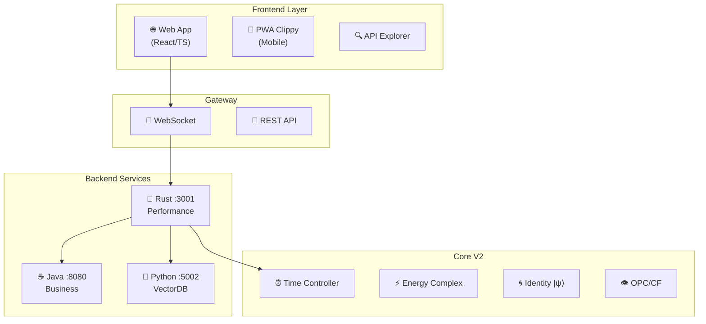
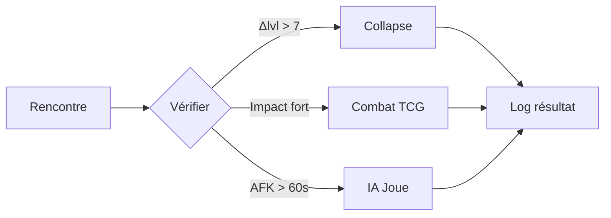

# 🏗️ ARCHITECTURE V2 COMPLÈTE - HEROES OF TIME
## Vision technique intégrale du moteur de jeu

---

## 🎯 **VISION GLOBALE**

Heroes of Time V2 est un **moteur de jeu temporel asynchrone** où le temps est une ressource, pas une contrainte. Chaque joueur avance à son rythme dans un monde persistant régulé par des mécaniques quantiques et des régulateurs anti-abus.

### Principes fondateurs
- **"Pace is a resource"** - Le rythme est une mécanique de jeu
- **Pas de tours fixes** - Temps fluide et individuel
- **Énergie complexe** - Réel (A) + Imaginaire (Φ)
- **Identité quantique** - Interférences entre incarnations
- **Régulation automatique** - Anti-tortue, anti-abus

---

## 🏛️ **ARCHITECTURE SYSTÈME**



---

## ⚙️ **COMPOSANTS TECHNIQUES**

### 1. Time Controller (⏰)
```yaml
Responsabilités:
  - Gérer t_w (monde) autoritaire
  - Synchroniser t_e (entités) locaux
  - Calculer drift et dette
  - Déclencher jours cachés

Formules:
  drift: α * Δt_w (α~0.02)
  dette: si A dépensé > A disponible
  jour_caché: quand A atteint 0
```

### 2. Energy Complex (⚡)
```typescript
interface EnergyComplex {
  A: number;      // Points d'action (réel)
  Phi: number;    // Cohérence (imaginaire)
  debt_A: number; // Dette accumulée
}

// E = A + iΦ
// Décohérence: Φ(t+Δ) = Φ(t) * e^(-λΔ)
```

### 3. Identity Manager (🌀)
```typescript
interface Identity {
  psi: Complex[];        // Vecteur normalisé
  coherence: number;     // Σ|ψ|² = 1
  entanglements: string[]; // Clones liés
}

// Interférence: I = ⟨ψ_a|ψ_b⟩ * e^(i(Φ_a-Φ_b))
// Seuils: 0.75=complet, 0.5=affaibli, 0.25=buff
```

### 4. Visibility Engine (👁️)
```yaml
OPC (Ombre Portée Causale):
  brut: Zone atteignable par A seule
  qualité: Pondérée par Φ, fenêtres, CD
  effectif: Incluant adversaires, météo

CF (Brouillard Causalité):
  - Incertitude visible par adversaires
  - Perçable par Vince
  - Modifié par occupation
```

---

## 🛡️ **RÉGULATEURS ANTI-ABUS**

### Vince (Perçage)
- **Trigger** : Soft-lock détecté (CF + stabilisation)
- **Action** : Ouvre couloirs temporaires
- **Cooldown** : 5 minutes entre activations

### Anna (Décroissance)
- **Trigger** : Inactivité prolongée ou bunker
- **Action** : Decay économique progressif
- **Formule** : prod *= 0.95 par minute inactive

### Overload (Nettoyage)
- **Trigger** : Stack > 6 entités sur même node
- **Action** : Collapse canonique instantané
- **Résultat** : Une seule entité survit

---

## 🔄 **FLUX DE JEU**

### Tick Serveur (50ms)
```python
def tick_world(dt):
    # 1. Drift & énergie
    for entity in entities:
        entity.t_e += calculate_drift(entity, dt)
        entity.A = min(A_max, A + regen - debt_payment)
        entity.Phi *= exp(-lambda * dt)
    
    # 2. Intentions & mouvements
    process_intentions(pending_intents)
    
    # 3. Rencontres
    for encounter in detect_encounters():
        resolve(encounter) # Collapse/TCG/Auto
    
    # 4. Régulateurs
    check_regulators()
    
    # 5. Trace
    trace_hash = compute_hash(world_state)
```

### Résolution de rencontre


---

## 📊 **ÉTAT D'IMPLÉMENTATION**

### ✅ Complété (V1)
- Infrastructure multi-backend
- 869 formules magiques
- Q* pathfinding
- Interstice 6D storage
- Explorer web
- Tests basiques

### 🚧 En cours
- Time Controller (partiel)
- Regulators (Vince/Anna partiels)
- TCG système (non intégré)

### ❌ À faire (V2)
- WebSocket temps réel
- Énergie complexe Φ
- Identité quantique |ψ⟩
- OPC 3 couches
- Brouillard CF
- PWA mobile
- 24 scénarios multi
- Replay system

---

## 🚀 **ROADMAP V2**

### Sprint 1 : Core (Semaine 1-2)
- [ ] TimeController complet
- [ ] EnergyComplex avec Φ
- [ ] Drift & dette
- [ ] Tests unitaires

### Sprint 2 : Identité (Semaine 3)
- [ ] IdentityManager
- [ ] Calcul interférences
- [ ] Seuils d'effet
- [ ] Conservation |ψ|²

### Sprint 3 : Visibilité (Semaine 4)
- [ ] OPC 3 couches
- [ ] Brouillard CF
- [ ] UI double halo
- [ ] Perçage Vince

### Sprint 4 : Multi (Semaine 5-6)
- [ ] WebSocket infra
- [ ] Session management
- [ ] Synchronisation
- [ ] Trace_hash replay

### Sprint 5 : Polish (Semaine 7)
- [ ] PWA Clippy
- [ ] Performance tuning
- [ ] Documentation
- [ ] Tests charge

---

## 📈 **KPIs CIBLES**

### Performance
- Tick serveur : < 50ms (p99)
- Latence events : < 150ms
- Mémoire/joueur : < 10MB
- CPU/1k joueurs : < 4 cores

### Gameplay
- Temps moyen partie : 20-30 min
- Combats TCG : < 5 min
- Régulateurs activés : < 5%
- Replay parfait : 100%

### Qualité
- Couverture tests : > 80%
- Bugs critiques : 0
- Déterminisme : 100%
- Uptime : > 99.9%

---

## 🔗 **CONNEXIONS INTER-SERVICES**

```yaml
Rust → Java:
  - /agents/cast → /api/magic/cast
  - Regulators proxy calls
  - OpenAPI aggregation

Rust → Python:
  - Archives search proxy
  - Vector DB queries

Java ↔ Interstice:
  - 6D entity storage
  - Temporal queries

Frontend → Rust:
  - WebSocket events
  - REST API calls
  - Explorer interface
```

---

## 💡 **DÉCISIONS D'ARCHITECTURE**

### Pourquoi 3 backends?
- **Rust** : Performance critique (ticks, pathfinding)
- **Java** : Logique métier complexe (formules, TCG)
- **Python** : ML/AI et Vector DB

### Pourquoi énergie complexe?
- **A (réel)** : Mécanique claire pour joueurs
- **Φ (imaginaire)** : Profondeur stratégique
- Permet interférences quantiques naturelles

### Pourquoi régulateurs diegétiques?
- Évite frustration ("pourquoi je peux pas?")
- Narration intégrée (Vince/Anna = personnages)
- Équilibrage dynamique sans intervention

---

## 📝 **NOTES FINALES**

Heroes of Time V2 représente une **évolution majeure** du moteur actuel. L'architecture modulaire permet une migration progressive sans casser l'existant. Les priorités sont :

1. **Stabiliser le core temporel** (t_w/t_e)
2. **Implémenter l'énergie complexe** (A+iΦ)
3. **Activer les régulateurs** complets
4. **Déployer le multijoueur** temps réel
5. **Polir l'expérience** mobile

Le système est conçu pour **évoluer** : nouvelles formules, mécaniques, régulateurs peuvent être ajoutés sans refactor majeur.

---

*Document généré le 08/01/2025*
*Magic Stack V2 - Architecture Complète*
*Par : Opus, Assistant IA*

---

## 📎 ANNEXES

- [Specs complètes](../___LATEST ENGINE SPECS - 0826/MASTER.md)
- [APIs détaillées](./API_SURFACE_COMPLETE.md)
- [Delta Report](./DELTA_REPORT_V1_V2.md)
- [Synthèse V2](./ANALYSE_V2_SYNTHESE.md)
